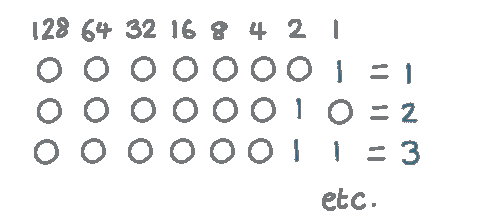
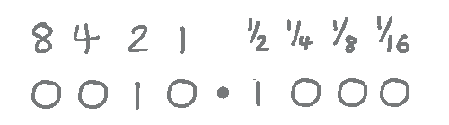
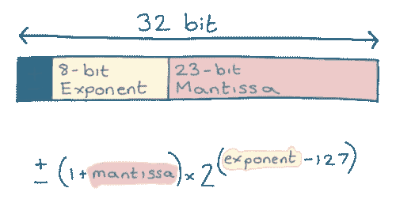
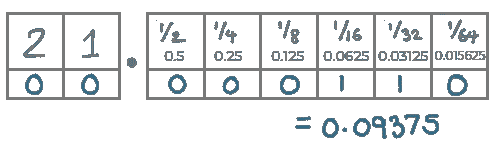
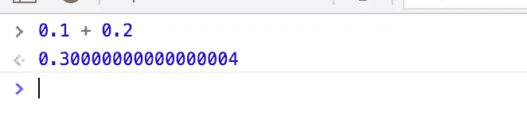

# 什么是浮点数？

> 原文：<https://javascript.plainenglish.io/what-are-floating-point-numbers-9363671f186c?source=collection_archive---------16----------------------->

浮点是以二进制存储数字的一种方式。它允许我们用固定的空间存储大量的值。

但是，如果不小心的话，浮点数(也叫“floats”)会给你带来一些问题。

## 我为什么要在乎？

你有没有想知道:

*   为什么 JavaScript 中的`0.1` + `0.3`不总是等于`0.4`？
*   我们如何用二进制存储非整数？

你可能熟悉我们如何用二进制表示一个数。

每个位代表 2 的幂，通过组合它们，我们可以产生每个整数:



但是当我们需要表示非整数的东西时，比如`2.5`，会发生什么呢？

让我们把这 8 位分成两半。

我们将使用“左”半部分来表示小数点前的数字(在我们的例子中为`2`)，使用“右”半部分来表示小数点后的分数*(在本例中为`0.5`)。*

在这个系统中，`2.5`将被表示为`0 0 1 0 1 0 0 0`:



我们现在可以表示分数，但是我们失去了很多范围。

例如，我们不能用这种格式表示`16.0`。这一点的左边没有足够的位。

我们可以不断添加更多的位来存储更大的数字，但这种格式仍然非常有限。

有时我们想存储非常大的数字，在这种情况下，我们希望在左边有更多的位。其他时候，我们希望存储非常小的分数，在这种情况下，我们需要在左边存储更少的位，在右边存储更多的精度，

这就是浮点运算；一种存储数字的方式，允许指针移动以表示更大范围的值。

浮点值的标准称为“IEEE 754”，它定义了 32 位和 64 位浮点(或“浮点”)值。

每个 32 或 64 位浮点被分成 3 个部分。

*   第一位代表“符号”；`0`为正数，或`1`为负数
*   接下来的 8 位称为“指数”
*   最后 23 位是“尾数”

我们在一个公式中使用这 3 个值，它给出了浮点数代表的数字:



你不需要理解这个公式，只需要知道这种存储数字的方式意味着我们可以表示大得多的范围。

通过使“指数”值变大或变小，我们可以表示非常小的分数或非常大的数。

这就是为什么它被称为“浮点”，它不像我们最初的例子那样有一个固定的点。相反，点“浮动”或移动，这取决于“指数”的大小。

## 舍入误差

有些数字我们无法用标准的十进制来精确表示。

例如，我们不能用十进制精确地表示⅓*:*

*`⅓ = 0.3333333...`*

*二进制的一些数也是如此；它们不能被精确地表示出来。*

*比如让我们试着用二进制来表示`0.1`。*

*同样，小数点后的值代表分数:*

**

*这是*非常接近*到`0.1`——在这个例子中这是我们能做的最好的——但是它不是*确切地说是* `0.1`。*

*我们的点可以“移动”这一事实意味着，如果我们愿意，我们可以给这个分数增加更多的精度，但事实仍然是，我们不能用二进制来精确地表示一些数字。*

*这可能会导致一些有趣的舍入误差。*

*如果你尝试用 JavaScript 计算`0.2` + `0.1`，你会得到`0.30000000000000004`的答案:*

**

*这是*非常接近*的正确答案，但不是*确切的*正确答案。*

*考虑到这一点，我们通常通过检查浮点数之间的差异来比较浮点数。*

*例如，我们不是检查两个数字是否等于，而是检查它们之间的差异是否非常小。*

```
*result1 === result2 // false
(result1 - result2) < 0.001 // true*
```

*当然，这是一个简化的例子。实际上，您可以选择一个适合您正在进行的计算的公差。*

## *结论*

*感谢您的阅读。我希望您发现这很有用，并且现在对浮点数有了更好的理解。*

**订阅我的* [*简讯*](https://www.baseclass.io/newsletter/) *先收到这个。**

**更多内容请看*[***plain English . io***](http://plainenglish.io)*