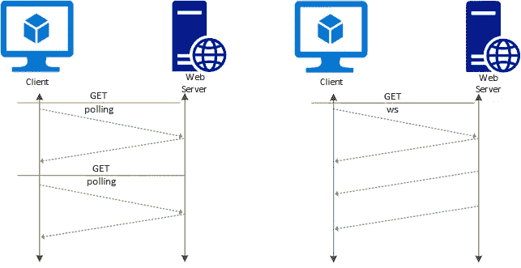
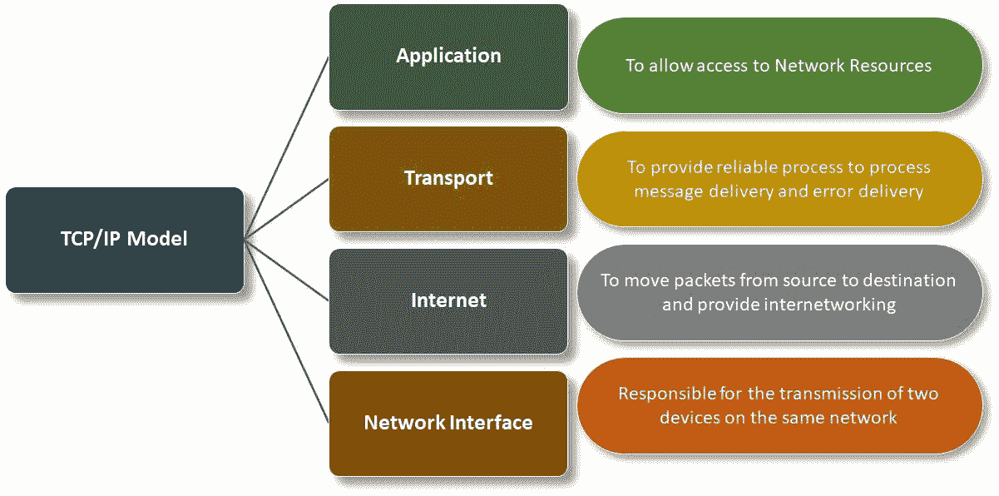
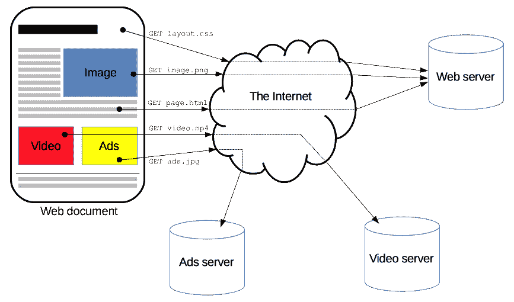
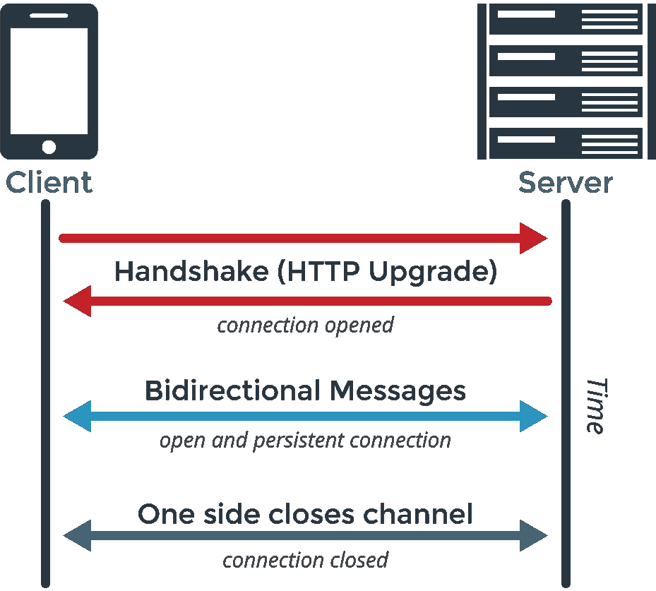
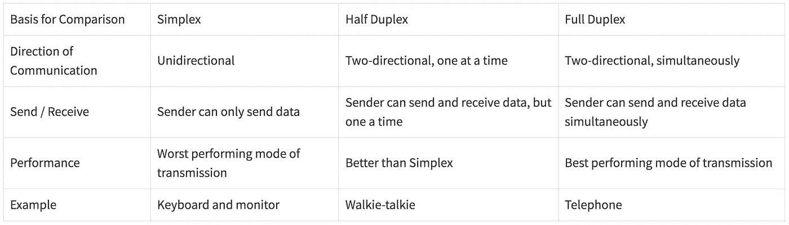
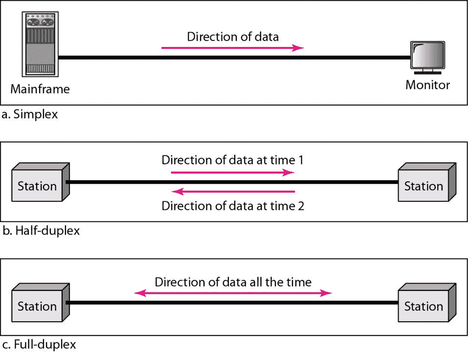

# 什么是 HTTP 和 WebSocket，什么时候使用一个而不是另一个？

> 原文：<https://javascript.plainenglish.io/what-are-http-and-websocket-and-when-to-use-one-over-another-a11b3dab428c?source=collection_archive---------7----------------------->

在这篇文章中，我们将学习⬇️

*   HTTP 和 WebSocket 如何在内部工作
*   HTTP 和 WebSocket 的主要区别是什么
*   我们什么时候需要使用 WebSocket over HTTP？

注意:这是一个系列文章，这个系列的输出是一个正在运行的群聊应用程序...如果你真的想使用套接字，我强烈推荐阅读全文。

Photo by [Volodymyr Hryshchenko](https://unsplash.com/@lunarts?utm_source=medium&utm_medium=referral) on [Unsplash](https://unsplash.com?utm_source=medium&utm_medium=referral)

# HTTP 和 WebSocket。

两者都是第四层，即**互联网协议** **套件**中的应用层协议，用于客户端-服务器通信。

# 互联网协议套件

互联网协议族，通常被称为 **TCP/IP** ，是在互联网和类似的计算机网络中使用的一组通信协议，即:(局域网、广域网、城域网、广域网)

这就是 TCP/IP 的结构。

# 超文本传送协议

*   HTTP 协议广泛用于网络上的任何数据交换。
*   HTTP 是单向的，这意味着请求是由接收方/客户端发起的，通常是 Web 浏览器
*   HTTP 是一种无状态协议，这意味着服务器不会在两个请求之间保存任何数据/状态
*   HTTP 提供半双工传输，这意味着客户端和服务器不能同时传输数据

这就是 HTTP 请求的样子。

# WebSocket

*   WebSocket 是双向的。
*   WebSocket 是一个有状态协议，这意味着客户端和服务器之间的连接将保持活动状态，直到被任何一方(客户端或服务器)终止
*   WebSocket 提供全双工传输，这意味着客户端和服务器可以同时传输数据。
*   为了安全起见，WebSocket 以 ws://或 wss://开头
*   WebSocket 最初通过 HTTP 握手打开，然后升级到 WebSocket 连接，您可以查看附件

我们已经听到了一些新术语，例如:(半双工、全双工)这些是什么，让我们也来看看。

# **单工、半双工和全双工**

这些是传输模式，在电子设备中，发送方和接收方之间的数据传输遵循特定的模式，根据发送和接收数据的性质，我们可以区分使用的是哪种传输模式。

我们已经介绍了 HTTP 和 WebSocket 是如何工作的，它们之间的主要区别是什么。

# 现在问题来了，我们什么时候需要在 HTTP 上使用 WebSocket🤔

# 当 WebSocket 是更好的选择时

*   快速反应时间
*   持续更新
*   即席消息
*   小有效负载的高频消息传递

# 当 HTTP 是更好的选择时

*   检索资源
*   高度可缓存的资源
*   同步事件
*   错误场景

# 结论

我们已经了解了 HTTP 和 WebSocket 是如何工作的，它们之间的主要区别是什么，以及我们何时需要使用一个而不是另一个，这在本文中已经基本完成了，在本系列的下一篇文章中，我们将深入探讨如何在 nodeJS 中使用 WebSockets。

Photo by [Alexas_Fotos](https://unsplash.com/@alexas_fotos?utm_source=medium&utm_medium=referral) on [Unsplash](https://unsplash.com?utm_source=medium&utm_medium=referral)

*更多内容看*[***plain English . io***](http://plainenglish.io/)