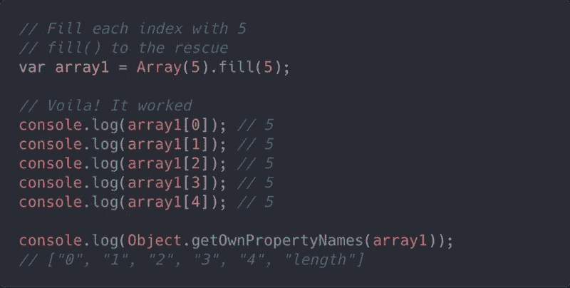

# 什么是 JavaScript 数组？

> 原文：<https://javascript.plainenglish.io/what-are-javascript-arrays-20a45a108ad1?source=collection_archive---------14----------------------->



# 描述

数组是类似列表的对象。它们有执行遍历和变更操作的方法。数组的长度可以随时改变。数据可以存储在阵列中不连续的位置。JavaScript 数组不一定是密集的。这取决于程序员的选择以及他们选择如何使用它们。这些都是合适的特性，如果不适合某个特定的用途，可以用类型化数组来替换。

数组不能使用字符串作为元素索引。它们必须使用整数。括号符号或点符号用于设置或访问非整数。它们不会从数组列表本身设置或恢复元素。可以设置或访问与该阵列的对象属性组相关的变量。数组的遍历和变异操作可能不适用于对象属性和数组元素列表的分离。

# 创建数组

使用数组文字创建 JavaScript 数组是最简单的方法。

```
Syntax:var array_name = [item1, item2, ...];
```

**例子**

```
var cars = ["Suzuki", "Cultus", "BMW"];A statement may span multiple lines. The spaces and line breaks are not important.Examplevar cars = ["Suzuki", "Cultus", "BMW"];
```

# 添加和移除数组中的元素

我们可以声明一个空变量，一个没有值的变量。然后我们可以随时给它赋值。而且我们可以随意改变它的值。我们也可以用数组来做这些事情。这就是我们如何声明一个空数组。

```
var pets = [];We assign values to the array pets1 pets[0] = "dog";2 pets[1] = "cat";3 pets[2] = "bird";
```

本例中数组的前三个元素是有序的。如果我们愿意，我们可以合法地在数组中留下断点。我们通常不会。假设我们从同一个空数组开始，对这些行进行编码。

```
1 pets[3] = "lizard";2 pets[6] = "snake";
```

如果提到宠物[3]，就会得到“蜥蜴”。如果我们提到宠物[6]，我们会得到“蛇”。但是如果我们通过宠物[2]或宠物[4]或宠物[5]来指代宠物[0],我们就会变得不明确。我们可以给一个已经有值的数组赋值。假设第一个

宠物数组的三(03)个元素是“狗”、“猫”和“鸟”。以前我们写这段代码。

```
1 pets[3] = "lizard";2 pets[4] = "fish";3 pets[5] = "gerbil";4 pets[6] = "snake";
```

目前，该数组有 7 个元素:“狗”、“猫”、“鸟”、“蜥蜴”、“鱼”、“沙鼠”和“蛇”。如果我们给一个已经有一个值的数组元素分配一个新值，旧值就会被新值替换。我们可以使用关键字 pop 删除数组的最后一个元素。假设我们有一个宠物数组，它的元素是“狗”、“猫”和“鸟”。下面的代码删除了最后一个元素“bird”，留下了一个两个元素的数组。

```
pets.pop();
```

我们可以使用关键字 push 在数组末尾添加一个或多个元素。

我相信我们有相同的由“狗”、“猫”和“鸟”组成的数组。下面提到的代码在数组末尾添加了两个新元素。

```
pets.push("fish", "ferret");
```

我们使用 shift 方法从数组的开头移除一个元素。假设我们有一个数组，宠物，它的元素是“狗”、“猫”和“鸟”。下面的代码删除了第一个元素“dog”，留给我们一个两个元素的数组。

```
pets.shift();
```

我们使用 unshift 方法将一个或多个元素添加到数组的开头。下面提到的代码在数组的开头添加了两个元素。

```
pets.unshift("fish", "ferret");
```

我们使用拼接方法在数组中的任意位置插入一个或多个元素。这是选择性地移除一个或多个跟在它后面的元素。假设我们有一个数组，包含元素“狗”、“猫”、“苍蝇”、“虫子”、“牛”。下面描述的代码在“猫”后面添加了“猪”、“鸭”和“鸸鹋”，同时删除了“苍蝇”和“臭虫”。

```
pets.splice (2, 2, "pig", "duck", "emu");
```

# 访问数组元素

JavaScript 数组是零索引的。数组的第一个元素位于索引 0 处。最后一个元素的索引值等于数组的 length 属性值减 1。我们可以通过引用索引号来访问数组元素。使用无效的索引号会返回 undefined。

```
let arr = ['This is the first element', 'This is the second element', and ‘This is the last element']console.log(arr[0])                              // logs 'this is the first element'console.log(arr[1])                               // logs 'this is the second elementAt the last, console.log(arr [arr.length - 1])            // logs 'this is the last element'
```

数组元素是对象属性，就像 to String 是属性一样(具体来说，to String()是方法)。然而，尝试按如下方式访问数组元素会引发语法错误，因为属性名无效:

# 数组和对象的区别

数组使用编号索引，编号索引是特殊类型的对象，对象使用 JavaScript 中的命名索引。

**数组和对象的使用**

*   关联数组不被 [JavaScript](https://www.technologiesinindustry4.com/) 支持。
*   当我们希望元素名是字符串(文本)时，我们应该使用对象。
*   当我们希望元素名是数字时，我们应该使用数组。

避免新数组( )

没有必要使用 JavaScript 的内置数组构造函数 new Array()。

请改用[ ]。

遵循两个不同的声明创建一个新的名为 points 的空数组:

```
var points = new Array();     // Badvar points = [];             // Good
```

下面两条不同的语句创建一个包含 6 个数字的新数组:

```
var points = new Array(40, 100, 1, 5, 25, 10);             // Bad and var points = [40, 100, 1, 5, 25, 10];                              // Good
```

*更多详情，请访问:*

[*https://www . technologiesinindustry 4 . com/2020/12/what-are-JavaScript-arrays . html*](https://www.technologiesinindustry4.com/2020/12/what-are-javascript-arrays.html)

*更多内容请看*[***plain English . io***](http://plainenglish.io/)