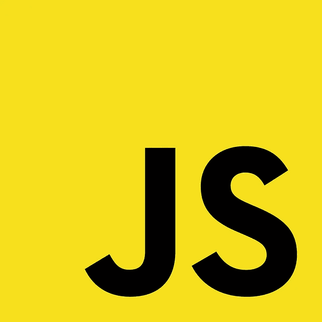

# 什么是 JavaScript 提示？

> 原文：<https://javascript.plainenglish.io/what-are-javascript-prompts-4a2dae6e08de?source=collection_archive---------10----------------------->



# 介绍

JavaScript 中的 prompt()方法显示一个提示框，要求用户输入。通常，它用于在进入页面之前获取用户的输入。这可以在不使用窗口前缀的情况下编写。当弹出提示框时，我们必须单击“确定”和“取消”才能继续。

使用 prompt()方法，显示接收两个参数的框；

1.  第一个参数是显示在文本框中的标签，
2.  第二个参数是文本框中显示的默认字符串。

提示框有两个按钮，确定和取消。这将返回 null 或用户输入的字符串。当用户单击“确定”时，该框返回输入值。单击“取消”时，它返回 null。

# 描述

一个提示框询问用户一些信息。它为她提供了一个响应字段

回答。这段代码向用户提出问题“你的物种？''.这在回复字段中提供了默认答案“人类”。他可以改变回应。不管他是保持默认响应不变，还是将其更改为其他内容，他的响应都被分配给变量。

```
var spec = prompt(“Your species?”, “human”);
```

提示代码类似于警报代码，有两个不同之处。

*   我们需要一种方法来捕捉用户在提示中的反应。这意味着我们需要先声明一个变量，后面跟一个等号。
*   我们可以在提示中指定第二个字符串。[这是在提示显示后出现在字段中的默认回复。](https://www.technologiesinindustry4.com/)如果用户保持默认响应不变，只点击 OK，默认响应就会被分配给变量。是否包含默认响应取决于我们。

我们可以像预期的那样将字符串赋给变量。然后要求变量代替括号内的字符串。

1.  var question = "你的物种？"；
2.  var 默认答案= "人类"；
3.  var spec = prompt(问题，默认答案)；

用户的响应是一个文本字符串。即使响应是数字，它也以字符串形式返回。例如，考虑以下代码。

1.  var numberOfCats = prompt("多少只猫？");
2.  var tooManyCats =猫的数量+1；

同时，我们需要一个数字。用户似乎正在输入一个；我们可能希望第二条语句中的数学运算能够奏效。例如，如果用户输入 3，我们可能会认为变量 tooManyCats 的值应该是 4。但是没有这样的运气。对提示的所有响应都以字符串的形式返回。JavaScript 将 1 转换为一个字符串，当字符串“3”与数字 1 之间有一个加号链接时，将 1 连接起来。因此，tooManyCats 的值不是 4，而是“31”。如果用户什么都不输入并点击 OK，变量被赋予一个空字符串`“”`。如果用户单击 cancel，该变量将被赋予一个特殊值 null。

# JavaScript 弹出框

有三种弹出框:

1.  警告框:如果我们想验证信息并传递给用户，通常会使用它。用户必须单击“确定”才能继续。
2.  确认框:如果我们想让用户确认或接收一些信息，可以使用确认框。当弹出确认框时，用户必须单击“确定”或“取消”才能继续。如果用户单击确定，该框返回 true。如果用户单击“取消”，该框返回 false。
3.  提示框:如果我们希望用户在进入页面之前输入一个值，通常会使用提示框。[当弹出提示框](https://www.technologiesinindustry4.com/)时，用户必须点击“确定”或“取消”才能继续下一步输入值。如果用户单击确定，该框将返回输入值。如果用户单击“取消”，该框返回 null。当弹出一个警告框时，用户必须单击 OK 才能继续。

# prompt()方法的语法

下一个示例演示了 prompt()方法的语法:

```
let result = window.prompt(message, default);
```

现在在这个语法中:

消息是要显示的字符串。如果我们忽略它，对话框上不会显示任何内容。默认值是包含文本输入字段默认值的字符串。结果是包含用户输入的文本的字符串或 null。提示()是模态的和同步的，类似于警报()和确认()。代码实现在对话框显示时停止，并在对话框释放后重新启动。

# JavaScript 提示的例子

**1。显示提示对话框**

下面的示例使用 prompt()方法显示一个对话框。向用户询问他们喜欢的编程语言。

```
let lang = prompt (‘What is your favorite programming language?’);let feedback = lang.toLowerCase() === ‘javascript’? `It’s great! ` :`It’s ${lang}`;alert(feedback);
```

**2。将用户输入转换为数字**

提示符()的结果将是一个字符串。如果我们想得到一个数字的答案，我们应该总是对它进行强制转换。以下示例使用 prompt()显示一个询问用户年龄的对话框。如果用户年满 16 岁或以上，他们就有资格加入。否则，他们不会。

```
let ageStr = prompt(‘How old are you?’);let age = Number(ageStr);let feedback = age>= 16?`You’re eligible to join.` :`You must be at least 16 year old to join.`;alert(feedback);
```

欲了解更多详情，请访问:

[https://www . technologiesinindustry 4 . com/2021/01/what-are-JavaScript-prompts . html](https://www.technologiesinindustry4.com/2021/01/what-are-javascript-prompts.html)

*更多内容请看*[***plain English . io***](http://plainenglish.io/)