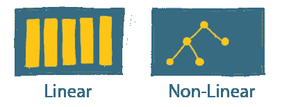
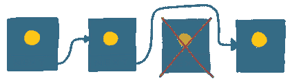
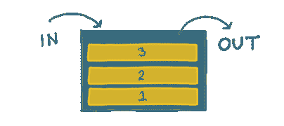

# 什么是线性数据结构？

> 原文：<https://javascript.plainenglish.io/what-are-linear-data-structures-9afb3e05edc9?source=collection_archive---------14----------------------->

我们说一个数据结构是“线性的”,如果其中的项目是按顺序存储的。

数组、链表和栈都是线性数据结构。

# 我为什么要在乎？

我们每天都在编程中使用这些数据结构。

即使你已经很熟悉了，偶尔重温一下也是有帮助的。

# 在 5 分钟或更短时间内

正如我们在引言中所说的，如果元素形成一个序列，那么数据结构就是“线性”的。

这意味着数据结构有第一个和最后一个元素，每个元素都连接到它的前一个和下一个元素。

*   一个‘数组’*是*一个线性数据结构；项目是按顺序存储的。
*   “图形”是*而不是*线性数据结构；图中的任何节点都可以链接到任何其他节点，没有固定的“顺序”。

(如果你对图表不熟悉，不要担心——有一份时事通讯将详细探讨它们)。

让我们来看看一些常见的线性数据结构…

# 数组

如果你做过任何编程，你几乎肯定熟悉数组的概念。

一个数组就像一个书架；这些条目存储在一起，但是我们可以跳到任何我们喜欢的条目来阅读。

数组中的项目有一个“索引”,允许我们直接引用它们。

跳转到我们喜欢的任何项目来读取其值的能力被称为“随机访问”，这是数组的一个巨大优势。

我们认为这是理所当然的，但这不是许多其他“线性数据结构”所具有的属性，正如您将在下面看到的。

当我们分配阵列时，我们必须预先确定我们需要多少空间。

如果我们填满了数组，我们必须停下来分配更多的空间。这意味着，虽然正常的数组插入速度非常快，但偶尔我们不得不暂停一会儿，让数组变大——这需要一些时间。

# 链接列表

链表是一种数据结构，其中每一项指向下一项。我们不能像数组那样直接跳到任何元素。相反，我们必须依次访问它们:

链表是有用的，因为不像数组，我们不需要预先决定我们需要多少空间。如果我们需要添加一个新项目，我们只需将它添加到末尾。

这意味着添加第 200 个项目与添加第 2 个项目的成本相同。这种可预测的性能是链表的一个优点。

通过简单地改变一些“下一个”指针，在链表的中间添加或删除一个条目也很容易。

下面是我们如何从链表中移除一个条目:

这在一个数组中更难做到，因为我们必须移动所有剩余的项来说明新的或被删除的项。

链表的一种变体是“双向链表”，其中每个元素不仅指向下一个元素的*，还指向前一个*元素的*。*

这意味着我们可以以任意顺序遍历数据结构，但仍然具有链表的优点。

# 行列

队列是一种“先进先出”(FIFO)的数据结构。这意味着项目的读取顺序与插入顺序相同。

这就好比在商店排队，第一个加入排队的人就是第一个被服务的人。

打印机队列是使用这种数据结构的一个很好的例子。打印机将按照项目排队的顺序打印项目。如果您最后将文档发送到打印机，它将是最后打印的内容。

队列也可以用作“缓冲器”。

假设我们有两个独立的系统，一个读取消息，一个处理消息。我们不希望*读取*消息的系统必须等待每条消息被*处理*后才能侦听另一条消息。

在它们之间放置一个队列可以让我们“解耦”这些系统。*读取*进程可以继续将项目添加到队列中，安全地知道*处理*端将从队列中取出项目并最终处理它们——不需要等待。

# 大量

堆栈是一种“后进先出”的数据结构；要添加的最后一个*项目是要读取的第一个*项目。**

你可以把它想象成一堆盘子，最后一个加入的盘子是我们要拿走的第一个盘子:

例如，你可以使用堆栈来实现“撤销”功能。用户执行的最后一个*任务是用户点击“撤销”按钮时要撤销的第一个*任务。**

我们每天在运行代码时看到的“调用堆栈”也是堆栈的一个很好的例子，但这是未来通讯的主题！

*我的* [*通迅订阅者*](https://www.baseclass.io/newsletter) *先收到这个。*

*更多内容请看*[***plain English . io***](http://plainenglish.io)