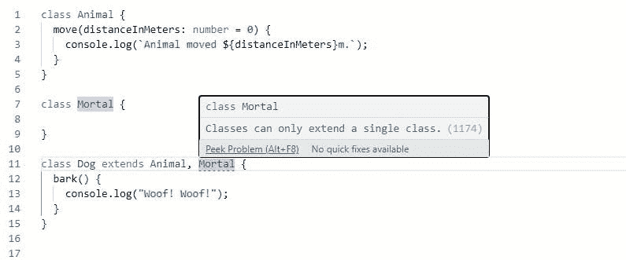
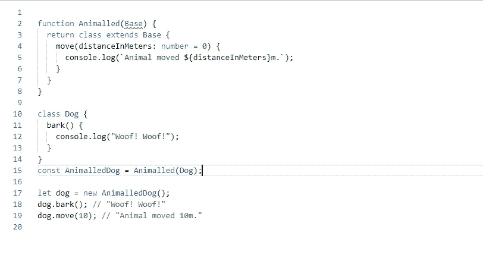

# 什么是 Mixins，如何在 TypeScript 中使用它们？

> 原文：<https://javascript.plainenglish.io/what-are-mixins-and-how-do-you-use-them-in-typescript-94e529ecb417?source=collection_archive---------5----------------------->

## 理解混音:从冰淇淋摊到打字稿


Image by [Anita S](https://pixabay.com/users/mintchipdesigns-522107/?utm_source=link-attribution&amp;utm_medium=referral&amp;utm_campaign=image&amp;utm_content=504326). from [Pixabay](https://pixabay.com/?utm_source=link-attribution&amp;utm_medium=referral&amp;utm_campaign=image&amp;utm_content=504326)

当史蒂夫·赫瑞尔开设他的第一家冰淇淋店时，他没有预先混合口味，而是让他的员工根据顾客的要求将新鲜制作的冰淇淋与糖果或其他糖果混合。

那些糖果添加物被称为**混合食品**。

史蒂夫可能只是想击败竞争对手，他不知道他的 **mix-in** 会在多年后进入计算机编程语言，尽管不是字面上的——我们还没有用代码变出冰淇淋。我们，你们这些人对我隐瞒了什么吗？

当一家现已倒闭的计算机制造公司 Symbolics Inc .在一种名为 **Flavors** 的早期面向对象编程语言中引入术语“Mixin”时，这个名称进入了计算机科学，这个名称的灵感来自马萨诸塞州萨默维尔的史蒂夫冰淇淋店。

我打赌我们都能猜到 Symbolics 公司的程序员在哪里度过他们的夜晚。

# 编程语言中的混合

正如 Steve Herell 的 Mixins 是对 main 事物的添加，面向对象编程语言中的 mix in 也是对一个类的“添加”。混合允许一个类使用另一个类中定义的“功能”。

如果你了解类继承，你可能会相信我们已经这样做了。让我们从官方的 TypeScript 文档中取这个例子:

```
class Animal {
 move(distanceInMeters: number = 0) {
 console.log(`Animal moved ${distanceInMeters}m.`);
 }
}class Dog extends Animal {
 bark() {
 console.log(“Woof! Woof!”);
 }
}const dog = new Dog();
dog.bark();
dog.move(10);
dog.bark();
```

尽管`Dog`类没有`move`方法，但是因为它`extends`了`Animal`类，也就是说，它继承了`Animal`类的属性和方法，我们可以安全地编写`dog.move(10)`。我们说`Dog`是派生类，而`Animal`是父类。

假设我们有另一个类，“凡人”，我们希望`Dog`类也有它的功能(狗也是凡人，对吗？).

我们可能会尝试这样做:

```
 class Dog extends Animal, Mortal {
…
}
```

如果我们这样做，TypeScript 会尖叫，TypeScript 不支持多重继承。



这就是为什么我们需要混音。

Mixins 允许我们在其他类中使用“基类”中声明的功能，而不必使基类成为那些类的父类。与其说我们从 Mixin 继承，我们通常说 Mixin 被“包含”(即混合)到一个类中。

Mixins 不是 TypeScript 所独有的，它们也是其他编程语言中可用的一种软件开发风格，并且它们被“包含”到类中的方式(通常)在这些语言中是不同的。

# 如何在 TypeScript 中使用 Mixins

TypeScript 中的 Mixins 实际上不是我们想要“混合”的类，而是接受一个类，然后将另一个类的功能“混合”到其中的工厂(函数)。


Mixins 可以作为创建“子类”的工厂在 TypeScript 中实现。代替`class Dog`扩展`class Animal`，我们编写一个函数(**mixin**)，它接受`Dog`类作为输入，并返回一个添加了`Animal`功能的新类(即“混合的”)。因为缺少更好更好的名字，我把这个类叫做`Animalled`:



上面的代码片段实现了`Animalled` mixin，我们可以用它来给任何类添加‘Animal’功能，在第 15 行我们把它添加到 dog 类。

如果您仔细观察，您会注意到第 2 行中的类型错误，在那里我将`Base`声明为函数参数。因为我们扩展了`Base`参数，TypeScript 抱怨我们应该给参数一个合适的类型，因为如果我们不指定类型，它默认为`any`。

所以，我们需要给`Base`一个类型，表明它可以作为一个类使用，我们需要一个*构造函数类型*。

```
type Constructor<T = {}> = new (…args: any[]) => T;function Animalled<TBase extends Constructor>(Base: TBase) {
 return class extends Base {
  move(distanceInMeters: number = 0) {
    console.log(`Animal moved ${distanceInMeters}m.`);
   }
 }
}class Dog {
 bark() {
   console.log(“Woof! Woof!”);
 }
}
const AnimalledDog = Animalled(Dog);let dog = new AnimalledDog();
dog.bark(); // “Woof! Woof!” 
dog.move(10); // “Animal moved 10m.”
```

类型`Constructor<T>`被称为**构造签名**。它将类型描述为可用于构造泛型类型`T`的对象，T 默认为{}。

`new (...args: any[])`告诉我们，这种类型的构造函数接受任意数量的任何类型的参数。注意，该类型的名称可以是任何名称，但`Constructor`是最合适的名称。

我们现在可以创建另一个 mixin 来添加`Mortal`功能:

```
 type Constructor<T = {}> = new (…args: any[]) => T;function Animalled<TBase extends Constructor>(Base: TBase) {
  return class extends Base {
   move(distanceInMeters: number = 0) {
       console.log(`Animal moved ${distanceInMeters}m.`);
   }
  }
}function Mortalled<TBase extends Constructor>(Base: TBase) {
 return class extends Base {
    confess() {
     console.log(“I seek immortality!”);
    }
  }
}class Dog {
  bark() {
   console.log(“Woof! Woof!”);
  }
}
const AnimalledDog = Animalled(Dog);
const MortalledAndAnimalledDog = Mortalled(AnimalledDog);let dog = new MortalledAndAnimalledDog();
dog.bark(); // “Woof! Woof!” 
dog.move(10); // “Animal moved 10m.” 
dog.confess(); // “I seek immortality!”
```

太棒了。

我们可以继续下去，通过混合更多的职业给这个职业更多的超能力。

# 摘要

我们已经知道:*mixin 是一个函数，它接受一个构造函数，声明一个扩展这个构造函数的类，向这个新类添加成员，然后返回这个类本身。*

有很多方法可以使用 mixins，这篇文章已经太长了，无法触及其中的一些。不过，我会在下面提供一些我觉得有用的文章的链接，请务必查看。

- [利用 Mixins 在 Angular 中的能力](https://medium.com/javascript-in-plain-english/harnessing-the-power-of-mixins-in-angular-f2faa432add2)

-[TypeScript 中的 mixin 模式—您需要知道的一切](https://www.bryntum.com/blog/the-mixin-pattern-in-typescript-all-you-need-to-know/)

- [“真正的”混合 JavaScript 类](https://justinfagnani.com/2015/12/21/real-mixins-with-javascript-classes/)

——[米欣——维基百科](https://en.wikipedia.org/wiki/Mixin#:~:text=In%20object%2Doriented%20programming%20languages,class%20of%20those%20other%20classes.)

快乐编码。

*最初发布于*[*https://solathecoder . hashnode . dev*](https://solathecoder.hashnode.dev/understanding-mixins-from-ice-cream-stands-to-typescript-ckk9t3b2100b4vas120xf24nw)*。*