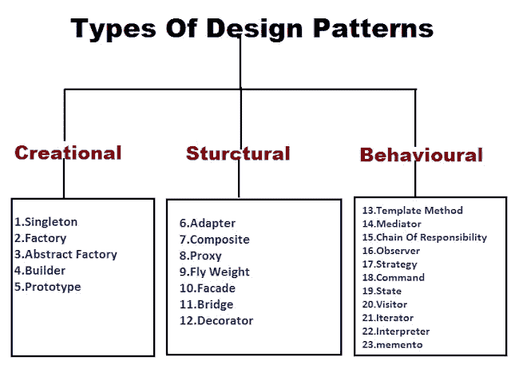

# 你需要知道的软件设计模式的类型

> 原文：<https://javascript.plainenglish.io/what-are-software-design-patterns-fe8a9f9ecabb?source=collection_archive---------5----------------------->

无论是初学者还是专家。

如果您是一名程序员，或者刚开始从事软件开发和编程，您迟早会遇到术语“软件设计模式”

# 什么是软件设计模式？

它是一个通用的、可重用的解决方案，适用于不同的软件设计问题。这些模板识别系统中的问题，并通过反复试验为开发人员长期面临的一般问题提供适当的解决方案。

软件设计模式有很多很多，而且会越来越多的出现。在这篇文章中，我将谈论所谓的经典模式中最著名的。

# 为什么要使用设计模式？

信息技术产业的巨大发展导致了软件开发实践的发展。之前要求所有软件都要完成后才能测试，导致问题的产生。

为了节省时间并避免在开发完成后回到开发阶段，在开发阶段引入了测试实践。

这种做法用于识别代码中的错误条件和问题，这些错误条件和问题当时可能并不明显。简而言之，设计模式帮助你确定你的代码的有效性，因为它们是有效的解决方案，并且已经被许多开发者测试过，不容易出错。

# 设计模式的类型

最常用的设计模式分为三大类。每个设计模式总共由 23 个设计模式组成。四个主要类别是:

*   创造模式
*   结构模式
*   行为模式

# 创造模式

创建模式提供了各种对象创建机制，这些机制以适合具体情况的方式增加了现有代码的灵活性和重用性。这给了程序更多的灵活性来决定应该为给定的用例创建哪些对象。

## 这些是创造模式:

## 抽象工厂

在这种模式中，接口创建相关对象的集合或系列，而不指定类名。

## 构建器模式

它允许使用相同的建筑规范生产不同类型和表示的对象。它用于通过组合简单对象来逐步创建复杂对象。对象的最终创建取决于创建过程的各个阶段，但独立于其他对象。

## 工厂方法

提供在超类中创建对象的接口，但允许子类改变所创建对象的类型。通过公共接口提供隐式对象实例化。

## 原型

它允许您复制现有的对象，而无需让您的代码依赖于它们的类。它用于通过使用对象副本将修改保持在最低限度来限制内存/数据库操作。

## 一个

这种设计模式将一个类的实例化限制为一个对象。

# 结构模式

它们提供了关于类组成和对象结构的有效解决方案和标准。继承的概念用于组合接口，并定义组合对象以获得新功能的方式。

## 适配器

它用于链接两个不兼容的接口并使用它们的功能。适配器允许类以其他方式协同工作，而这些方式是不兼容接口所不能做到的。

## 桥

在这个模式中，main 和 interface implementer 类有一个结构上的改变，但它们之间没有任何影响。这两个类可以独立开发，只用一个接口作为桥梁连接起来。

## 复合材料

它用于将对象作为单个对象进行分组。它允许您将对象组成树结构，然后像处理单个对象一样处理这些结构。

## 装饰者

这种模式限制了在向对象添加新功能时对其结构的修改。初始类保持不变，而装饰类提供了额外的功能。

## 外表

为库、框架或任何其他复杂的类集提供简化的接口。

## 轻量级

Flyweight 模式用于通过减少对象创建来减少内存使用和提高性能。该模式寻找已经存在的相似对象进行重用，而不是创建新的相似对象。

## 代理人

它用于创建可以表示其他类或对象的函数的对象，接口用于访问这些功能

# 。行为模式

行为模式处理类对象之间的通信。它们用于检测已经存在的通信模式的存在，并且可以操纵这些模式。这些设计模式特别与对象之间的通信相关。

## 责任链

责任链设计模式是一种行为模式，它避免了将请求的发送者耦合到接收者，给予多个对象响应请求的能力。

## 命令

将请求转换为包含该请求所有信息的单独对象。这种转换允许您用不同的请求参数化方法，延迟或排队请求的执行，并支持不可撤消的操作。

## 解释者

用于在创建指示解释上下文的界面时评估语言或表达式。

## 迭代程序

它的实用程序提供了对集合对象中许多元素的顺序访问，而无需执行任何相关的信息交换。

## 调解人

这种模式在整个类中提供了简单的通信，支持多个类之间的通信。

## 纪念品

Memento 模式允许您遍历集合的元素，而不暴露它们的底层表示。

## 观察者

它允许定义一个订阅机制来通知各种对象关于任何发生在被观察对象上的事件。

## 状态

在状态模式中，类的行为随其状态而变化，因此由上下文对象表示。

## 战略

它允许你定义一系列的算法，但是它们在一个单独的类中，并且使它们的对象可以互换。

## 模板方法

与具有相似性的组件一起使用，您可以实现一个代码模板来测试这两个组件。只要稍加修改，代码就可以更改。

## 访问者

访问者模式旨在定义一个新的操作，而不修改现有的对象结构。

许多类型的软件设计模式允许我们更容易地创建我们的代码，并使用已经测试过并保证有效的代码结构。

无论什么时候，当你使用别人创建的代码时，使用设计模式将帮助我们发现问题并改进代码。

[*更多内容看 plainenglish.io*](http://plainenglish.io/)