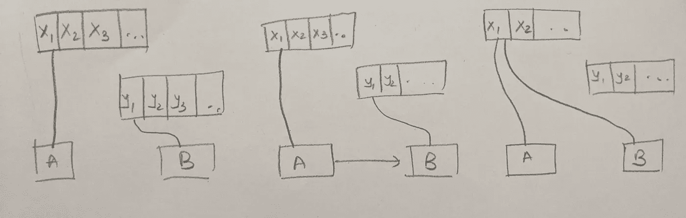
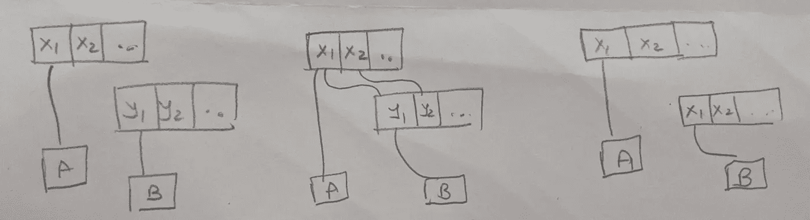
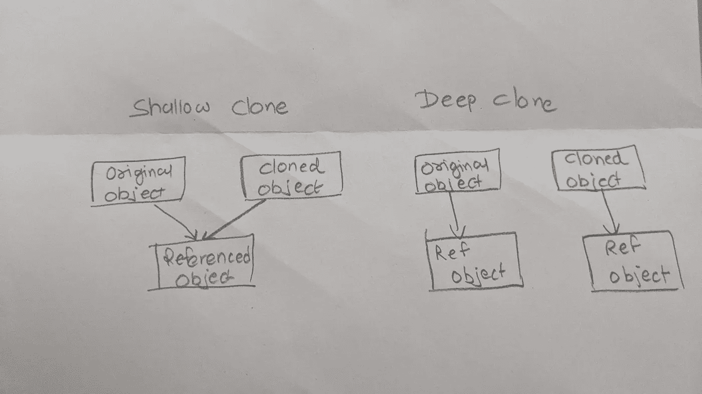
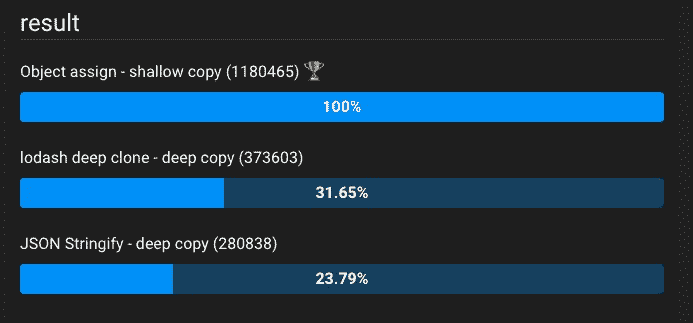

# 在 JavaScript 中克隆一个对象有哪些不同的方法？

> 原文：<https://javascript.plainenglish.io/what-are-the-different-ways-to-clone-an-object-in-javascript-2e3e33527bd7?source=collection_archive---------23----------------------->


Photo by [Kelly Sikkema](https://unsplash.com/@kellysikkema?utm_source=medium&utm_medium=referral) on [Unsplash](https://unsplash.com?utm_source=medium&utm_medium=referral)

作为开发人员，学无止境。我们总是需要与时俱进的技术，以及即将到来的或当前的市场趋势特征。

这些小文章不仅能帮助你编写更好的 TypeScript 或 JavaScript 代码，还能理清前端技术的概念。这不仅有助于你建立一个强大的基础，也有助于即将到来的前端面试。

任何编程语言中最基本的主题之一就是摆弄对象。

**当我们在组件中创建了一个对象时，我们可能需要在不止一个地方使用这个对象，为此，我们可能会一次又一次地更新同一个对象，这可能会破坏我们的逻辑。**

*要解决这个问题，我们需要克隆一个对象来分配一个新的引用。让我们讨论一下克隆对象的有效方法。*

*我们先来了解一下* ***两个克隆中常见的*** *术语。*

> **浅抄**抄收不准引用。
> 
> **深层拷贝**拷贝一切。

为了了解更多，在这个 StackOverflow 回答中， [dlamblin](https://stackoverflow.com/users/459/dlamblin) 很好地解释了这个问题。

**浅显抄**:



变量 a 和 B 位于内存的两个不同部分。当我们把 B 赋值给 A 时，两者都指向同一个内存地址。现在，如果你对 A 或 B 做了任何改变，因为它们有相同的内存地址，默认情况下它们会被改变。

**深度复制**:



在这个副本中，你可以看到 B 被分配了一个新的内存地址。所以，如果我们改变 A 或 B 中的任何东西，都不会影响它们，它们的值是唯一的。

亚历山大用更简单的方式解释道。



# 1.本地方法(深层拷贝)

最好也是最古老的克隆方式之一是使用 JSON.stringify 进行本地深度克隆。

`JSON.parse(JSON.stringify(object))`

```
const a = {
  string: 'string',
  number: 123,
  bool: false,
  nul: null,
  date: new Date(),  // stringified
  undef: undefined,  // lost
  inf: Infinity,  // forced to 'null'
  re: /.*/,  // lost
}
console.log(a);
console.log(typeof a.date);  // Date object
const clone = JSON.parse(JSON.stringify(a));
console.log(clone);
console.log(typeof clone.date);  // result of .toISOString()
```

# 2.使用库的可靠克隆(深层拷贝)

我们可以使用 lodash 库，例如:

*   洛达什— `[cloneDeep](https://lodash.com/docs#cloneDeep)`

```
var objects = [{ 'a': 1 }, { 'b': 2 }];var deep = _.cloneDeep(objects);
```

# 3.ES6(浅层拷贝)

ES6 提供了两种不同的克隆对象的方法，一种是 Object.assign，另一种是 spread 操作符。

```
var data= {val: "string"};
var newdata= Object.assign({}, data);
var newdata3= {...data};  // Spread Operator
```

让我们检查一下性能矩阵。

[https://jsben.ch/0HMc4](https://jsben.ch/0HMc4)



**参考文献:**

[](https://stackoverflow.com/questions/122102/what-is-the-most-efficient-way-to-deep-clone-an-object-in-javascript) [## 在 JavaScript 中深度克隆一个对象最有效的方法是什么？

### HTML 标准包括一个内部结构化克隆/序列化算法，可以创建…

stackoverflow.com](https://stackoverflow.com/questions/122102/what-is-the-most-efficient-way-to-deep-clone-an-object-in-javascript) 

# 你可以在这里查看我以前的文章:

*更多内容看*[***plain English . io***](http://plainenglish.io/)