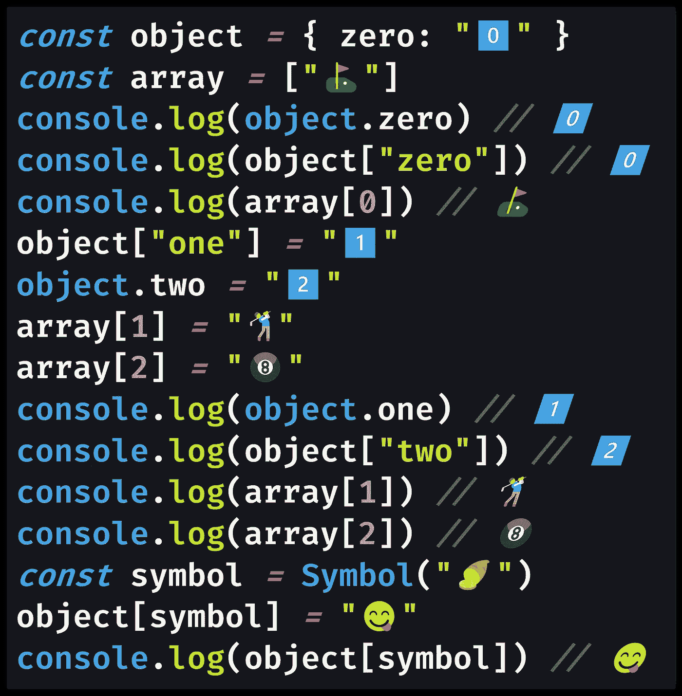

# JavaScript 中的对象属性访问器有哪些？

> 原文：<https://javascript.plainenglish.io/what-are-the-object-property-accessors-in-javascript-5a1bfb4339c4?source=collection_archive---------6----------------------->

## 您可以通过两种方式之一在 JavaScript 中访问对象属性:`.`点语法或`[]`括号符号。下面是为什么有两个属性访问器以及它们之间的区别。

Photo by [Alejandro Barba](https://unsplash.com/@albrb?utm_source=medium&utm_medium=referral) on [Unsplash](https://unsplash.com?utm_source=medium&utm_medium=referral)

JavaScript 开发人员首先要了解的一件事是[原语类型](https://medium.com/p/671909def6ca)(如[数字](https://medium.com/javascript-in-plain-english/how-to-check-for-a-number-in-javascript-8d9024708153)和[布尔值](https://medium.com/javascript-in-plain-english/how-to-check-for-a-boolean-in-javascript-98fdc8aec2a7))和[对象](https://medium.com/p/3b2632330296)(如[数组](https://medium.com/javascript-in-plain-english/how-to-check-for-an-array-in-javascript-6ad20f7a0e21)和`[Dates](https://medium.com/p/efd87ecfea66)`)之间存在差异。

您通常可以识别对象，因为它们是通过对象文字语法 ( `{}`，花括号)调用的，然后使用单个句点字符`.`点语法访问。

调用`.`点语法就是所谓的对象属性访问器，因为它允许您访问指定的属性。

> "属性访问器通过使用点符号或括号符号来提供对对象属性的访问."— [MDN 文档](https://developer.mozilla.org/en-US/docs/Web/JavaScript/Reference/Operators/Property_accessors)

对象属性在 JavaScript 中也称为对象键，因为对象被定义为键值对的集合。

JavaScript 中的对象属性名必须是[字符串](https://medium.com/javascript-in-plain-english/how-to-check-for-a-string-in-javascript-a16b196915ff)或[符号](https://medium.com/p/30c3f294ea65)，尚未声明的属性返回`[undefined](https://medium.com/coding-at-dawn/how-to-check-for-undefined-in-javascript-bcedd62c8ad)`。

与此同时，数组通常使用方括号`[]`初始化，除非您正在复制使用`[Array.from()](https://levelup.gitconnected.com/how-to-copy-an-array-in-javascript-with-array-from-298c7e66eebc)`。然后，通过使用方括号指定索引来访问每个项目。

您也可以使用方括号符号来访问任何对象的键，如果属性名是变量，您也可以这样做。

由于符号根据定义是唯一的变量，所以必须使用方括号来访问定义为符号的对象键。

[View raw code](https://gist.github.com/DoctorDerek/c86c2927276662e869d1f2fc1e257c50) as a GitHub Gist

初始化后，可以通过组合对象属性访问器和`[=](https://developer.mozilla.org/en-US/docs/Web/JavaScript/Reference/Operators/Assignment)`[赋值运算符](https://developer.mozilla.org/en-US/docs/Web/JavaScript/Reference/Operators/Assignment)来定义对象属性。就赋值而言，数组的工作方式与任何典型的对象相同。

某些内置对象`[Set](https://medium.com/coding-at-dawn/how-to-use-set-to-filter-unique-items-in-javascript-es6-196c55ce924b)`和`[Map](https://medium.com/javascript-in-plain-english/are-javascript-object-keys-ordered-and-iterable-5147eedb26cea)`有特殊的`.set()`、`.get()`和`.has()`方法来代替属性访问器。

**快乐编码！**🍧🍨🧁🍫🍪

[德里克·奥斯汀博士](https://www.linkedin.com/in/derek-austin/)是《职业规划:如何在 6 个月内成为一名成功的 6 位数程序员 的作者，该书现在可以在亚马逊上找到。