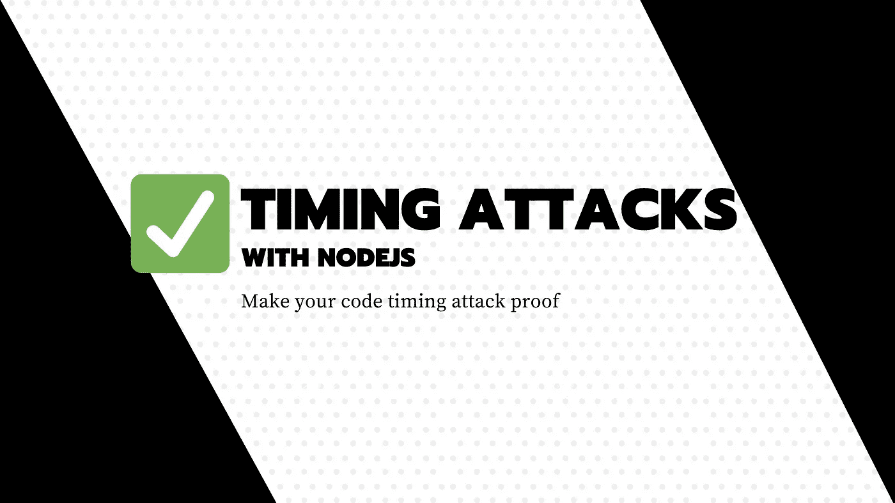
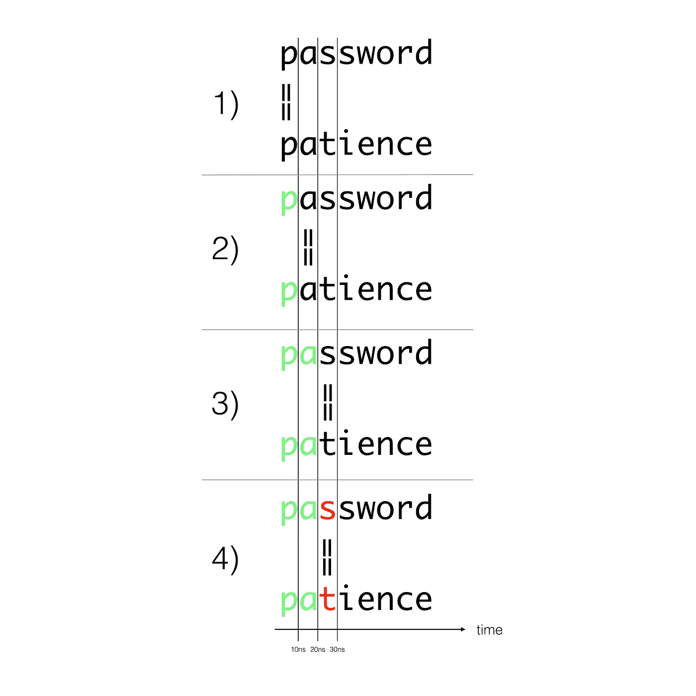

# 什么是计时攻击，如何利用 Node.js 防范？

> 原文：<https://javascript.plainenglish.io/what-are-timing-attacks-and-how-to-prevent-them-using-nodejs-158cc7e2d70c?source=collection_archive---------3----------------------->

## 网络安全

## 直到有人向我证明我的代码易受攻击，我才意识到这个安全漏洞。



在玩 secret 和 network 的时候，你可能会被经典的三重等式验证所诱惑。

假设您有一个 API 路由，它需要一些带有 API 键的报头/有效负载才能被访问(例如:`*4wyU1O!aSZECZXz$1NYymtGBX`)。

我们可能有以下代码:

```
// This is a Typescript file, body is a JSON object with given shape
function onRequest(body: {secret: string}) {
  if(body.secret !== "*4wyU1O!aSZECZXz$1NYymtGBX") {
    throw new AccessDeniedException();
  }

  // Do something else and be considered granted
}
```

乍一看，这段代码看起来完美地工作着，事实上，它正在从根本上工作。真正的真相除了这段代码及其漏洞之外，还要恶毒得多。

这是为什么呢？让我们首先深入了解一下计时攻击的目的以及 Node.js 中字符串比较的行为。

# 什么是定时攻击？

> 在[密码术](https://en.wikipedia.org/wiki/Cryptography)中，**定时攻击**是一种[旁道攻击](https://en.wikipedia.org/wiki/Side-channel_attack)，攻击者试图通过分析执行密码算法所花费的时间来危害[密码系统](https://en.wikipedia.org/wiki/Cryptosystem)。

字符串比较是一个根据输入需要不同时间处理的函数，因此容易受到计时攻击。

在大多数情况下，无论何时你的代码，你都不依赖于外部敏感数据，但是当你比较一些终端用户提供的外部秘密时，比如一个 API 密匙，你可能是脆弱的。

## Node.js 中的字符串比较是如何工作的



当您使用三重等式`===`时，JavaScript 引擎将遍历每个字母并比较相同索引处的字符。**第一次不匹配**，**返回假。**

这意味着如果在后面的字符失败，计算通常会花费更多的时间。

使用这种技术，当一个好的字母匹配时，我们可以检测到处理时间的变化，并且我们可以继续前进，直到我们得到完整的字符串相等。

## 如何防止 Node.js 中的计时攻击？

为了解决这个暴力破解的问题，我们需要一种比较技术，无论是否有字符的早期不匹配，它都需要相同的时间安全。使用安全的比较功能，检查字符串长度的差异，并始终一致地比较所有字符。

这样，比较两个不同的字符串总要花费相同的时间。

在 Node.js 的`crypto`模块中，我们有一个`timingSafeEqual`函数来实现这个目的。这里是一个使用`passport-js`策略实现的例子。

*更多内容看*[***plain English . io***](http://plainenglish.io/)