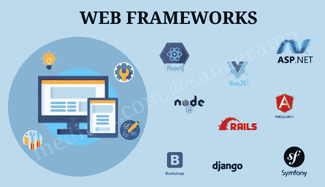

# 什么是 Web 框架？我们为什么要走向他们？

> 原文：<https://javascript.plainenglish.io/what-are-web-frameworks-and-why-should-we-move-towards-them-bbad9eabec1e?source=collection_archive---------15----------------------->

**Web Frameworks**

什么是框架？我脑海中首先想到的是一个**原型**。在一般意义上，它指的是奠定结构的蓝图。

“框架”是一个你更经常看到的与代码相关的词。如果你是 CS 背景的新手，你不会熟悉它的实际用途，如果你已经在这个领域，你可以通过阅读这个博客获得更多的见解。这个博客涵盖了使用框架的目的、它们的类型，同时也象征着向它们发展的必要性。

# 什么是框架？

如果您使用过 web 应用程序，您会发现在整个布局中有许多冗余的功能。所有这些特性都可以由开发人员自己编写，只要他们想构建一个新的应用程序；然而，也有很多工具可以帮助他们实现这一目标。此外，开发人员希望构建以某种方式格式化的应用程序，以帮助他们变得更高效，并帮助其他开发人员理解他们的代码。

所有这些都可以通过使用 Web 框架来完成——帮助他们构建 Web 应用程序，并使用额外的功能，而无需额外的工作。它们提供了一个起点，这样开发人员就可以专注于特性而不是配置细节。或者，我们可以说-

> **“框架是一个真实的或概念性的结构，旨在为构建某种东西提供支持或指导，从而将其结构扩展为有用的东西。”**

— [TechTarget](https://whatis.techtarget.com/definition/framework)

# Web 框架的类型

Web 框架通常分为三个领域——前端、后端和用户界面框架。

1.  用户界面框架:它们有助于创建风格化和专业外观的网络应用程序。它们中的大多数都包含一个网格系统，帮助对齐元素，并使用 CSS 呈现 HTML 组件，这样布局看起来既干净又专业。他们还能流畅地处理配色方案。它们实际上属于前端域；然而，每当我们谈论前端框架时，我们指的是 JavaScript 框架。一些用户界面框架包括:

*   引导程序
*   实现
*   基础
*   语义用户界面
*   索环

根据网站的外观和目标，选择一个完美的 UI 框架通常被认为是个人偏好。不同的风格可能会吸引不同的网站，这取决于它们的目的。

**2。前端框架:**用 JavaScript 编写，用于组织网站的功能性、交互性。其中包括:

*   Vue JS
*   角度 JS
*   反应 JS
*   余烬

前端框架的发展非常迅速，每隔几个月就会有新的前端框架加入到列表中。所以一个开发者应该根据他的需求来学习，而不是“根据趋势”。

**3。后端框架:**它们是用各种编程语言编写的不同类型的框架，包含了广泛的特性。下面是后端框架的几个例子:

*   节点 JS
*   Spring MVC
*   姜戈
*   瓶
*   Ruby on Rails
*   表达
*   流星

除了开发人员期望的特性之外，还基于编程语言选择后端框架。例如，如果开发人员想在网站上添加身份验证(或用户登录)，用 Django 编写会更容易，因为身份验证是内置的。然而，在 Flask 中，开发者需要一个额外的服务。

# 我们为什么要使用框架？

我们应该转向框架有一定的原因，下面是一些原因:

1.  它节省了**的时间和精力**，因为它遵循了易于理解的结构，因为它提高了代码的可读性。
2.  它**通过构建可重复使用的模板而不是重新处理它们来消除冗余。**
3.  它提高了 web 应用程序的**性能**和**效率**，因为它方便了调试和测试。
4.  它有助于应用程序开发生命周期的**原型**、**设计**和**实现**阶段，还简化了 web 应用程序的持续**维护**和增强。
5.  **代码的有组织的结构**和架构有助于更快的开发和提高整体理解，因为它提高了代码的质量。
6.  确保**灵活性**和**定制**，因为改动很小就非常可行。
7.  更多**安全代码**，因为它有内置的安全功能，如 CSRF 保护，SQL 注入等。
8.  它**在节约和努力的同时降低了成本**，因此增加的成本随着时间的推移而成比例减少。

# 结论

所以，如果你已经看完了这篇博客，你现在一定很熟悉框架的目的，它允许设计者和开发者专注于为他们的基于 web 的项目构建一个独特的特性，而不是通过编码来重新发明。创建它们是为了提高 web 应用程序开发任务的性能和效率。根据我们的便利性和任务，我们可以从市场上大量可用的框架中进行选择。

人们应该转向 web 框架，因为它为架构提供了稳定性，节省了时间，并为代码提供了结构，使其易于出错。随着行业的发展趋势，人们应该根据自己的需求选择合适的框架。我认为，选择一个框架不能掉以轻心；这是一个长期的约定。所以，确保您做出了正确的选择！

# 参考

 [## 什么是网络框架，我为什么要使用它？

### “框架”是一个经常与代码相关的词。那么，什么是框架呢？当我们谈论框架时…

welearncode.com](https://welearncode.com/what-are-frontend-frameworks/)  [## web 应用程序框架有多有用？&我如何知道哪个框架适合我？…

### 我们揭示了 web 应用程序框架的独特而显著的特征，并帮助您发现适合您的…

www.cuelogic.com](https://www.cuelogic.com/blog/how-useful-are-web-application-frameworks-how-do-i-know-which-framework-would-suit-me) 

*多内容于* [***浅显易懂***](http://plainenglish.io/)