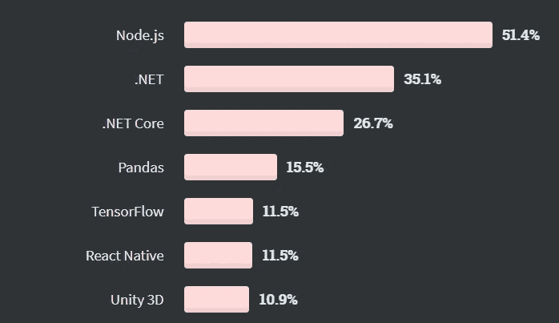

# 用 Node.js 可以构建什么？

> 原文：<https://javascript.plainenglish.io/what-can-you-build-with-node-js-46844adf9148?source=collection_archive---------6----------------------->

## 2021 年给你考虑的一些 Node.js 项目思路。

JavaScript 是世界上最流行的编程语言，Node.js 是将 JavaScript 带到 web 应用程序后端的首选技术。每年，Node.js 都会在受欢迎程度和功能方面不断创新。

随着 Node.js 变得越来越流行，Node.js 开发人员开始使用越来越有挑战性的 Node.js 应用程序。Node.js 应用在规模、商业目标、目标市场和各种技术细节方面都有所不同。但同时，他们都旨在充分利用 Node.js 的销售功能，如高性能或适合基于微服务的架构。在本文中，我将向您展示一些最好的 Node.js 作品，希望它可以为如何创建您自己的 Node.js 项目提供一个思路。

是的……你不会在这里读到世界上最大、最时尚的公司，比如优步、LinkedIn 或易贝，以及他们 Node.js 的故事。这一次，我想向您展示我每天都在做的项目，并通过这个展示 JavaScript 运行时环境与您的业务有多么相关。这些 Node.js 应用程序示例也可能给你一些关于节点应用程序项目的有趣想法。

在此之前，我们先来看看为什么 2020 年可能是 Node.js 有史以来最好的一年，以及为什么它如此重要。

Node.js 主要用于大型 web 应用程序，因此它永远不会取代 PHP 成为 web 上使用最多的技术。不过，值得注意的是，根据 W3Techs 图表显示，Node.js 网站的份额持续增长:

软件开发人员对该技术的采用也是如此，快速浏览一下最新的[堆栈溢出调查](https://insights.stackoverflow.com/survey/2020)就能证明这一点。Node.js 现在是“其他框架、库和工具”类别中最受欢迎的技术，51.4%的受访者承认在某种程度上使用过它。

更重要的是，开发人员只是喜欢使用这项技术，因为它不仅使 JavaScript 编码变得更加令人愉快，而且往往会吸引从技术和商业角度来看都令人兴奋的项目，这种项目是雄心勃勃的软件开发人员最喜欢的。这就是为什么开发人员决定让 Node.js(以及更广泛的 JavaScript)成为任何技术栈的主干。

我一直从事的 Node.js 项目可以很好地表达对这种 JavaScript 技术的投入程度。我们来看看吧！

# 1.用于视频上传和管理的 Node.js 应用程序

Photo by [Joey Huang](https://unsplash.com/@onice?utm_source=medium&utm_medium=referral) on [Unsplash](https://unsplash.com?utm_source=medium&utm_medium=referral)

## 描述

StageClip 是一家总部位于英国的公司，为大学学生提供个性化的毕业典礼视频。由于 COVID 的爆发，他们不得不迅速重新思考他们的业务模式，考虑到现场仪式暂时不会进行。他们提出了虚拟毕业的概念，让学生通过网络应用上传他们的毕业演讲。一个全新的系统需要在非常紧迫的期限内开发出来。

## 节点. js

开发人员在前端使用 React，在后端使用 Node 创建了一个全 JavaScript 的 web 应用程序。它应该能够承受高流量和时变流量。可伸缩性是最重要的。

## 经验教训

对于 Nodejs 开发人员来说，这个项目是在以创纪录的速度开发一个可伸缩的基于 Node.js 的系统。

# 2.使用节点改进内容管理和性能

Photo by [Scott Graham](https://unsplash.com/@homajob?utm_source=medium&utm_medium=referral) on [Unsplash](https://unsplash.com?utm_source=medium&utm_medium=referral)

## 描述

Reservix 是德国最大的售票服务公司之一。他们发现自己需要提高编辑和 web 应用程序用户的工作效率。CMS 必须重新制作。

## 节点. js

Reservix 团队为新的 web 应用程序设计了 UI。开发者在服务器端用 React 和 Node 变成了现实。这个 Node.js 项目依赖 PostgreSQL 进行数据库管理。

## 经验教训

开发人员能够提高他们与客户端外部团队合作的能力，并且能够处理 Node.js 应用程序示例，该示例涉及各种各样的内容类型以及它们之间的复杂关系。

# 3.使用 Node 开发新应用——构建高级框架

Photo by [Marius George Oprea](https://unsplash.com/@mariusoprea?utm_source=medium&utm_medium=referral) on [Unsplash](https://unsplash.com?utm_source=medium&utm_medium=referral)

## 描述

Brickvest 是一家总部位于伦敦的金融科技公司，活跃在房地产行业。他们想出了为合作伙伴创建新的金融科技应用程序的高级框架的想法。这使得加速 MVP 和成熟的金融科技应用程序的开发成为可能。

## 节点. js

Node.js 被用作高度定制系统的基础，该系统还包括作为外部服务网关实现的面向服务的架构。对于数据管理，Node.js 开发人员使用了一个名为 Tesseract 的原始解决方案。它不仅可以响应事件实时推送数据，还可以在不同的服务之间同步数据。

## 经验教训

作为一个独一无二的 Node.js 项目，Brickvest 为 Nodejs 开发团队提供了在金融科技市场工作的机会，并完成了高级框架，该框架拥有现成的模块，可用于开发新的创新型金融科技项目。通过 Node.js 的 web 应用程序，你再也找不到比这更好的 fintech 开发速成班了！

# 摘要

Photo by [Thái An](https://unsplash.com/@johnn21?utm_source=medium&utm_medium=referral) on [Unsplash](https://unsplash.com?utm_source=medium&utm_medium=referral)

如您所见，随着时间的推移，您可以通过服务器端 Node.js 开发获得越来越多的收益。在本文中，我向您展示了以下示例:

*   面向个人用户的高度可伸缩的 web 应用程序。
*   针对各种类型用户的复杂管理系统的服务器端 Node.js 应用示例。
*   一个高层次的金融科技开发框架。

使用 Node.js web server 可以做的事情还很多。如果你已经有了一个令人兴奋的想法，可以成为一个新的节点项目，那就试试吧。让我们制作新的 Node.js 项目，并在未来发展我们的知识。

*更多内容尽在*[*plain English . io*](http://plainenglish.io/)