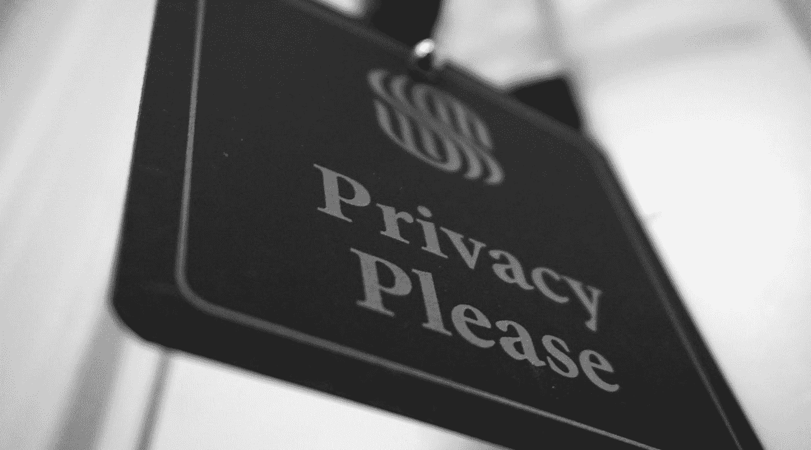

# 不使用浏览器 Cookies 您可以跟踪什么？

> 原文：<https://javascript.plainenglish.io/what-can-you-track-without-using-browser-cookies-9a74847a89fb?source=collection_archive---------6----------------------->

## 分析你的网站而不违反 GDPR



Photo by [Jason Dent](https://unsplash.com/@jdent?utm_source=medium&utm_medium=referral) on [Unsplash](https://unsplash.com?utm_source=medium&utm_medium=referral)

WhatsApp 改变了政策，现在将与脸书共享数据。谷歌浏览器对第三方 cookies 的支持将于 2022 年结束。每个人都在谈论隐私。似乎，在趋势中，你必须忘记 cookies，将用户隐私放在功能之上。但是我能追踪到什么而不侵犯 GDPR 或 CCPA 呢？从我的项目中删除谷歌分析后，我问了自己这个问题。

# 浏览器缓存

2011 年，第一次尝试跟踪没有 cookies 的用户。分析平台 Kissmetrics 找到了一种方法，即如何通过浏览器缓存识别用户。

主要思想是使用 Etag 作为标识符。它是站点缓存文件的校验和。这就是浏览器检测网站更新的方式。对于每个用户，校验和是不同的，所以它可以用作唯一的标识符。

没关系，你是否使用匿名模式。你是否允许网站跟踪你？是否启用了虚拟专用网或代理？如果您没有禁用缓存，网站可以标记您并跟踪您的所有活动。您知道有多少人禁用了他们的缓存？我也不认识他们。这就是为什么这种跟踪方法非常有用。

但是有些人不满意这个平台如何跟踪用户。因为您不能按下按钮并清除您的数据，并且您不能不允许跟踪而不对性能产生负面影响。2012 年，他们起诉，法官站在他们一边。这种方法是禁止的。该公司支付了 51 万美元，并被关闭。

这种方法即使在今天仍然有效，100%准确**，但看起来不是最佳选择。**

# LocalStorage

使用本地存储网站肯定可以跟踪用户，但这不适用于像谷歌分析这样的分析服务，因为脚本不能在一个网站上存储数据，在另一个网站上读取数据。

所以对于一个网站来说，如果你对评论不感兴趣，这是一个很好的解决方案。您可以生成一个唯一的令牌，将其放入存储中，并通过该令牌跟踪您的用户。

但是，如果您需要一个功能强大的分析平台，能够检测您在不同网站上的用户，建立受众群并提供评论功能，该怎么办？这样的平台如何跟踪用户？

# 浏览器指纹识别

目前，在我看来，追踪用户最迷人的方式是浏览器指纹识别。使用 JavaScript，您可以获得关于用户、用户设置和硬件的公共数据。这些参数的组合可以以 **99%** 的准确度识别用户。它以隐姓埋名的方式工作，并不违反 GDPR。

听起来不现实？让我向您展示一个数据示例，它可以将您标识为唯一的访问者。

## **航海家.用户代理**

```
Mozilla/5.0 (Macintosh; Intel Mac OS X 10_15_6) AppleWebKit/605.1.15 (KHTML, like Gecko) Version/14.0.2 Safari/605.1.15
```

当然，这是第一个检查的地方。传递以下信息的变量:

*   浏览器名称
*   浏览器版本
*   平台

在**∞*55***浏览器中有一个有这个值。

## 导航器.插件

```
Plugin 0: WebKit built-in PDF; ; ; (Portable Document Format; application/pdf; pdf) (PostScript; application/postscript; ps) (Portable Document Format; text/pdf; pdf)
```

关于已安装浏览器插件的信息。也可以取自`window.navigator`对象。

**≈76** 浏览器中有一个有这个值。

## **HTTP 头**

```
text/html, */*; q=0.01 gzip, deflate, br en-us
```

转发以下信息的标头:

*   浏览器可以处理什么类型的内容。数据格式和首选语言。

**≈18** 浏览器中有一个有这个值。

## **系统字体**

```
Andale Mono, Arial, Arial Black, Arial Hebrew, Arial Narrow, Arial Rounded MT Bold, Arial Unicode MS, Comic Sans MS, Courier, Courier New, Geneva, Georgia, Helvetica, Helvetica Neue, Impact, LUCIDA GRANDE, Microsoft Sans Serif, Monaco, Palatino, Tahoma, Times, Times New Roman, Trebuchet MS, Verdana, Wingdings, Wingdings 2, Wingdings 3 (via javascript)
```

坦率地说，我相信没有人使用这个指标，因为它大大降低了网站的性能。这个想法是用一个小的文本字符串显示一个 span 标签。然后从已知的字体列表中更改字体，并检查应用的跨度几何图形(宽度和高度)。

**≈16** 浏览器中有一个有这个值。

## **画布或 WebGL 指纹的哈希**

`e889dfb1c44b9beb8d7c6fe292d92269`

在大多数情况下，只有这一个指标可以检测用户并在所有站点来宾之间跟踪他。我们可以在 canvas/WebGL 元素上绘制一些形状，将结果序列化并散列。

**≈431** 浏览器中有一个有这个值。

接下来的参数相当简单，我相信不需要解释。我将只提供一个参数名称和精度。

## **时区**

`Europe/Kiev`

**≈114** 浏览器中有一个有这个值。

## **屏幕尺寸和深度**

`1440x900x24`

**≈32** 浏览器中有一个有这个值。

## **语言**

`en-Gb`

**≈12** 浏览器中有一个有这个值。

## **首选配色方案**

`window.matchMedia(‘(prefers-color-scheme: dark)’); // True or False`

**≈3** 浏览器中有一个有这个值。

这不是可以跟踪的参数的完整列表。但是剩下的就没那么独特了，经常在用户之间见面。

以下是一些例子:

*   不跟踪标题已启用
*   平台
*   触摸支持
*   广告拦截器已启用
*   本地存储/会话存储可用性

正如你所看到的，他们中的一些可以足够准确地标记用户。想象一下它们的组合。站点可以将多个指标组合成一个字符串，然后生成校验和。这将是用户的唯一标识符，此外，该网站可以跟踪 IP 地址，但它可以避免与 VPN 或代理。

# 结论

GDPR 和即将到来的 cookie 功能的削减不会在不久的将来改变市场。因为我很确定，像 Google Analytics 这样的平台已经做好了没有 cookies 也能工作的准备。您已经可以在禁用 cookies 标志`window[‘ga-disable-UA-XXXXXX-Y’] = true;`的情况下使用分析。但是尊重用户隐私的小型分析服务肯定能分一杯羹。

**感谢阅读！**