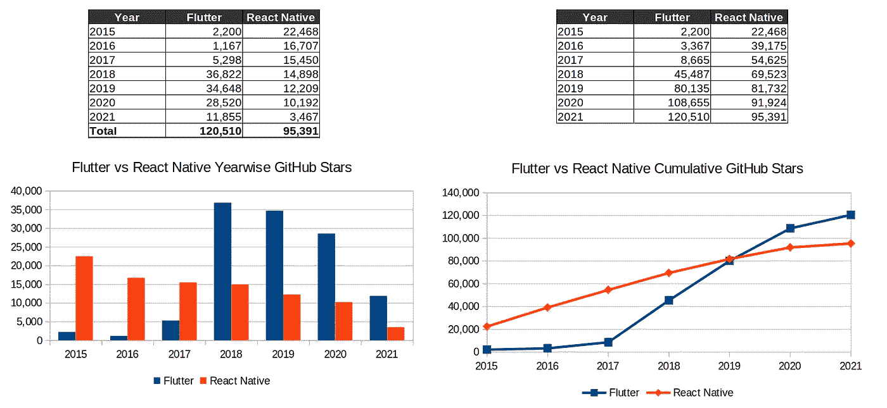

# GitHub 明星们对「Flutter vs React Native」怎么看？

> 原文：<https://javascript.plainenglish.io/what-do-github-stars-say-about-flutter-vs-react-native-df4143094a82?source=collection_archive---------4----------------------->

Photo by [Immo Wegmann](https://unsplash.com/@macroman?utm_source=unsplash&utm_medium=referral&utm_content=creditCopyText) on [Unsplash](https://unsplash.com/s/photos/dart?utm_source=unsplash&utm_medium=referral&utm_content=creditCopyText)

GitHub 星是表示欣赏或兴趣的标志。有些人认为 GitHub stars 仅仅是书签(或机器人入口)，对此我不同意。

Flutter 和 ReactNative 将继续存在，并拥有自己的使用案例和社区基础。博客的想法是分析从 JavaScript 社区到 Flutter (Dart)的交叉。

Java vs Kotlin，JavaScript vs TypeScript，同样 JavaScript vs DART 在学习方面也不是很大的挑战。最近，JavaScript 社区已经优雅地接受了 TypeScript 进入他们的生态系统。

学习一门新语言不会成为接受一个新框架的障碍，只要这个框架能提供一些好的东西。

> 有几个 Flutter vs React 的原生博客和视频突出了利弊。现在，我将跳过细节。

下面提供了基于 GitHub stars 的统计数据

GitHub Stars

**推论**

*   Flutter 每年有稳定的 **3 万开发者流入**。ReactNative 每年有 12000 到 15000 名新用户。
*   根据过去三年的趋势，Flutter 的接受者比 React Native 多 3 倍——**75k 对 25k**

下面提供的细节基于使用 GitHub GraphQL API 收集的数据

在 12 万颗恒星中

*   20k 是由激进的人主演的
*   24k 由 Vue 乡亲主演
*   23k 由 React 乡亲主演
*   总的来说，41k 是由 JavaScript 人主演的

**总结**

我已经决定加入这场战斗。我们做了一些分析来仔细检查 JavaScript 开源社区的观点。在后续的博客中，我将从 JavaScript 开发者的角度分享我学习 Flutter 的历程。

*更多内容请看*[*plain English . io*](http://plainenglish.io/)