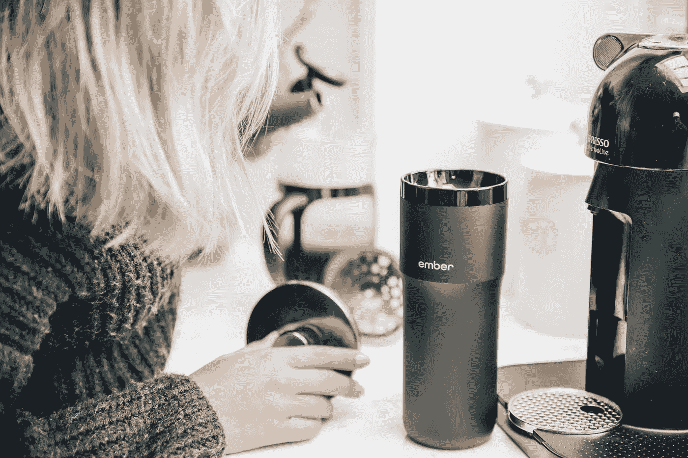
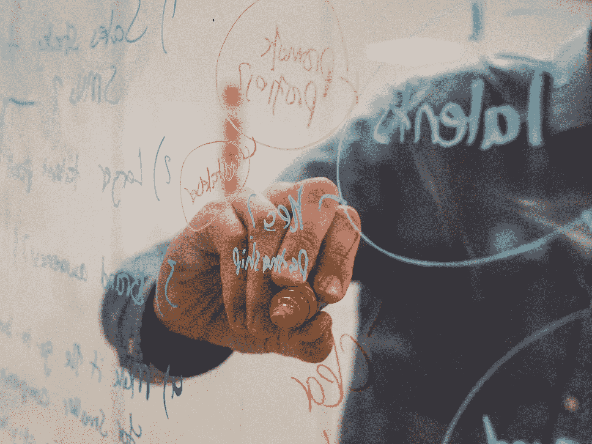

# 你送程序员什么礼物？

> 原文：<https://javascript.plainenglish.io/what-do-you-gift-to-programmers-87fea52b86ba?source=collection_archive---------5----------------------->

## 能给任何程序员的生活带来额外欢乐的礼物。

Photo by [Nina Mercado](https://unsplash.com/@nina_mercado?utm_source=medium&utm_medium=referral) on [Unsplash](https://unsplash.com?utm_source=medium&utm_medium=referral)

随着假期的临近，我想用每个人都能想到的一个独特的类别编制一份清单。

无论你是打算送给朋友还是自己，这些礼物想法永远不会让你失望。

# 背部按摩器

Photo by [Keenan Constance](https://unsplash.com/@keenangrams?utm_source=medium&utm_medium=referral) on [Unsplash](https://unsplash.com?utm_source=medium&utm_medium=referral)

坐在桌子上，弓着身子敲键盘，这份礼物可以帮助缓解背部和颈部疼痛。

[https://www . Amazon . ca/Comfier-肩部-按摩器-揉捏-按摩器](https://www.amazon.ca/Comfier-Shoulder-Massager-Kneading-Massager/dp/B07QNN19XJ/ref=sr_1_1_sspa?keywords=Comfier-Shoulder-Massager-Kneading-Massager&qid=1640096069&sr=8-1-spons&psc=1&spLa=ZW5jcnlwdGVkUXVhbGlmaWVyPUEzQ1FLSEdIWFIwOFpYJmVuY3J5cHRlZElkPUEwMjc1NjA5MVk1WlZRQUJXWDNCUSZlbmNyeXB0ZWRBZElkPUEwMDMxMzg2TFFVSVdRVDVFU0NEJndpZGdldE5hbWU9c3BfYXRmJmFjdGlvbj1jbGlja1JlZGlyZWN0JmRvTm90TG9nQ2xpY2s9dHJ1ZQ==)

# 旅行杯

Photo by [Taylor Beach](https://unsplash.com/@taylor65s?utm_source=medium&utm_medium=referral) on [Unsplash](https://unsplash.com?utm_source=medium&utm_medium=referral)

你们大多数人都知道程序员的必需品是咖啡，旅行杯是他们每天早上都会用到的完美礼物。

[https://www . Amazon . ca/spoon tiques-Positive-Affirmations-Travel-White/](https://www.amazon.ca/Spoontiques-Positive-Affirmations-Travel-White/dp/B00876AP4K/ref=sr_1_8?keywords=mug%2Btravel&qid=1639666079&sr=8-8&th=1)

# 桌灯

Photo by [Chang Duong](https://unsplash.com/@iamchang?utm_source=medium&utm_medium=referral) on [Unsplash](https://unsplash.com?utm_source=medium&utm_medium=referral)

程序员喜欢在晚上写代码，台灯是他们专注于代码和错误斗争的完美礼物。

[https://www . Amazon . ca/juk stg-Eye-care-Brightness-Lighting-Touch-Sensitive](https://www.amazon.ca/Spoontiques-Positive-Affirmations-Travel-White/dp/B00876AP4K/ref=sr_1_6?keywords=Spoontiques-Positive-Affirmations-Travel-White%2F&qid=1640096097&sr=8-6)

# 班长

Photo by [Mohammad Rahmani](https://unsplash.com/@afgprogrammer?utm_source=medium&utm_medium=referral) on [Unsplash](https://unsplash.com?utm_source=medium&utm_medium=referral)

程序员喜欢进行多任务处理，拥有多个显示器可以让他们自由地在一边查看代码，在另一边查看执行。这对他们来说是一份完美而珍贵的礼物。

[https://www.amazon.ca/Acer-SB220Q-Ultra-Thin-Frame-Monitor](https://www.amazon.ca/JUKSTG-Eye-Caring-Dimmable-Brightness-Studying/dp/B07QFWD274/ref=sr_1_2?keywords=JUKSTG-Eye-Caring-Brightness-Lighting-Touch-Sensitive&qid=1640096137&sr=8-2)

# 降噪耳机

Photo by [Alireza Attari](https://unsplash.com/@alireza_attari?utm_source=medium&utm_medium=referral) on [Unsplash](https://unsplash.com?utm_source=medium&utm_medium=referral)

当我们生活在在家工作的文化中时，当你受到别人的干扰时，这个小玩意就变得至关重要。除此之外，程序员可以不受干扰地倾听并专注于他们自己的工作。

[https://www . Amazon . ca/索尼-WH-1000 xm4-取消-耳机-WH1000XM4](https://www.amazon.ca/Sony-WH-1000XM4-Canceling-Headphones-WH1000XM4/dp/B0863TXGM3/ref=sr_1_3?crid=22P1DGFCKOLCQ&keywords=Sony-WH-1000XM4-Canceling-Headphones&qid=1640096200&sprefix=sony-wh-1000xm4-canceling-headphones%2Caps%2C75&sr=8-3)

# 书

Photo by [Sincerely Media](https://unsplash.com/@sincerelymedia?utm_source=medium&utm_medium=referral) on [Unsplash](https://unsplash.com?utm_source=medium&utm_medium=referral)

有时候，书籍可能是给他们的完美礼物，可以帮助他们了解和探索更多关于编程的世界。

[https://www . Amazon . ca/practical-Programmer-journey-mastery-纪念日](https://www.amazon.ca/Pragmatic-Programmer-journey-mastery-Anniversary/dp/0135957052/ref=sr_1_1?keywords=Pragmatic-Programmer-journey-mastery-Anniversary&qid=1640096220&sr=8-1)

# 干爽板/垫

Photo by [Kvalifik](https://unsplash.com/@kvalifik?utm_source=medium&utm_medium=referral) on [Unsplash](https://unsplash.com?utm_source=medium&utm_medium=referral)

白板是程序员集思广益和绘制图表的完美礼物。

[https://www . Amazon . ca/Quartet-Desktop-Computer-Frameless-GDP 186/](https://www.amazon.ca/Quartet-Desktop-Computer-Frameless-GDP186/dp/B01M2DADUX/ref=sr_1_1?keywords=Quartet-Desktop-Computer-Frameless-GDP186&qid=1640096255&sr=8-1)

# 监控记事本

Photo by [Ravi Palwe](https://unsplash.com/@ravipalwe?utm_source=medium&utm_medium=referral) on [Unsplash](https://unsplash.com?utm_source=medium&utm_medium=referral)

众所周知，我们有很多便利贴，所以不要忘记任务。让监控记事簿变得很酷，并且可以根据优先级进行组织。

[https://www . Amazon . ca/LRZCGB-Transparent-Reminder-Computer-Monitors](https://www.amazon.ca/LRZCGB-Transparent-Reminder-Computer-Monitors/dp/B075FQ2QNB/ref=sr_1_6?keywords=Transparent-Reminder-Computer-Monitors&qid=1640096274&sr=8-6)

# 站立书桌

Photo by [TheStandingDesk](https://unsplash.com/@thestandingdesk?utm_source=medium&utm_medium=referral) on [Unsplash](https://unsplash.com?utm_source=medium&utm_medium=referral)

长时间坐在同一个座位上很累？这份礼物有助于抵御工作。站着工作比长时间坐着更有帮助。

[https://www . Amazon . ca/VIVO-可调节-转换器-工作站-桌面-V000K](https://www.amazon.ca/VIVO-Adjustable-Converter-Workstation-DESK-V000K/dp/B075JYG2TB/ref=sr_1_5?keywords=VIVO-Adjustable-Converter-Workstation-DESK-V000K&qid=1640096306&sr=8-5)

# 蓝光眼镜

Photo by [JESHOOTS.COM](https://unsplash.com/@jeshoots?utm_source=medium&utm_medium=referral) on [Unsplash](https://unsplash.com?utm_source=medium&utm_medium=referral)

如果你或你的朋友长时间使用电脑，这个礼物可以帮助放松眼睛。

https://www.amazon.ca/[遇见阳光遮挡头痛电脑透明](https://www.amazon.ca/MEETSUN-Blocking-Headache-Computer-Transparent/dp/B087TLQR46/ref=sr_1_1_sspa?crid=3QGOQIY51XYAF&keywords=MEETSUN-Blocking-Headache-Computer-Transparent&qid=1640096326&sprefix=meetsun-blocking-headache-computer-transparent%2Caps%2C85&sr=8-1-spons&psc=1&smid=ARUEKKLFGKQL9&spLa=ZW5jcnlwdGVkUXVhbGlmaWVyPUEzSExRMDNLSUs3RUNEJmVuY3J5cHRlZElkPUEwODU2NjI4MlhVRjRFMzgwWlNSRiZlbmNyeXB0ZWRBZElkPUEwODU0MTUwNllIWjBUQkdEWjBGJndpZGdldE5hbWU9c3BfYXRmJmFjdGlvbj1jbGlja1JlZGlyZWN0JmRvTm90TG9nQ2xpY2s9dHJ1ZQ==)

# Gaiam 平衡球椅

Photo by [Jin Cheng](https://unsplash.com/@catially?utm_source=medium&utm_medium=referral) on [Unsplash](https://unsplash.com?utm_source=medium&utm_medium=referral)

长时间坐着会影响健康。这把椅子很有帮助，因为即使我们坐着，它也能提供一些身体运动。他们还声称这可以提高生产率。

https://www.amazon.ca/Gaiam-Classic-Balance-Ball-Chair

# 书呆子袜子

Photo by [Nick Page](https://unsplash.com/@nickpage?utm_source=medium&utm_medium=referral) on [Unsplash](https://unsplash.com?utm_source=medium&utm_medium=referral)

程序员喜欢书呆子气，这可以是向他人展示的完美礼物，也可以让他们感到温暖。

【https://www.amazon.com/K-Bell-Occupation-Novelty-Socks 

# 烦躁玩具

Photo by [Charles Deluvio](https://unsplash.com/@charlesdeluvio?utm_source=medium&utm_medium=referral) on [Unsplash](https://unsplash.com?utm_source=medium&utm_medium=referral)

有时候，像办公桌旁的减压装置这样的小东西可能是任何人都想要的完美的东西，也是最好的礼物。

[https://www . Amazon . com/Infinity-坐立不安-旋转器-焦虑-手指](https://www.amazon.ca/PILPOC-theFube-Fidget-Cube-Infinity/dp/B076CQLLND/ref=sr_1_1_sspa?crid=2H78C9PFSJ1C9&keywords=infinity+fidget+cube&qid=1640096543&sprefix=infinity+fidget%2Caps%2C102&sr=8-1-spons&psc=1&spLa=ZW5jcnlwdGVkUXVhbGlmaWVyPUExWTVCTTdPMllTTTVRJmVuY3J5cHRlZElkPUEwMjg5MDkyMzBGVkQ4V0lBNEFKUCZlbmNyeXB0ZWRBZElkPUEwNjY0MTQ5MVpQUkJEUE8xM0E5WiZ3aWRnZXROYW1lPXNwX2F0ZiZhY3Rpb249Y2xpY2tSZWRpcmVjdCZkb05vdExvZ0NsaWNrPXRydWU=)

# 滑动笔记本电脑清洁器

Photo by [Lauren Mancke](https://unsplash.com/@laurenmancke?utm_source=medium&utm_medium=referral) on [Unsplash](https://unsplash.com?utm_source=medium&utm_medium=referral)

他们中的大多数人没有时间清理笔记本电脑。如果你送一件小巧精致的礼物，比如笔记本电脑清洁剂，会怎么样？

[https://www.amazon.com/OXO-Grips-Sweep-Laptop-Cleaner](https://www.amazon.ca/LUTER-Keyboard-Eco-Friendly-Practical-Telescopic/dp/B09F2J2Q9L/ref=sr_1_3_sspa?crid=3F71IMRP08KNV&keywords=laptop+cleaner+brush&qid=1640096627&sprefix=laptop+cleaner+b%2Caps%2C86&sr=8-3-spons&psc=1&spLa=ZW5jcnlwdGVkUXVhbGlmaWVyPUEzQk5PU1FZN0FXVkxKJmVuY3J5cHRlZElkPUEwOTU1NjY2MTlFWFdZOTlWUlRWRiZlbmNyeXB0ZWRBZElkPUEwMjIwNzk4MUpaODMwMFNSUlk4MCZ3aWRnZXROYW1lPXNwX2F0ZiZhY3Rpb249Y2xpY2tSZWRpcmVjdCZkb05vdExvZ0NsaWNrPXRydWU=)

是啊，太多想法了。如果你想提出任何新的礼物想法，请在评论区随意添加。我一定会把它添加到列表中。

Photo by [Sincerely Media](https://unsplash.com/@sincerelymedia?utm_source=medium&utm_medium=referral) on [Unsplash](https://unsplash.com?utm_source=medium&utm_medium=referral)

*更多内容看* [***说白了. io***](http://plainenglish.io/) ***。*** *报名参加我们的* [***免费每周简讯这里***](http://newsletter.plainenglish.io/) ***。***