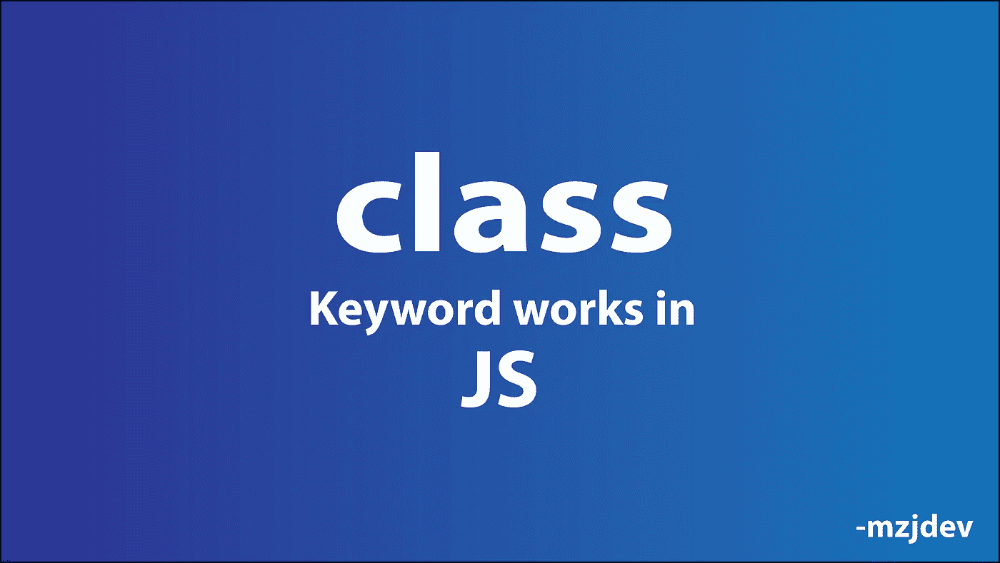

# Javascript 中的类到底是什么？

> 原文：<https://javascript.plainenglish.io/what-exactly-is-a-class-in-javascript-c51eb65bdf61?source=collection_archive---------18----------------------->

## 一个类如何在幕后工作— JavaScript



## 我为什么要写这个？

在 Javascript 中，`Classes` 的行为与其他语言不同。结果，我们经常遇到问题，因为我们认为`classes` 和其他语言中的一样。

现在 React 流行了，我们经常会碰到这样的问题。因此，React 引入了功能组件。所以，理解 JavaScript 中的`class` 非常重要。今天，我们将了解 JavaScript 中的类到底是什么。

## 期待什么？

*   JavaScript 中的对象创建
*   工厂功能
*   构造函数
*   `class`在 JavaScript 中

## JavaScript 中的对象创建

一个`class` 的主要目的是创建对象。在 JavaScript 中有 4 种创建对象的方法。

*   对象文字
*   工厂功能
*   构造函数
*   班级

要理解 JavaScript 中的`class` ，我们必须知道使用工厂函数和构造函数创建对象。

## 工厂功能

```
var circleFunctions = {
    draw:function(){
         console.log("draw")
    }
}
function createCircle(radius){
         var newCircle = Object.create(circleFunctions);
         newCircle.radius = radius;
         return newCircle;
}
var circle = createCircle(5);
circle.draw()  // draw
```

`Object.create(obj)`返回一个空对象，该对象带有一个作为参数传递的链接。

`var newCircle = Object.create(circleFunctions)`

上面的代码行将在`circleFunctions` 和`newCircle` 之间建立一个链接。在上面一行之后，我们将有一个空对象，它有一个到`circleFunctions`的链接，分配给`newCircle` 。该链接存储在`__proto__`中。即:

`newCircle={__proto__:circleFunctions}`

`var circle = createCircle(5)`

在上面一行之后，

```
circle={
       radius:5,
       __proto__:circleFunctions
}
```

当我们访问`circle` 对象上的`draw` 方法时，Javascript 将在`circle` 对象内寻找`draw` 方法。显然，`circle` 对象内部没有定义 draw 方法。JavaScript 不止于此。相反，它在分配给`__proto__` 属性的对象中寻找`draw` 方法。JavaScript 引擎可以在那里找到`draw` 方法。这就是我们如何得到`“draw”`作为输出。

我们在 JavaScript 中将`circleFunctions`称为`prototype`。

## 构造函数

```
function Circle(radius){
        this.radius = radius
}
Circle.prototype.draw=function(){
       console.log("Draw")
}var circle = new Circle(5);
circle.draw()// Draw
```

我们需要一个`new` 关键字来正确调用构造函数。按照惯例，我们使用 pascal 命名方法来命名构造函数。这里，`new` 关键字为我们做了几件事。基本上，它做这 4 件事:

*   创建一个新的空对象，即`{}`
*   将新创建的空对象分配给`this`关键字，即`this = {}`
*   在`this`和`prototype`对象之间建立链接，即`this = {__proto__:Circle.prototype}`
*   返回`this`

如果你想深入了解`new`关键词，可以参考下面这篇文章:

[](/how-exactly-new-keyword-works-in-javascript-af3abf238f8a) [## JavaScript 中的“new”关键字到底是如何工作的？

### 本文的目的是展示 JavaScript 中的“new”关键字如何让我们作为开发人员的生活变得更加轻松。

javascript.plainenglish.io](/how-exactly-new-keyword-works-in-javascript-af3abf238f8a) 

`var circle = new Circle(5)`

当我们到达上面的行时，我们将有一个属性为`radius`的对象和一个到`Circle.prototype`的链接，

```
circle = {
       radius:5,
       __proto__:Circle.prototype
}
```

现在，如果我们在`circle` 对象上调用`draw` 方法，JavaScript 引擎不会在`circle` 对象中找到`draw` 方法。它继续在 `__proto__`中搜索并找到 draw 方法。

## 班级

```
class Circle{
      constructor(radius){
             this.radius = radius
      }
      draw(){
             console.log(“Draw”)
      }
}
var circle = new Circle(5);
circle.draw()//"Draw"
```

`class Circle`中的`draw`方法实际上是分配给`Circle.prototype.draw`的。

上面的代码段和下面的代码段是一样的。

```
function Circle(radius){
        this.radius = radius
}
Circle.prototype.draw=function(){
       console.log("Draw")
}var circle = new Circle(5);
circle.draw()// Draw
```

`class` 只是构造函数的语法糖。当涉及到分类的时候，这让我们的世界变得简单多了。

## 结论

JavaScript 中的类只不过是构造函数的语法糖。它隐藏了所有的复杂性，并为我们自动化了几件事情。这样，我们的代码就更加简单和清晰。

*更多内容请看*[***plain English . io***](http://plainenglish.io/)