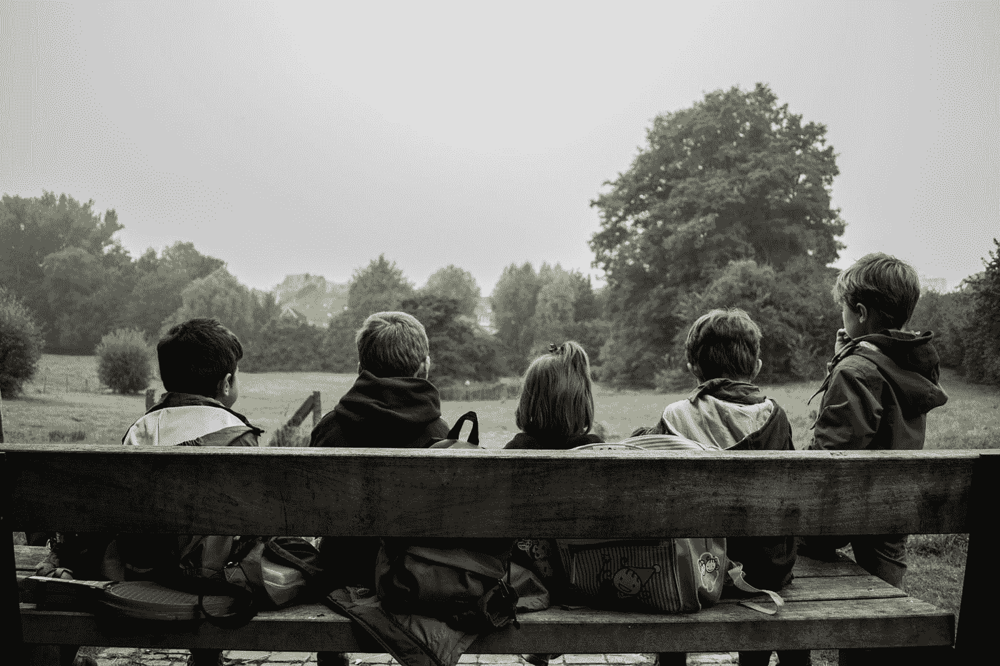

# 如果编程语言是孩子会怎样

> 原文：<https://javascript.plainenglish.io/what-if-programming-languages-were-children-4a29bc5a061?source=collection_archive---------12----------------------->

## 他们是什么样的人，他们应该如何成长。

Photo by [Piron Guillaume](https://unsplash.com/@gpiron?utm_source=medium&utm_medium=referral) on [Unsplash](https://unsplash.com?utm_source=medium&utm_medium=referral)

关于编程语言动画化的幻想话题已经完全从我们的博客中消失了。所以是时候回归它了，想象语言变成了孩子。

# 语言

有时候你会觉得这个女孩是在军事实验室长大的。她说话的方式很奇怪。没有漂亮衣服的问题，根据 RGB 图，非常准时，迂腐。所有的铅笔都有序地放在她的铅笔盒里。朋友是合适的。

教育只有一个明显的好处:你让她做什么她就做什么。但是，与此同时，当请求表述不正确、不准确、不完整时，Ada 将每次都进行纠正。

# 汇编语言

幼儿园保育员组的孩子。他认识单个单词，但他最多能在一个句子中加上 3 个。他混淆性别，时间，一般会创造出违背逻辑的怪事，这很正常。

为人父母是一个复杂的过程。从字面上看，就是手指上最简单的东西也要解释，还要检查几遍执行情况。然后当然可以教他解高等数学例题，但是等他长大了就容易多了。

# 脑残

本地傻逼。但是，作为一个坏影响的经典例子，孩子们喜欢他。他们不断地叫他去院子里玩。他发誓——他们大笑。所以，很自然地，他没有机会上学，也没有机会在未来找到一份收入丰厚的工作，但他似乎一点也不在乎。

教育他为时已晚，但你让 Brainfuck 把导数出界，就能看到纯洁心灵的光芒。但是，由于这家伙的词汇单调，他会很快厌倦。

# C

这个男孩昨天学会了按字面意思说话，今天他已经读了很多聪明的书，并不断使用长动词结构。对话已经失去了令人愉快的天真，但这个家伙卷入了关于政治和经济的争论。在教养上，要有耐心，不要中途断理。所以孩子会比同龄人更快地吸收信息。用正确的方法，他将成长为一个伟大的聪明，同学们将不得不不断地注销测试，以有时间在调用之前移交工作。真的，这样不会给他加好友。

# C ++

这个家伙可能长大后会像 C 一样，但他的父母很快厌倦了他的长篇大论。他们教他用皮带和胡萝卜的方法用更短的方式表达思想，让孩子更有吸引力。真的，从这一点，他失去了一点思考的速度。为了不让孩子产生自卑感，有必要最大限度地利用他的智力。他数学和绘画都很好。然而，他不太可能取得突出的成绩。

# C#

他走来走去，告诉他的同学，当其他人都不能把两个词放在一起时，他是如何在幼儿园背诵长诗的。今天，他也一样聪明，但还没有聪明到可以夸耀的地步。因此，由于他的父母，他逃脱了一切。他想要什么，他们就给他买什么，不管是新电脑、虚拟现实眼镜还是手机。也就是说，开发 C#相当容易。他带着感激的心情接受礼物，互相摸索很久，很少摔坏东西。如果它坏了，谁在乎呢？

# visualbasic 语言

C#的大哥，有不是原生的嫌疑。小时候，他是一个不错的男孩，但在某个时候，他选择了错误的环境——他的性格开始迅速恶化。他不断地在父亲的车库里翻找，给朋友修自行车，并没有真正思考过自己的未来。

有时候好像他有虚构的朋友。和他在一起的父母老师都不容易。有时候它是一个很棒的孩子，聪明又机智。但是当他不知道问题的答案或者只是累了的时候，你就会知道这个角色的另一面。

# Java 语言(一种计算机语言，尤用于创建网站)

这个地区最受欢迎的女孩之一。她设法既聪明又有趣。她的口袋里总是装满了口香糖，她的脑子里充满了找乐子的想法。但最重要的是，她从不疲倦或气馁。

她喜欢学习，但并不是说她能快速掌握一切。有时候，她会惹恼老师和家长，让他们陪她一起健身，检查她的作业。然而，由于其性质，Java 接触不良公司的可能性往往为零。最有可能的是，一个光明的未来在等着她。

# Java Script 语言

在幼儿园的时候，他和 Java 很友好，后来就分道扬镳了。作为一个男孩，他的房间里堆满了构造器——JavaScript 喜欢用零件组装机器人，并在它们之间播放战斗场景。然而，他的爱好也有不好的一面——房间里的整个地板都散落着小细节，所以进去会很痛苦。

JavaScript 是一个非常聪明的家伙。对他来说，抓住问题的实质，吸收大部分信息并不困难，但有时他会在细节上感到困惑。幸运的是，当他在学校的时候，这并不重要。

# 斯卡拉

这个女孩是她父母的骄傲。她很容易拒绝欺负她的男孩，学习很好，甚至去学校参加奥林匹克竞赛，从表面上看，她是可爱和令人愉快的。然而，她并不努力出名——首先，她不想，其次，她完全明白她的大多数同学不会理解她。

然而，在找到与女儿的共同语言之前，父母不得不担心很多，打破了他们的习惯。刚开始，同龄人对 Scala 的认知是谨慎的(而且不仅仅是因为名字)，但是聊得更好了，他们才明白这是一个多么美好的孩子。

# 计算机编程语言

一个极其冷静的孩子，不太合群，但他知道如何给人惊喜。大概，学校里每个人都有一个家伙，在数学课上走到黑板前，在心灵的宫殿里翻找了一会儿，然后不写一个动作就给出了正确答案。或者他可以用手画一个完美的圆。这是 Python。

父母明明是飞车党，不然怎么解释这样的名字。显然，他的性格特征就是从这里产生的。他非常聪明，但总是犹豫不决，不敢大声说出自己的理由。在沟通和教育中，记住这一点很重要，然后一切都会好的。

# 红宝石

这个可爱的娘娘腔不断欺负 Python。可以理解，本质上是差不多的，只是 Ruby 天赋少很多。她对精确科学一无所知，但她不在乎。创造力是主要的激情。她喜欢鲜艳的服装。最重要的是它们不是大众市场。因为她清楚地知道自己想要什么，所以她的父母对她的教育没有任何问题。和她谈话总是很有趣。她总是听取建议，因为她的技能而乐于助人。

# 服务器端编程语言（Professional Hypertext Preprocessor 的缩写）

小丑和快乐的家伙。她喜欢角色扮演游戏，不管是龙与地下城还是只有邮递员。由于他持续的热情和不寻常的个性，邻居的男孩觉得他很奇怪。但是朋友们喜欢——和他在一起永远不会无聊。

教育家和老师都不太喜欢他，注意力太分散。但父母崇拜任何指出教养或性格缺点的人，并准备与之争吵。

# 咬舌

他喜欢教周围的每个人。3 岁时，他教院子里的狗伸出爪子，躺下并吠叫。4 岁时，他给幼儿园老师写了如何准备散步的说明。5 岁时，他起草了一份给管理公司的 28 点请愿书，指出了维修院子的缺点。6 岁时，我从盒子里拿出一个朋友，因为没有人想和他交流。最后，他答应在 7 点前教他说话。而且看起来他会成功。

试图教 Lisp 本身完全没用。你只能把下一个绝妙的点子扔给他，默默观察过程。有时候这很有意思。

你的编程语言是什么样的孩子？

*更多内容尽在*[***plain English . io***](http://plainenglish.io/)