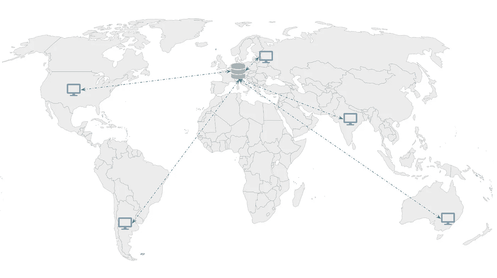

# 什么是内容交付网络(CDN)？

> 原文：<https://javascript.plainenglish.io/what-is-a-content-delivery-network-cdn-36e6a187123c?source=collection_archive---------16----------------------->

## 如何通过加快网站加载速度让用户开心

Photo by [clark cruz](https://www.pexels.com/@clark-cruz-1064141?utm_content=attributionCopyText&utm_medium=referral&utm_source=pexels) from [Pexels](https://www.pexels.com/photo/ferris-wheel-at-night-2911364/?utm_content=attributionCopyText&utm_medium=referral&utm_source=pexels)

你有没有问过自己为什么互联网运行得那么快？你在搜索框中输入文本，几毫秒内就能得到结果。然后你去你最喜欢的流媒体服务，电影几乎立即开始播放。

毫无疑问，网络连接应该具有良好的吞吐量。让我们想象一下，我们有可靠的高速互联网。在某种程度上，它解决了问题，但并不完全。从你所在城市的服务器上加载一张图片或一部电影，与从另一个洲的服务器上加载相比，这是很明显的。即使有良好的网络，您也会遇到延迟问题。

解决办法是什么？我们很少遇到的这个问题是如何解决的？

# 这个想法

有几种方法可以减少延迟。我们既可以像上面所说的那样提高网络速度，也可以缩短数据传输的距离。虽然随着时间的推移，网络速度变得越来越快，但它仍然不足以在几毫秒内走遍半个世界。

Latency issue accessing content from different continents

上面的例子说明了延迟的问题。我们可以拥有非常快的网络连接，但是来自澳大利亚的客户将会经历延迟，因为内容是在欧洲的服务器上。

答案显而易见:我们应该缩短服务器和客户机之间的距离。这就是内容分发网络(CDN)的理念所在。

The idea of Content Delivery Network

为了缩短数据传输的距离，我们需要一个更近的服务器。这些是*边缘服务器*，当它们在网络中与*原始服务器*连接时，它们已经缓存了来自该服务器的内容。因此命名为内容传递网络。

世界各地的客户端向其所在区域的边缘服务器发出请求，而不是原来的边缘服务器。这大大减少了延迟。例如，对于澳大利亚的客户，图像是从东南亚的存储器提供的。边缘服务器与欧洲的原始服务器具有相同的数据，但它更接近最终客户。

每次添加新数据时，它们都会被推送到所有边缘服务器。它们充当缓存层并具有生存时间(TTL)。因此，更新的内容可能不会立即出现在其他地区。我们需要等待缓存周期结束，或者手动使缓存无效。

关于内容交付网络，有一些重要的事情我们必须知道。这种方法仅适用于静态内容，如图片、视频、CSS 样式或静态网站。它不适用于应用程序或数据库，因为它们面临复杂的挑战，应该以不同的方式解决。

# 如何

接下来你可能会问自己:我应该环游世界并在每个地区雇佣一个团队吗？答案是否定的。随着全球向云基础设施的转移，这项工作已经完成。

云提供商提供 CDN 解决方案。他们在多个地区拥有边缘服务器和其他服务。亚马逊网络服务、数字海洋、微软 Azure 和其他云系统都有 cdn，因为这是基本产品之一。

AWS 上最流行的解决方案是捆绑 S3(用于存储对象的服务)和 CloudFront (CDN 服务)。这些文件存储在某个地区的 S3 服务器上。CloudFront 跨其他地区交付这些文件。它有一个简单的设置，有很多功能，如访问控制，额外的安全层，加密，友好的 API。分发的内容将受到保护，可以随时更新。

# 结论

内容交付网络是一个简单的工程解决方案，它使应用程序具有响应性和高性能。没有人想在页面加载时等待很长时间。最好的用户体验是在 3 秒以内渲染网站。而 CDN 使得无论请求来自哪个洲都成为可能。

*更多内容看*[***plain English . io***](http://plainenglish.io)