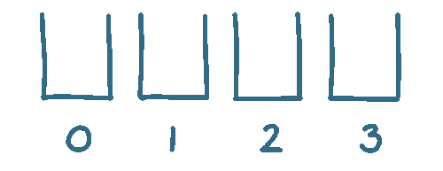
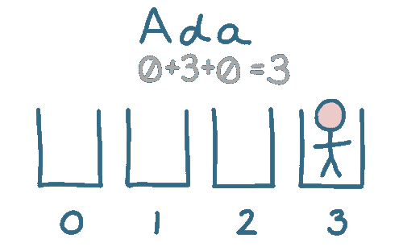
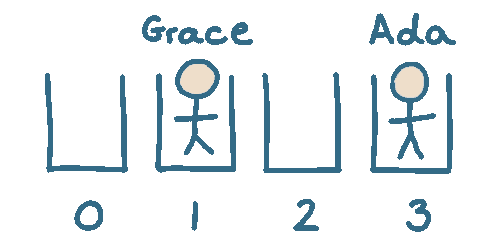
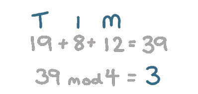
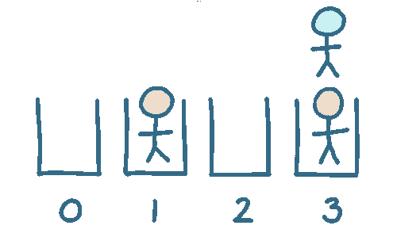

# 什么是哈希表？

> 原文：<https://javascript.plainenglish.io/what-is-a-hash-table-8901416e7042?source=collection_archive---------15----------------------->

哈希表是一种数据结构，它存储了一组键/值对，这种存储方式使得以后查找它们非常有效。

## 我为什么要在乎？

你有没有想知道:

*   在给定的语言中，散列映射、关联数组或字典数据结构是如何工作的？
*   什么时候适合使用哈希表存储项目？
*   我们如何处理哈希表中的“冲突”?

假设我们想要存储一个用户列表，这样我们以后可以使用他们的名字找到他们。

我们可以简单地将用户存储在一个数组中。当我们以后需要查找某人时，我们可以遍历所有用户来查找匹配的名字。

当我们只有 3 个用户时，这很好。但是，如果我们有几千个，那就太慢了。通过使用哈希表，我们可以做得更好。

与遍历数组相比，哈希表存储条目的方式使得以后查找条目更快。

# 创建我们的哈希表

要使用哈希表，我们需要每个用户有一个唯一的值——这是我们的密钥。我们将使用此密钥存储该项目，并在以后检索它。

因为这是一个很好的例子，所以我们假设每个用户都有一个惟一的名字，并以此作为我们的键。在实践中，我们会使用保证像 ID 一样唯一的东西。

哈希表的工作原理是将项目存储在桶中:

选择桶数本身就是一个话题。为了一个简单的例子，我们将使用 4 个桶。

当我们将用户添加到哈希表中时，我们使用他们的键来决定将他们存储在哪个桶中。

当我们需要再次检索用户时，我们可以直接跳到正确的桶来找到它们..比依次检查每个用户要快得多！

# 在表中存储项目

让我们存储我们的第一个用户“Ada”。

首先，我们需要决定把她放在哪个桶里。这意味着我们需要从一个字符串(' Ada ')到一个桶号。这个过程就是我们的哈希函数。

我们将为这个例子发明一个简单的散列函数。让我们取用户名中的每个字母，并给它分配一个编号；`A=0`、`B=1`、`C=2`等。最后，我们可以把所有的值加在一起。结果就是我们的 hash。

对于“Ada ”,这是 3，因此我们可以将 Ada 存储在桶 3 中:

当我们以后需要检索‘Ada’时，我们可以对她的名字执行相同的散列函数。这将告诉我们在 3 号桶中寻找她，不需要遍历数组。

让我们存储下一个用户“Grace”:

“grace”的哈希值是 29，但我们没有 29 个存储桶！

仅仅使用它们的散列值来存储项目将意味着我们将需要非常大量的桶。相反，我们需要一种方法将哈希值(29)转换为桶号(从 0 到 3)。

一种常见的方法是将散列除以桶的数量，并将余数用作桶的数量。

两个数相除后的余数称为[模数](https://blog.mattclemente.com/2019/07/12/modulus-operator-modulo-operation.html)。“grace”的哈希值是 29，我们有 4 个存储桶。29 除以 4 后的余数是 1，所以“grace”存储在 1 号桶中。

这个操作可以写成 ad `29 % 4 = 1`，或者`29 mod 4 = 1`。

当我们以这种方式计算存储桶时，我们的哈希表看起来是这样的:

# 碰撞

一个好的散列函数旨在将项目均匀地分布在整个桶中。

但是在实践中，我们最终会为多个项目计算同一个桶。这叫做碰撞。

让我们存储“Tim”:

我们现在有两个用户需要存储在 bucket 3 中:

有几种方法可以解决这个问题:

我们可以使用一种算法来不断挑选新的桶，直到我们找到一个空的，然后将我们的项目存储在那里。每个桶中只有一个项目的方法称为开放式寻址。

或者，不是在每个桶中只存储*一个*物品，我们可以存储一个*物品集合*。当我们使用这种方法发现冲突时，我们只需将两个项目放在同一个桶中。

当我们以后需要检索项目时，我们仍然可以直接跳到正确的存储桶。不过，这一次，这个桶可以包含多个项目。在这种情况下，我们将依次检查桶中的每个项目，寻找我们想要的项目。

这被称为独立链接，通常被用于哈希表实现。

这就是为什么好的散列函数对性能极其重要的一个原因。

一个糟糕的散列函数不会均匀地分布项目，所以它们最终只集中在少数可用的桶中。

在最坏的情况下，所有东西都在*同一个*桶中结束，我们可能会遍历*每个项目*来找到我们要找的东西。这就是我们一开始使用哈希表所要避免的！

*喜欢这个？通过注册* [*我的简讯*](https://www.baseclass.io/) 每两周获得一篇这样的文章

**想了解更多？查看这些链接:**

*   [哈希表上一个精彩的栈溢出答案](https://stackoverflow.com/a/30567466/1558579)
*   [关于散列表的三部分系列文章，更详细地介绍了上述所有内容](https://www.geeksforgeeks.org/hashing-set-1-introduction/)
*   [关于哈希函数的更多信息](https://www.geeksforgeeks.org/what-are-hash-functions-and-how-to-choose-a-good-hash-function/)
*   [另一个关于如何确定桶数的堆栈溢出回答](https://stackoverflow.com/a/225664/1558579)

*更多内容尽在*[***plain English . io***](https://plainenglish.io/)