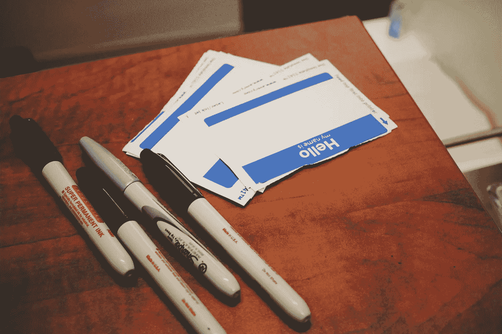

# 什么是 JavaScript 标签？

> 原文：<https://javascript.plainenglish.io/what-is-a-javascript-label-e15d4898ef63?source=collection_archive---------19----------------------->



Photo by [Jon Tyson](https://unsplash.com/@jontyson?utm_source=unsplash&utm_medium=referral&utm_content=creditCopyText) on [Unsplash](https://unsplash.com/s/photos/name-tag?utm_source=unsplash&utm_medium=referral&utm_content=creditCopyText)

你可能永远不会在现实世界中遇到它，但它一直是语言的一部分。嘿，也许有一天你会碰到它的完美用例。说不定你会天天用！我不会评判你，过你最好的生活！

```
label:
  statement
```

标签是命名代码块的一种方式。然而，与变量不同的是，您只能从标签自身的代码块中访问标签。标签与 break 和 continue 语句一起使用。这对于从嵌套循环内部中断和继续非常有用。

如果你想快速简单地跳过数据集的特定部分，只需使用带标签的 continue 语句。

```
loops:
for(let i = 1; i < 4; i++){
  for(let j = 1; j < 4; j++){
    if(j % 3 === 0){
      continue loops;
    }
    console.log("i = " + i + ", j = " + j)
  }   
}// i = 1, j = 1
// i = 1, j = 2
// i = 2, j = 1
// i = 2, j = 2
// i = 3, j = 1
// i = 3, j = 2
```

这允许您跳过任何剩余的内循环迭代，以及当前的外循环迭代，如果满足某个条件的话。你继续`loops:`的下一次迭代。这里，当`j`被 3 整除时，循环语句将从`loops:`开始继续，而不仅仅是继续当前的循环。

如果您想从内循环中跳出外循环，可以使用带标签的 break 语句。

```
loops:
for(let i = 1; i < 5; i++){
  for(let j = 1; j < 5; j++){
    if(i === 3){
      break loops;
    }
    console.log("i = " + i + ", j = " + j)
  }   
}// i = 1, j = 1
// i = 1, j = 2
// i = 1, j = 3
// i = 1, j = 4
// i = 2, j = 1
// i = 2, j = 2
// i = 2, j = 3
// i = 2, j = 4
```

这一次，当`i`等于 3 时，我们脱离`loops:`，而不是仅仅脱离当前的内部循环。

这太酷了。是的，在这些情况下，你可以在内部 for 循环中添加另一个条件来检查`i`或`j`的值。然而，如果您不幸在深度嵌套的循环中工作，label 语句可能会派上用场。

您可以在非循环代码块上使用标签。在这种情况下，中断是唯一的选择，因为没有继续的循环。

```
block: {
  console.log("First");
  break block;
  console.log("Second");
}
console.log("Third");// First
// Third
```

您也可以标记函数，但只能在非严格模式下。在严格模式下，函数或生成器上的标签会抛出语法错误。

虽然你可能一辈子都不用标签，但它仍然是语言中有趣的一部分。谁知道呢，也许有一天它会救你的命！

*更多内容请看*[***plain English . io***](http://plainenglish.io)