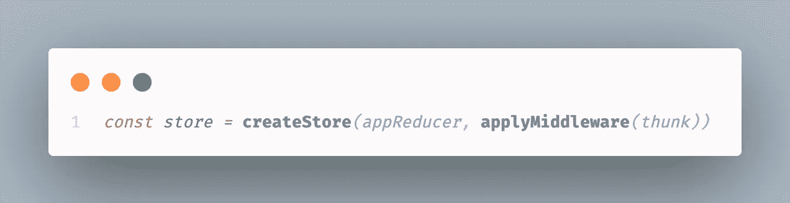

# React/Redux 中的提供者是什么？

> 原文：<https://javascript.plainenglish.io/what-is-a-provider-in-react-redux-ed5f6991550c?source=collection_archive---------6----------------------->

当我在 React 中构建一个应用程序并实现 Redux 时，我总是会遇到一个叫做`Provider`的东西。我开始使用它的时候并不知道它到底是做什么的，也不知道为什么我需要使用它，但是我被告知这是 React 和 Redux 之间正确通信所必需的。在最近的一次代码审查中，有人问我“T1 到底是什么，它有什么用途？”我今天的目标就是回答这个问题。

简而言之，Redux 是 React 代码，可以处理应用程序中所有的全局状态变化。与其他一些功能和中间件一起，redux 的想法是将所有被定义为“状态”的部分存储在一个被称为`store`的地方。Redux 使用一个叫做`reducer`的东西，根据发送给减速器的`dispatch`来控制状态改变的内容和方式。

现在查看 react 应用程序中的`index.js`文件，其中有一个`store`变量。`store`变量将由导入的`createStore`函数(如果使用了`thunk`，可能还有`applyMiddleware`)和应用程序的缩减器组成。

这很重要，因为在应用程序的当前位置，我有一个公共位置来存储我的状态，但是没有办法实际访问它。

## 这就是提供商的用武之地。

实现`Provider`包括将任何需要知道`Provider`组件内部状态的组件包装为子组件，并向`Provider`(理想情况下)传递一个名为`store`的属性，该属性等于创建的`store`变量。

我这里有 ***可以*** 连接到`Provider`里面的全局存储的组件。这些组件 ***尚不具备*** 访问商店的能力，但可以与`react-redux`内部的另一个功能连接。`Provider`顾名思义，它*提供*访问商店的能力。

为了让我的组件实际使用并更新状态的`store`，我将使用从`react-redux`导入的`connect`函数。

这个函数做了几件事。首先，它允许我将一个组件连接到全局存储，但是它也允许我映射存储中存在的状态，以及我拥有的任何功能，作为我的组件的道具。

这个来自我的 21 点模拟器的例子展示了我创建的两个函数，`mapDispatchToProps`和`mapStateToProps`。`mapStateToProps`将内部返回对象左侧的键匹配到全局状态内部的相应值。`mapDispatchToProps`获取我创建的任何动作创建器，将它们传递给`dispatch`，并将该函数绑定到一个具有给定键的匿名函数，该函数可以像`this.props.updateRecord(user, playerOne)`一样被调用。这里最需要记住的是`dispatch` *单独* **只接受对象**。中间件`thunk`提供了向`dispatch`传递函数的能力，它与上面我的`store`变量中的`applyMiddleware`一起使用。`Thunk`告诉`dispatch`它可以接受对象、*以及*函数。它还说任何给它的函数都应该立即调用**。**

**光靠这两个功能还不足以连接到商店。我需要导出带有`connect`函数和两个`mapTo`函数的组件`Game`。**

****

**上面的 connect 函数是提供者的另一端。它告诉提供者，“嘿，这个组件需要访问存储”。请注意，mapTo 函数并不都是必需的。可以传递空值来代替这两个值。**

**看看我的动作创建者，`updateRecord`函数的返回值是一个匿名函数，它发送一个`fetch`请求(在本例中是发送给`user#show`方法),根据需要更新数据库，并按照构建`dispatch`的方式将`fetch`的响应发送给`dispatch`;带有类型和有效载荷。**

****

**reducer 的结构是一个名为`appReducer`的函数，它使用一个`switch`语句来检查`action`参数的`type`，并基于那个`type`执行代码。这里，如果`type`是`‘UPDATE_RECORD’`，该语句更新全局状态以分别反映`player`和`dealer`的`wins`和`losses`。**

****

## **结论**

**现在你知道了。提供者本身并不是一个非常复杂的概念，而是一个更大的整体的一部分。要回答“什么是提供者”这个问题，不解释这里的所有其他概念是不可能的，因为它们一起帮助管理 React 中的状态。**

***更多内容请看*[***plain English . io***](http://plainenglish.io)**