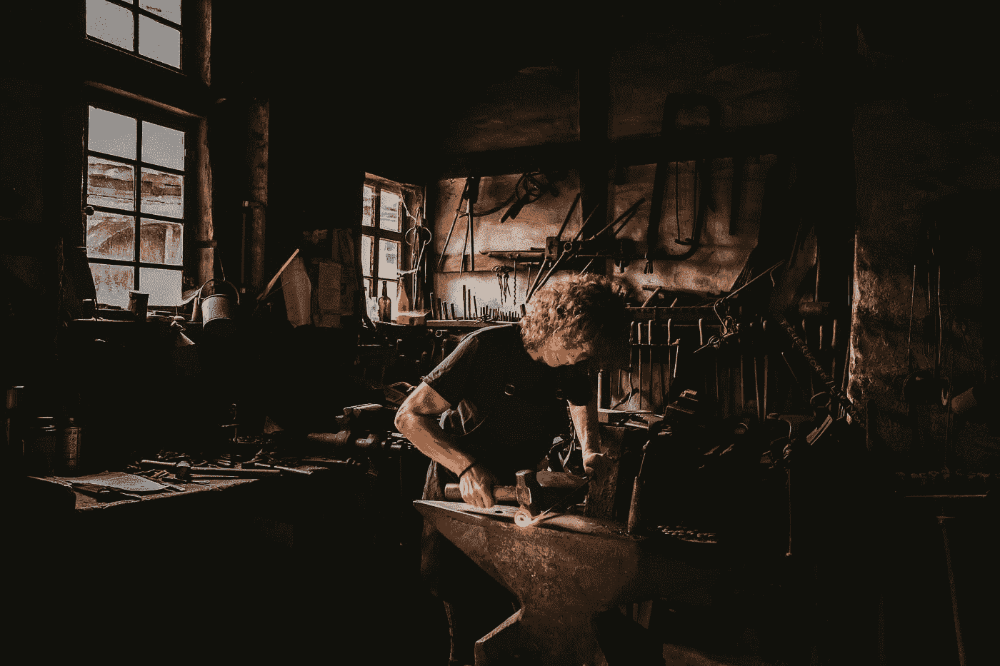
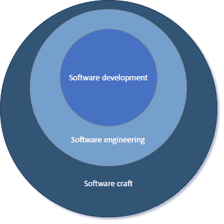

# 什么是软件工匠？

> 原文：<https://javascript.plainenglish.io/what-is-a-software-crafter-ebe0f27e3375?source=collection_archive---------19----------------------->

## 即使我们使用诸如*软件工程*和*软件架构*这样的术语，软件开发实际上更多的是一种艺术形式而不是科学。

这个内容是我的 [Dev Concepts 系列丛书](https://dev-concepts.dev)的[第一卷](https://gum.co/DevConcepts-Part-01-SoftwareCraft)的一部分。

# 什么是软件工匠？

简单地说，软件工艺不仅仅是软件开发和软件工程:

在这个领域工作了 15 年之后，对我来说，软件开发更像是一门艺术，而不是科学。在其中，每个问题都有几乎无限多的解。有的比有的好，需要经历才能知道。对我来说，这是工作的乐趣所在。每天都充满了新的有趣的谜题要解决。这有时会令人沮丧，但当以正确的心态对待时，它会是一种真正的快乐。

我个人认为自己是一名软件工匠。比作为软件开发人员/工程师更重要。*手艺*这个词对我来说有着非常*深刻的*含义。

我认为它是以下定义的组合:

*   计划、制作或执行的技巧
*   小心、熟练或巧妙的制造或生产

作为一名工匠，我不仅仅是想成为一名程序员，生成无尽的无意义的代码。我不想成为一个没人能理解的单行魔法的制造者。写工作软件根本*不够*。

我不想交付非常昂贵甚至无法维护的解决方案。我不想创建不能给用户带来真正价值的解决方案。与客户合作对我来说还不够。

这就是为什么我和至少 3 万名其他工匠一起签署了软件工艺清单。

我想要的是成为一名专业人士，专业人士群体中的一员。我想要的是精心制作能够经受时间考验的*美丽代码*。我想帮助大家提高标准。我也想帮助别人学习这门手艺。最后，我想与我的客户建立*合作关系*，这样我就能不断为他们带来价值。如果你熟悉敏捷宣言，那么我会说，比起简单的“执行”，我更看重技术。我把我的公司叫做 [DeveloPassion](https://developassion.be) 正是因为我对软件开发充满热情，并且希望利用这种热情为我的客户开发出*伟大的*软件。

> 你的工作是一门手艺，如果你磨练自己的能力，并带着尊重和关爱去运用它，那么就像熟练的车匠一样，你可以在职业生活的日常努力中创造意义。加州新港，深度工作

创建我认为是精心制作的(或漂亮的)代码/软件需要仔细的思考和关注，这反过来需要*敏锐的*技能。不认为软件开发是一门手艺的开发人员不会投入足够的努力来完全掌握他们正在做的事情，并且会对低质量的结果感到满意。

将软件开发/工程视为一门手艺对你想要交付的东西有着重要的影响:不仅是价值，还有质量、可维护性、美观，甚至是优雅。正如我在《开发概念》中解释的那样，漂亮/高质量的软件是多方面的。将软件开发视为一门手艺也深深影响着你在工作中的自豪感。

我想鼓励你们每一个人真正把软件开发/工程视为一门手艺，而不是一项“生产”工作，并且通过追求质量而不是数量来提高标准。手工艺者还应该能够有效地与客户和主题专家沟通。专业人士明白，强大的沟通技巧对成功至关重要。这不仅仅是执行力的问题！最终结果将是更快乐的客户，更低成本的开发，以及为取得巨大成果而自豪。

成为一名软件工匠并不容易。在接下来的文章中，我会告诉你我所知道的关于如何成为一个人的一切。这需要时间和努力，但是你可以在第一天就立志成为一名这样的人；仅仅通过真正的关心。不仅关心最终结果，还关心开发中的一切(例如，工具、方法、途径、协作、文档等)。

# 参考

*   [软件工艺宣言](https://manifesto.softwarecraftsmanship.org)
*   [务实的程序员:从熟练工到大师](https://www.amazon.com/Pragmatic-Programmer-Journeyman-Master-ebook/dp/B003GCTQAE?tag=dsebastien-20)
*   软件工艺:新的当务之急迈克·亨德里克森著
*   理查德·塞尼特的《工匠》
*   Dave Hoove 和 Adewale Oshineye 的《学徒模式:有抱负的软件工匠指南》
*   [什么是软件工艺](https://www.linkedin.com/pulse/what-software-craftsmanship-david-max)
*   [工艺——第五个敏捷宣言价值？](https://www.infoq.com/news/2008/08/manifesto-fifth-craftsmanship)
*   [软件工艺怎么了](https://qz.com/work/1371151/what-happened-to-software-craftsmanship)

# 结论

在这篇文章中，我试图分享我对成为一名软件工匠的看法。对不同的人来说，它意味着不同的东西，但它有一个核心要素:不断专注于超越和不断改进。

你可以像对待其他工作一样，把软件开发当成一份工作，一份能带来食物的工作。很好，真的。但是把这份工作当成一门手艺会帮助你取得更好的成绩，并为你的工作感到自豪。

你对这个话题有什么看法？你也是软件工匠吗？你想成为其中一员吗？

今天到此为止！

PS:如果你想学习大量关于产品/软件/Web 开发的其他很酷的东西，那么[看看 Dev Concepts 系列丛书](https://dev-concepts.dev)，[订阅我的时事通讯](https://dsebastien.net/newsletter)，还有[来 Twitter 上打个招呼吧！](https://twitter.com/dSebastien)

*原载于 2021 年 8 月 18 日*[*https://dsebastien.net*](https://dsebastien.net/blog/2021-08-18-what-is-a-software-crafter)*。*

*更多内容看*[***plain English . io***](http://plainenglish.io/)