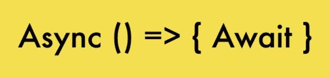
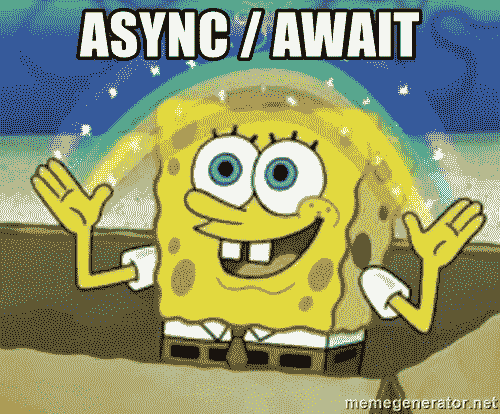
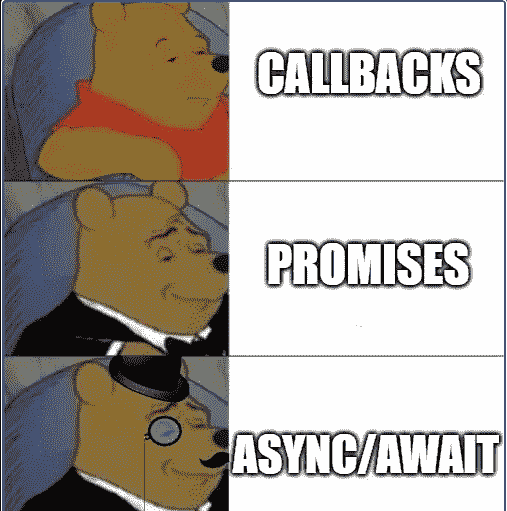

# 什么是 Async/Await 以及如何使用它

> 原文：<https://javascript.plainenglish.io/what-is-async-await-and-how-to-use-it-20ef88bb0f1?source=collection_archive---------17----------------------->

`async/await`是 JavaScript 的一个特性，它允许你编写看起来很像同步代码的异步代码，实际上，它是由 JavaScript 承诺驱动的。



Async/Await 只是让写承诺变得更加容易。如果你想学习如何使用承诺，请看这里。

我的建议是尽可能使用**异步等待**。它使你的代码更加清晰易读。


## **使用 Async()**

```
async myName(){
    return "Haboob"
}orconst myName => async() => {
    return "Haboob"
}
```

函数前面的单词“async”意味着一件简单的事情:函数总是返回一个承诺。其他值自动包装在已解析的承诺中。

因此，如果您调用上面的方法，您将看到在 then()块中成功返回的值，以及在 catch()块中的任何错误

```
myName().then(alert); // Haboob
```

## **使用 Await**

关键字`await`让 JavaScript 等待，直到承诺完成并返回结果。

```
const getFirstName = async (userId) => {
  //let's say this takes a few seconds
  return "Bob";
};

const getLastName = async (userId) => {
  //let's say this takes a few seconds
  return "Ross";
};

const getUserFullName = async (userId) => {
  const firstName = await getFirstName(userId);
  const lastName = await getLastName(userId);
  return `${firstName} ${lastName}`; // Bob Ross
};
```

`await`字面上暂停函数执行，直到承诺解决，然后用承诺的结果恢复它。这不会消耗任何 CPU 资源，因为 JavaScript 引擎可以同时做其他工作:执行其他脚本、处理事件等。

这只是一个比`promise.then`更优雅的获得承诺结果的语法。而且，更容易读写。

> `***await***` ***只在一个*** `***async***` ***函数*** *里面起作用。*

如果你试图在一个非异步的顶级代码中使用 await，你可以像这样把它包装在一个异步块中。

```
(async () => {   
  let response = await fetch('/getUserInfo/user.json');   
  let user = await response.json();   ... }
)(); 
```

## **用异步/等待处理错误**

理想情况下，您可以像在常规代码中一样使用 try-catch 来处理错误。

```
async function getRandomUserInfo() {    
  try {     
    let response = await fetch('/get-random-user-info');     
    let user = await response.json();   
  } 
  catch(err) {     
    // catches errors both in fetch and response.json
     alert(err);   
  } 
}
```

如果不想使用 try-catch，也可以使用。catch()方法提供了带有函数调用的承诺

```
getRandomUserInfo().catch(alert);orvar response = await fetch('/get-random-user-info').catch((err) => { console.error(err); });
```

## **什么时候用 try-catch vs .then()/。catch()**

当我们使用`async/await`时，我们很少需要`.then()`，因为`await`处理等待我们的事情。而且我们可以用普通的`try..catch`代替`.catch`。

但是在代码的顶层，当我们在任何`async`函数之外时，我们在语法上不能使用`await`，所以通常的做法是添加`.then/catch`来处理最终结果或下降错误，如上面方法 *getRandomUserInfo* 所示

## **使用 await with Promises**

您可以将 await 与所有 promise 方法一起使用。

它甚至可以与 Promise.all()一起工作

*通过* [*点击此处*](https://sicpic.medium.com/always-keep-your-promises-fee1487fff16) 了解更多关于承诺的信息

```
try {
  let userData = await Promise.all([   
    fetch(/get-user-status),   
    fetch(/get-user-info) ]
  );
}
catch(err) {     
    // catches errors from both fetch
     alert(err);   
}
```

在出错的情况下，它像往常一样传播，从失败的承诺到`Promise.all`，然后变成一个异常，我们可以使用`try..catch`在块周围捕捉它。

这也将减少您的时间，因为 promise 中的所有请求都将并行运行。

这里有一个 g [ood 源来查看性能增益。](https://dev.to/christopherkade/the-dangers-of-async-await-3p5g)



## **示例—使用 async/await 重写 Promise 代码**

下面是一些使用默认承诺编写的代码

```
function getRandomUserData() {
  return getUserData(/get-random-user-info) // returns a promise
    .catch(e => {
      return getFallbackData(/get-fallback-user-info)  // returns a promise
    })
    .then(userData => {
      return grabImportantUserData(userData)  // returns a promise
    })
}
```

现在，如果我们使用 async-await 将它转换成代码

```
async function getRandomUserData() {
  let userData
  try {
    userData = await getUserData(/get-random-user-info)
  } catch(e) {
    userData = await getFallbackData(/get-fallback-user-info)
  }
  return grabImportantUserData(userData)
}
```

## **动态导入**

使用 await 时，您甚至可以进行动态导入。

**如果模块导出了单独的方法**

```
let {getFirstName, getLastName} = await import('./name.js');getFirstName()
getLastName()
```

**如果模块被默认导出**

```
let obj = await import('./name.js');let getFullName = obj.default()getFullName()
```

## **伟大链接了解更多**

*https://www . log in radius . com/blog/async/callback-vs-promises-vs-async-await/*

*https://javascript.info/async-await*

*https://morioh.com/p/eecf27783d7b*



*更多内容请看*[***plain English . io***](http://plainenglish.io/)