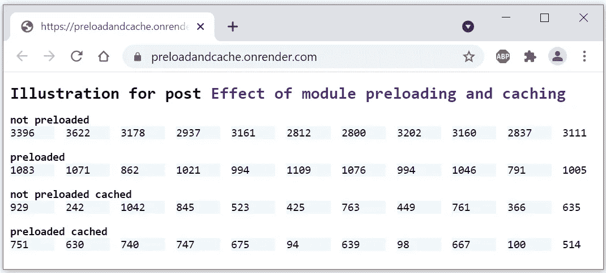
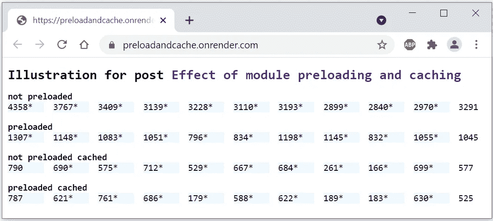

# 预加载和缓存 JavaScript 模块哪个更好？

> 原文：<https://javascript.plainenglish.io/what-is-better-preloading-or-caching-javascript-modules-246d3573e6ad?source=collection_archive---------12----------------------->

## 对用户和开发者都更好。


捆绑对用户来说是好事，但对开发者来说却是噩梦。在开发过程中依赖 bundlers 特别烦人。不幸的是，捆绑并不总是可选的。比如不得不 transpile 的开发者，注定要捆绑。

模块的预加载和缓存是两种主要的技术，可以减轻开发人员对没有正当理由的捆绑器的使用。

[我之前描述了模块预加载的基本原理和显著效果。](https://marian-caikovski.medium.com/javascript-modules-and-browser-cache-4050b72ec51c)

[缓存模块甚至更有效，但是，应该适当地进行缓存，以便在发布新版本的 web 应用程序时可以轻松地更新缓存的模块。](https://marian-caikovski.medium.com/javascript-modules-and-browser-cache-4050b72ec51c)

## 如果模块预加载并缓存在自动刷新的最新缓存中，会发生什么情况？

对于这个实验，我修改了在[上一篇关于预加载](https://marian-caikovski.medium.com/does-preloading-of-modules-make-sense-7c3ee9ccdd45)的文章中描述的样本网页。

简而言之，在基准测试期间，我测量了由 255 个模块组成的模块依赖树的加载时间。实验树是具有 8 个级别的完美二叉树，分别包含 1、2、4、8、16、32、64 和 128 个模块。在浏览器知道任何叶模块之前，它已经发出了 7 个顺序请求来加载它的 7 个父模块。这棵树纯粹是实验性的，而不是真实的。

整个模块树的加载时间在四种不同的设置中测量:

*   模块没有被预加载和缓存
*   模块是预加载的，但不是缓存的
*   模块不会被预加载，而是被缓存到自动刷新缓存中
*   模块被预加载并缓存到自动刷新缓存中

在示例页面中，上面列出的四个条件由四行`iframes`表示。页面逐渐地，一个接一个地加载`iframe`s——一次只加载一个`iframe`。为了计算每个设置的代表性平均加载时间，十个`iframe`被加载到每行中。

由不同种类的`iframe`加载的模块仅仅在它们的响应头上有所不同。不应该被缓存的模块用`Cache-control: no-store, max-age=0`服务，而被缓存的模块用`Cache-Control: stale-while-revalidate=604800`服务。

## 结果

你可以在样本页面[https://preloadandcache.onrender.com/](https://preloadandcache.onrender.com/)看到结果



注意，缓存的模块存储在自动刷新的缓存中。我认为这是一个非常酷的模块友好特性。看看当我稍微改变所有四个 *module1.js* 中的代码，使它们的输出明显改变时会发生什么。使用更新后的代码，每个`iframe`将显示毫秒，后跟一个星号:

```
import val2 from './module2.js';
import val3 from './module3.js';const total=Date.now()-t0;
 document.querySelector('div').replaceChildren(total**+"*"** );

window.parent.postMessage(total,"*");
console.log(val2+val3);
```

你在上面提到的帖子中描述了代码，但在这里你不需要理解更多，在新版本的页面中，数字后面会跟着 ***** 。所以我部署了页面的新版本，并在浏览器中重新加载它:



好看吗？缓存的模块由缓存提供，但是在提供模块之后，浏览器会向服务器检查所使用的模块是否是最新的。如果它过期，缓存将从服务器加载其最新版本。

# 结论

预加载模块大大减少了首次访问时的页面加载时间。如果模块被缓存，那么在以后访问页面时预加载它们只会稍微减少可以忽略的页面加载时间。

我相信第一次访问可以看作是应用程序的安装，每个用户都知道这需要一些时间。如果应用程序没有用，快速的首次加载不会有太大帮助。然而，模块预加载很容易实现，即使是第一次页面加载也应该更快。

示例代码可以从[https://github.com/marianc000/preloadCache](https://github.com/marianc000/preloadCache)下载

*更多内容请看*[***plain English . io***](http://plainenglish.io/)