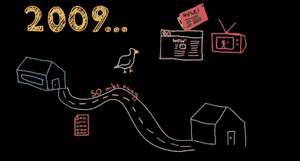
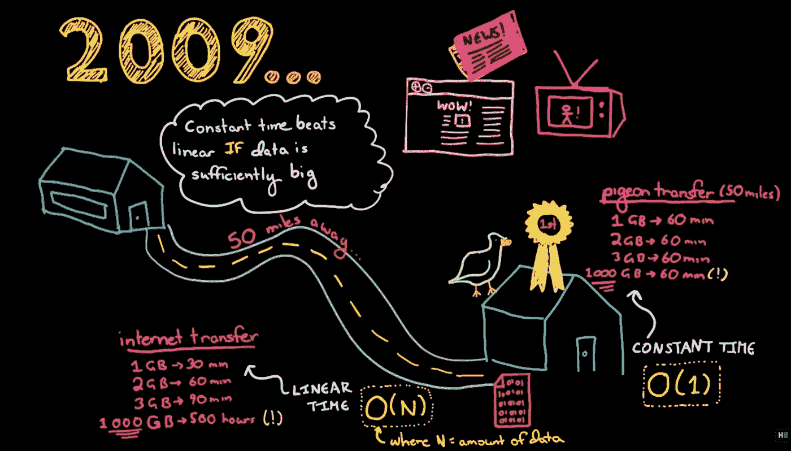
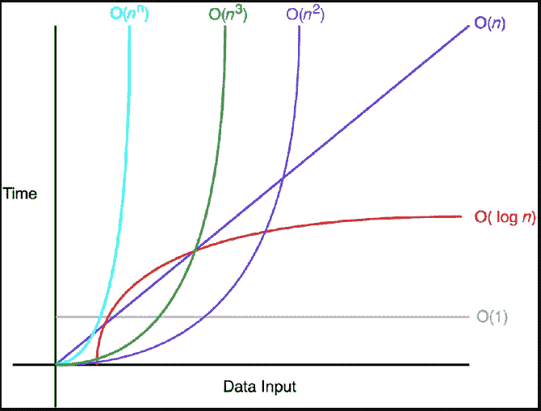

# 什么是编程中的“大 O 记数法”？

> 原文：<https://javascript.plainenglish.io/what-is-big-o-notation-in-programming-fb3026292cce?source=collection_archive---------6----------------------->

## 有什么方法可以确定你是否写了最好的代码？


Photo by [Nathan Dumlao](https://unsplash.com/@nate_dumlao?utm_source=medium&utm_medium=referral) on [Unsplash](https://unsplash.com?utm_source=medium&utm_medium=referral)

你见过一些程序需要更多的时间来执行吗？

可能有一些原因，例如，我们使用的机器。但是让我们假设我们有一台好机器。那么程序执行延迟背后的原因是什么？什么会导致这种情况？

## 根据我们传递的输入，我们编写的程序需要更多的时间。

但是如何检查我的程序是否有效呢？我们有办法确定吗？如何检查我的程序在传递不同的输入时是否执行得最好？

在给出答案之前，让我们先了解一个高效的程序是如何基于一个有趣的故事来工作的。

有一次，一家公司厌倦了缓慢的互联网，他们想运行一些测试。

他们试图将数据从一个地方传输到 50 英里以外的另一个地方。

***他们使用的方法是用一只信鸽。***



Credit: [https://www.youtube.com/watch?v=v4cd1O4zkGw](https://www.youtube.com/watch?v=v4cd1O4zkGw)

所以他们拿了一个 u 盘绑在鸽子身上，另一方面，他们利用互联网来达到同样的目的。

有趣的是鸽子打败了互联网。但是怎么做呢？

**无论数据量有多大，鸽子都需要时间才能到达目的地，而对于互联网来说，时间的变化取决于数据量。**



Credit: [https://www.youtube.com/watch?v=v4cd1O4zkGw](https://www.youtube.com/watch?v=v4cd1O4zkGw)

# ***让我们走向复杂。***

编码涉及两种类型的复杂性。

**时间复杂度:****处理输入所花费的时间。**

****空间复杂度:****处理输入所需的空间量。****

# ****什么是大 O 记数法？****

****这是我们用来描述算法复杂性的术语。我们可以描述运行这个程序花了多长时间。****

****简单来说，它指的是*当输入变大时，你的运行时间如何随着输入而增加。*****

1.  ******你的运行时间是如何增加的**——由于完成一个程序所需的时间因计算机的处理器而异，所以我们使用 Big On 符号来查看运行时间是如何变化的。****
2.  ******带输入****——我们现在不仅检查花费的时间，还检查输入，大 O 符号有“n”，它定义了输入。因此，随着运行时随着输入的大小而增长，我们可以用 O(n)来表示它******
3.  ********随着输入变大** —随着输入变大，有时程序需要更多时间来执行，这导致了性能问题。所以我们写的程序也需要检查更大的输入。******

# ****很多理论，对吧？让我们看看视觉效果来更好地理解这一点。****

********

> ******O(1)******

****O(1)相对于输入空间不变。所以，O(1)被称为 ***常数时间*** 。简单地说，无论传递什么输入，时间都是不变的。****

******举例:******

```
**let names = ['Atit', 'mahesh', 'ramesh', 'kamlesh'];
let data = [1, 2, 3, 4, 5, 6, 7, 8, 9, 10];function checkLength(data) {
  return data.length;
}console.log(checkLength(names)); // 4
console.log(checkLength(data)); // 10**
```

****在这里，不管传递的输入是什么，复杂度都将保持为 O(1)****

> ******线性|** **O(n)******

****线性时间复杂度意味着时间与输入成比例。时间会根据输入而变化。****

******示例:******

```
**function print(array) {
    for (var i = 0; i < array.length; i++) {
        console.log(array[i]);
    }
}print(names) //4 times
print(data) //10 times**
```

> *******【二次】|*******(n)********

*****它表示与输入大小成比例的性能。O( ***n)代表表现最差。********

*******例如:*******

```
***function testdata(data) {data.forEach(function(items) {console.log('values ', data);
        items.forEach(function(number) {
            console.log('Marks', number); //});
    });
}const test = [
    ['maths', 52],
    ['science', 65],
    ['english', 72]
]testdata(test)***
```

> ********【对数| O(log n)】********

*****它表示执行算法所需的时间与输入大小 *n* 的对数成正比。*****

```
***function log(n) {
    for (let i = 1; i < n; i = i * 2) {
        const result = i;
        console.log(result);
    }
}log(4); //2***
```

*****这里，对于一个给定的具有任意迭代次数的程序，I 的值= i*2，所以在第 N 次迭代中，i= i*n，I 的值总是小于循环本身的大小(N)。*****

*****所以我们可以上来，*****

```
***2^n < N
log(2^n) < log(N)
n < log(N)***
```

*****因此，这种算法的最坏情况时间复杂度是 O(log(n))。*****

# *****放下常数*****

*****对于特定输入，O(N)码可能比 O(1)码快。大 O 只是描述了增加的速度。因此，我们去掉常数，这意味着 O(3N)实际上是 O(N)。*****

*****O(3N) → O(N)*****

*****正如我们可以去掉常数一样，也可以去掉非主导项。*****

*****O(N3+N) → O(N3)*****

*****O(N+logN) → O(N)*****

*****O(2∫2N+1000 n100)→O(2N)*****

# *****如何计算复杂度？*****

*****显然，基于算法中使用的代码结构，复杂度是不同的。让我们看看一些代码示例及其复杂性。*****

## *****`**Loops:**`*****

*   *****`**Loops**`:在循环内部，语句重复 n 次。如果我们的代码需要 O(m)复杂度来执行，在 n 次重复循环内，它将是 n∫O(m)或 O(n∫m)。*****

```
***for (let i in arr1) {
    print(i);
}***
```

*   *****循环次数将为 4，循环内代码的执行次数为 O(1)，因此组合执行次数将为 O(4)。*****

## *****`**Nested**loops`:*****

*   *****如果我们在另一个循环内部有一个循环，那么复杂度会呈指数级增长，这意味着如果一个简单循环的复杂度为 O(n)，那么在这个循环内部增加另一个循环将使复杂度为 O( ***n*** )。*****

```
***for (let i in arr1) {
    print(i);
    for (let j in i) {} 
}***
```

*   *****这里第一个循环的复杂度是 O(5)，因为数组计数是 5，所以嵌套循环也以相同的复杂度执行了 5 次，这意味着两者都将是 O(5 )。*****

## *****要查看不同的复杂数据结构，您可以访问:*****

*****[https://www.bigocheatsheet.com/](https://www.bigocheatsheet.com/)*****

## *****要了解更多关于复杂性的在线信息，您可以访问:*****

*****https://shunnarski.github.io/BigO.html*****

# *****延伸阅读:*****

*****[](/33-javascript-useful-shorthands-cheat-list-2021-e08b46a1a688) [## 2021 年你应该知道的 JavaScript 顶级优化技术

### 使用现代速记技术、技巧和诀窍优化您的 JavaScript 代码。

javascript.plainenglish.io](/33-javascript-useful-shorthands-cheat-list-2021-e08b46a1a688) [](/latest-javascript-features-you-should-know-in-2021-7712232c00ae) [## 新引入的 JavaScript 特性可以提升您的知识

### 利用 ES2021 的新功能优化您的 JavaScript 代码。

javascript.plainenglish.io](/latest-javascript-features-you-should-know-in-2021-7712232c00ae) [](/top-100-questions-you-must-prepare-for-your-next-angular-interview-1-10-3e13d5fefab9) [## 你必须为下一次角度面试准备的 100 个问题(1-10)

### 最常见的角度面试问题 2021

javascript.plainenglish.io](/top-100-questions-you-must-prepare-for-your-next-angular-interview-1-10-3e13d5fefab9) 

*更多内容尽在*[***plain English . io***](http://plainenglish.io/)*****