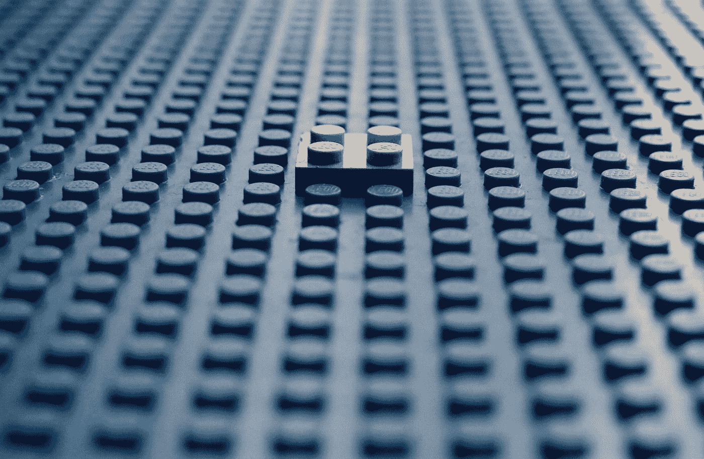
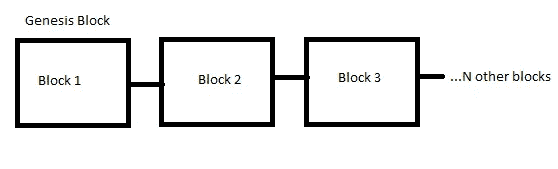

# 什么是区块链？

> 原文：<https://javascript.plainenglish.io/what-is-blockchain-and-why-all-programmers-should-know-about-it-897d73c24a75?source=collection_archive---------5----------------------->

## 一篇关于区块链的信息性文章。

Photo by [Glen Carrie](https://unsplash.com/@glencarrie?utm_source=medium&utm_medium=referral) on [Unsplash](https://unsplash.com?utm_source=medium&utm_medium=referral)

区块链基本上是一种用于维护信息记录的技术，由于它的分布，T2 不可能改变或入侵系统。区块链无疑是现代技术充分发挥潜力的真实例子。

更简单地说，**区块链是一个拥有信息的区块链**。这项技术确保不可能以任何方式篡改信息。

区块链是比特币背后的主要技术。比特币是一种**数字货币**，而区块链是一本**记录其所有所有者的书**。

 [## 绝对初学者的 Python 基础教程

### 用最简单的方式解释了 Python 的基础知识。

python .平原英语. io](https://python.plainenglish.io/fundamental-python-tutorial-for-absolute-beginners-2d848e66850d) 

## 体系结构

Image supplied by the [author](http://aniketz.medium.com)(Visual representation of Blockchain)

众所周知，区块链是存储所需信息的区块链。区块链的第一个区块叫做 **Genesis 区块。**

块存储根据其当前用途所需的信息。例如，一个比特币块将存储**发送方**、**接收方**和**金额**信息。

一个块也有一个唯一的标识，称为**散列**。因此，每当创建一个块时，都会为该块生成一个哈希，每当数据发生更改时，哈希也会重新生成。

Hash 基本上是一个永远不会相同的唯一值。它类似于人的指纹。没有任何两个人的指纹可以匹配，哈希也是如此。

因此，每当块的**数据被调整时，其散列也改变**。这意味着当数据经过处理后，它将成为一个**全新的数据块。现在，由于单个块引起的变化，所有的**块都变得无效。****

 [## 什么是加密货币？作为程序员可以做一个吗？

### 揭开加密货币的基础。

javascript.plainenglish.io](/what-is-cryptocurrency-can-you-make-one-as-a-programmer-5cc92bdfb651) 

## 如何正确更改数据而不导致无效

假设我们有一本 10 页的书。我们在这本书的每 10 页中创建了数据。在区块链，该技术被分发给许多授权的可信来源。因此，没有人拥有区块链。

有一群人拥有同一个区块链。因此，假设我们**制作了 10 本书，并把它给了 10 个信任的人**。现在，如果一个人试图更改任何一页上的数据，那么他的书将被标记为无效并因此被丢弃。

这本书的原版在其余 9 个人那里仍然安全。因此，要改变先前条目**的值，我们需要大多数人同意我们的行动**。这意味着**超过 6 个人应该支持我们的改变。**

这是在区块链更改数据的方法，这实际上非常困难，因为区块链分布在巨大的网络中，如果您试图入侵区块链并更改大部分副本中的前一数据块的数据，更改大部分数据将需要数千年的时间。

这种分发是使用**对等网络**完成的。这意味着，每当一个**人进入网络，他将获得一个区块链**的完整副本，并存储在他的网络上。

 [## 2022 年的技术趋势

### 2022 年需要的技能。

javascript.plainenglish.io](/technologies-that-will-trend-in-2022-122d2dcf5ca3) 

毫无疑问，区块链是未来的**技术**，学习可以为你的编程之旅提供新的途径。这项技术将解决未来所有的数据黑客问题，并承诺保持数据的安全和可靠。

区块链肯定会是人类发明的最好的技术之一，我们应该尝试在未来创建的各种项目中实现它。

区块链有以下几大优势——

*   不能被黑。因此，交易将始终保持安全和可靠。
*   分散的
*   公共区块链的变化可以被每个人看到，因此没有可以创造欺诈

我相信这篇文章会对每个想了解区块链基础知识的人有所帮助。坚持编程，坚持练习。祝你编程之旅好运。

 [## 通过我的推荐链接加入 Medium-Aniket

### 作为一个媒体会员，你的会员费的一部分会给你阅读的作家，你可以完全接触到每一个故事…

aniketz.medium.com](https://aniketz.medium.com/membership)  [## 3 个代码编辑器，我已经用了 3 年了

### 轻便快速的代码编辑器比一些笨重的编辑器更好。

javascript.plainenglish.io](/3-code-editors-i-have-been-using-for-the-past-3-years-33abb5b88c5a)  [## 编程前我优先考虑的 3 条黄金法则

### 即使有困难，我如何处理编程生活方式。

javascript.plainenglish.io](/3-golden-rules-i-prioritize-before-programming-d7286beb566b)  [## 每个程序员都应该知道的关于 NFT 的一切

### 解释什么是不可替代令牌(NFT)。

javascript.plainenglish.io](/all-about-nft-that-every-programmer-should-know-bcb933d4e71b) 

*更多内容请看*[***plain English . io***](http://plainenglish.io/)