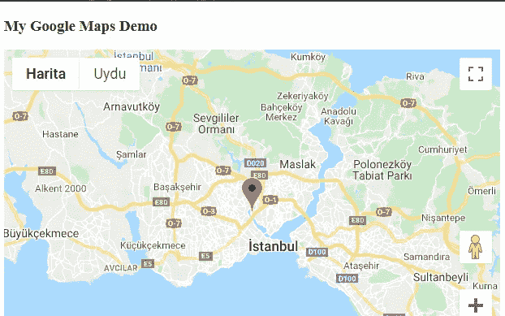

# 什么是浏览器 API？

> 原文：<https://javascript.plainenglish.io/what-is-browser-api-7a1aeb7573b5?source=collection_archive---------14----------------------->

## 让我们解释一下浏览器 API 是如何工作的，以及我们如何使用它们。


Photo by [Mitchell Luo](https://unsplash.com/@mitchel3uo?utm_source=medium&utm_medium=referral) on [Unsplash](https://unsplash.com?utm_source=medium&utm_medium=referral)

在转向浏览器 API 之前，我们需要知道什么是 API:

它是应用编程接口的缩写。好吧，但这是什么？

当我们说接口时，它指的是一个共享的边界，计算机系统的两个或多个独立组件通过它交换信息。交换可以在软件、计算机硬件、外围设备、人以及它们的组合之间进行。

所以 API 的名字给了我们一个线索。

我认为最好的解释是:

API 是一个接口，通过它你可以访问别人的代码，或者别人的代码可以访问你的代码。实际上是公共方法和属性。

假设您想在网页上显示地图上标记的伊斯坦布尔。

我们不想写所有的代码、数据库或设计地图矢量，对吗？谷歌已经做了这些事情。他们编写了这些叫做谷歌地图 API 的功能，这样每个人都可以使用它们。有了他们提供的 API 密匙，你就可以使用允许的功能了，我们很快就会这样做。

我们这里有三个代码块。

JavaScript:

```
// Initialize and add the mapfunction initMap() {
  // The location of Istanbul
  const istanbul= { lat: 41.051, lng: 28.943 };
  // The map, centered at Istanbul
  const map = new google.maps.Map(document.getElementById("map"), {
    zoom: 9,
    center: istanbul,
  });
  // The marker, positioned at Istanbul
  const marker = new google.maps.Marker({
    position: istanbul,
    map: map,
  });
}
```

CSS:

```
/* Set the size of the div element that contains the map */#map {
  height: 400px;
  /* The height is 400 pixels */
  width: 100%;
  /* The width is the width of the web page */
}
```

HTML:

```
<!DOCTYPE html>
<html>
  <head>
    <title>Add Map</title>

    <link rel="stylesheet" type="text/css" href="./style.css" />
    <script src="./index.js"></script>
  </head>
  <body>
    <h3>My Google Maps Demo</h3>
    <!--The div element for the map -->
    <div id="map"></div>

    <!-- Async script executes immediately and must be after any DOM elements used in callback. -->
    <script
      src="https://maps.googleapis.com/maps/api/js?key=YOUR_API_KEY&callback=initMap&libraries=&v=weekly"
      async
    ></script>
  </body>
</html>
```

我们在脚本中添加了 API URL。它使我们能够使用 *initMap()* 函数中的方法。我们用几行代码就可以得到我们想要的东西，如下所示。谢谢你，谷歌。



## 浏览器 API:

就像我们使用来自谷歌代码的信息并在地图上显示伊斯坦布尔一样，我们也可以使用来自用户访问我们页面的“浏览器”的信息。这些被称为浏览器 API。它们内置在您下载的浏览器中。不仅仅是来自浏览器的数据，我们甚至可以访问关于浏览器加载的计算机环境的数据。是不是很神奇？

它们有很多，我们可以在不同的学科中使用它们。我们可以在全屏模式下呈现一个特定的元素，一旦不再需要就退出全屏模式。我们可以获得有关系统电池电量的信息，并在电池电量或充电状态发生变化时收到事件通知。或者只是在用户关闭标签时获取信息。下面列出了四个主要的使用领域:

*   与浏览器中呈现的当前页面的结构进行交互(文档对象模型或 DOM API)
*   在不离开当前页面的情况下对服务器执行异步请求(Fetch API)
*   与音频、视频和图形交互
*   与浏览器的设备功能交互(地理定位、设备定位、客户端数据存储)

尽管这些 API 可以用 JavaScript 访问，但它们的实现是用浏览器使用的语言，例如，对于 Google Chrome 来说就是 C++。

**让我们举一个例子来更好地理解真实网页上的浏览器 API。**

假设页面上有一个表单。在用户提交表单后，您希望在本地缓存输入数据，以加速将来包含该数据的请求。您已经需要这些浏览器 API:

*   获取 API(保存记录)
*   DOM API(向 HTML 列表添加新项目)
*   客户端数据存储(在本地缓存数据)

在不知道您可能使用了 DOM API 的情况下，当您选择如下 HTML 元素时:

```
const button = document.getElementById("button");
```

文档是一个对象。像所有的 Web APIs 一样，DOM API 也是基于对象的。因此，您的代码使用一个或多个 JavaScript 对象与 API 进行交互，以包含上面提到的浏览器和系统信息。所以对于 DOM API，文档是我们的对象，我们使用 out 中的方法，就像我们使用 *getElementById* 一样。

**让我们看看另一个叫做页面可见性 API 的 API 的实现:**

```
function userChangedThePage() { if (document.hidden) { console.log('We lost the user attention. Aaaand gone') } else { console.log('Hurray! User returned. Preciouss.') }}document.addEventListener("visibilitychange", userChangedThePage);
```

这是一个 API，当用户完全切换标签或窗口或浏览器时，以及当他们回来时，它会给出提示。它的用法就是这么简单。它让一个非常复杂的操作变得像任何 API 一样简单。

好吧。所以我们能不能写一些代码，在我们需要的时候全屏翻页，或者在他们进入页面的时候玩“吓一跳”游戏？

答案是否定的，因为你对此很熟悉。浏览器中有安全机制。尽管不同浏览器的安全性紧密程度不同，但基本权限是相同的。

您可以通过以下链接访问浏览器 API 列表:

[](https://developer.mozilla.org/en-US/docs/Web/API) [## Web APIs | MDN

### 为 Web 编写代码时，有大量的 Web APIs 可用。下面是所有 API 和…

developer.mozilla.org](https://developer.mozilla.org/en-US/docs/Web/API) 

*更多内容看* [*说白了. io*](http://plainenglish.io/) *。报名参加我们的* [*免费周报*](http://newsletter.plainenglish.io/) *。在我们的* [*社区*](https://discord.gg/GtDtUAvyhW) *获得独家写作机会和建议。*