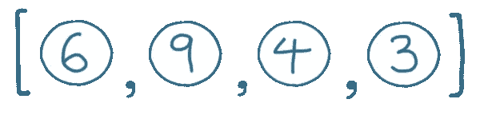
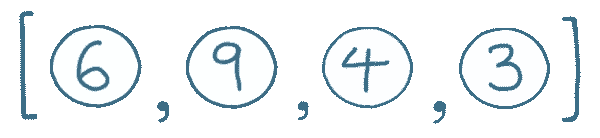
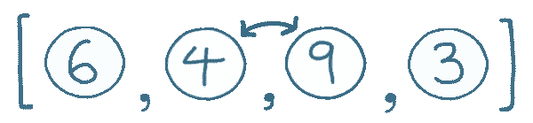
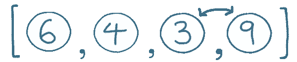
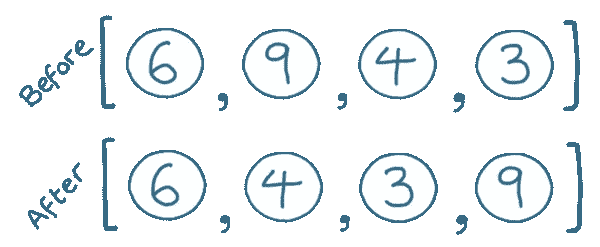
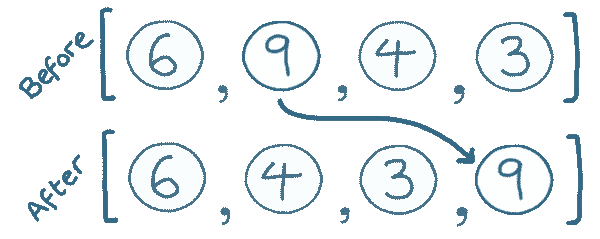
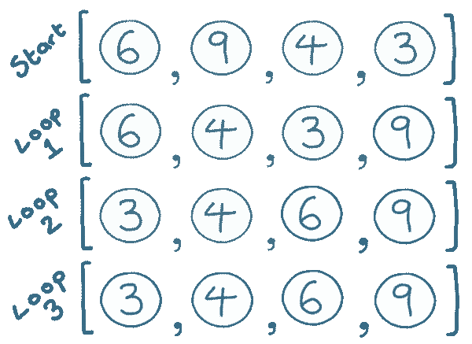
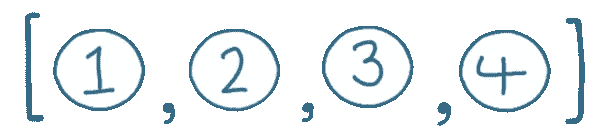

# 什么是冒泡排序？

> 原文：<https://javascript.plainenglish.io/what-is-bubble-sort-3b7916e5bfcf?source=collection_archive---------18----------------------->

冒泡排序可能是最简单的排序算法。它在规模上效率很低，但是写起来很快，并且在少数元素上运行良好。

冒泡排序是对排序算法的极好介绍。

当我们稍后讨论更复杂的搜索算法时，它也是一个有用的参考。

让我们将这个数组按升序排序:



# 步骤 1:比较元素对

我们将依次遍历每一对元素。

如果一对元素的顺序不对，我们将交换它们。

我们走吧…

第一对已经是正确的顺序，所以我们可以忽略它们。



下一对。这些元素的顺序是错误的，所以我们将交换它们。



最后是最后一对，也需要交换:



我们现在已经遍历了所有的线对，所以我们第一次遍历数组就完成了。

这是阵列在第一遍的开始和结束时的情况:



请注意最大值 9 是如何在数组中向上移动到正确的位置的:



它已经“冒泡”到正确的位置，因此被称为“冒泡排序”。

# 重复

我们的第一次传递将最高的元素 9 移动到正确的位置。

每次我们重复这个循环，我们移动*下一个最高的元素*到位。

现在，我们重复这个过程——依次比较每一对并在需要时交换它们——直到数组完全排序。

列表中有 4 个元素，这意味着我们需要重复循环 3 次。

为什么是 3？因为一旦 3 个元素在数组中的正确位置，剩下的一个也必须是正确的。

如果数组中元素的数量是`n`，我们需要的循环数是`n-1`。

这是每次通过后数组的状态。每个循环后的排序元素会突出显示。



下面是这个算法的 JavaScript 代码:

```
// We need to repeat the algorithm n-1 times
for (let loop = 0; loop < array.length - 1; loop++) {

  // Loop through each pair of elements
  for (let pair = 0; pair < array.length - 1; pair++) {

    // Is this pair the wrong way around?
    if (array[pair] > array[pair + 1]) {   

      // Make the swap (using temporary variable)
      let tmp = array[pair]
      array[pair] = array[pair + 1]
      array[pair + 1] = tmp
    }

  }
}
```

不过，我们可以通过一些优化来改进这个基本算法。

# 优化#1

还记得算法的第一遍是如何让 9 上升到正确的位置的吗？

在第一遍之后，我们知道最后一个元素被正确放置，所以我们可以在下一次循环中忽略它。第二遍之后，对倒数第二个元素进行排序，依此类推。

我们将修改代码，忽略第一次循环后的最后一个元素，第二次循环后的最后一个*和两个*，依此类推。

这将使我们的算法稍微快一点。

下面是更新后的代码:

```
for (let loop = 0; loop < array.length - 1; loop++) {
  for (let pair = 0; pair < array.length - loop - 1; pair++) {
    if (array[pair] > array[pair + 1]) {
      let tmp = array[pair]
      array[pair] = array[pair + 1]
      array[pair + 1] = tmp
    }
  }
}
```

# 优化#2

想象我们的算法被传递了一个这样的数组:



这个数组已经排序了，我们的排序算法循环三次完全是浪费时间。

这将引导我们进行下一步优化；如果我们在没有交换任何元素的情况下完成了一个循环，我们知道数组已经排序了，我们可以提前停止。

在我们开始冒泡排序之前，如果数组已经排序(或接近排序),这可以节省大量时间。

添加这些代码后，我们最终的冒泡排序算法如下所示:

```
for (let loop = 0; loop < array.length - 1; loop++) { let hasSwapped = false;

  for (let pair = 0; pair < array.length - loop - 1; pair++) {
    if (array[pair] > array[pair + 1]) {
      let tmp = array[pair]
      array[pair] = array[pair + 1]
      array[pair + 1] = tmp      
      hasSwapped = true;
    }
  }

  if (!hasSwapped) {
    // No swaps, the array is now sorted
    break;
  }
}
```

# 想了解更多？

查看这些链接:

*   [冒泡排序的可视化表示](https://visualgo.net/en/sorting)
*   [一篇关于上述改进的更详细的文章](http://techieme.in/improving-bubble-sort/)

*订阅我的* [*通迅*](https://www.baseclass.io/newsletter/) *先收到这个。*