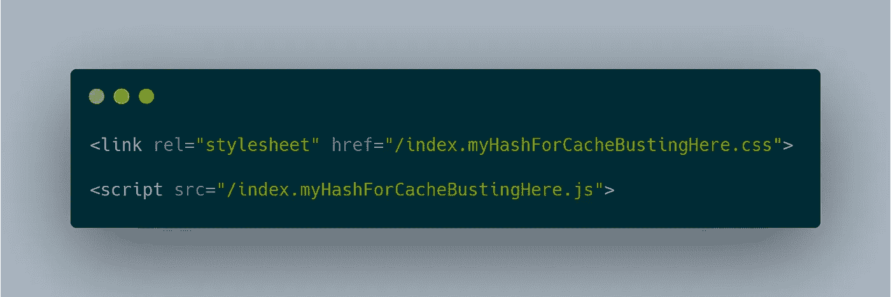

# 什么是缓存破坏？

> 原文：<https://javascript.plainenglish.io/what-is-cache-busting-55366b3ac022?source=collection_archive---------3----------------------->

## 缓存破坏是一种技术，使浏览器可以在文件上有长时间的缓存，同时在文件改变时重新加载文件

缓存破坏是一种技术，使浏览器可以在文件上有长时间的缓存，同时在文件改变时重新加载文件。在你理解这一点之前，你必须理解网站的缓存是如何工作的。

## 缓存您的网站

当你想让浏览器缓存文件，这样用户就不必每次访问你的网站时都重新加载，你就使用 [HTTP 缓存](https://developer.mozilla.org/en-US/docs/Web/HTTP/Caching)。HTTP 缓存允许您指定文件名的缓存时间，这样加载页面就非常快。现在让我们来研究一下这个问题。

## 缓存的问题是

假设您有一个包含 3 个文件的网站，`index.html`、`index.js`和`index.css`，并且您将缓存生存期设置为 1 年，这样网站的加载速度会非常快。现在你可以改变`index.css`，在你的应用程序中使用不同的配色方案。您的老用户不会注意到，因为他们必须等待一年才能刷新缓存。

这就成了一个问题，尤其是在部署错误修复和安全补丁的时候。人们通常使用缓存破坏来解决这个问题，他们使用各种方法来更改每个版本加载的文件的名称，以便浏览器加载它们并将其添加到缓存中。

## 缓存破坏

有几种不同的方法可以改变文件名，这样当文件名改变时就可以加载了。一种方法是使用版本号，并在加载时将它们放在文件名中。每个版本都可以有一个子目录，`v1/index.js` `v2/index.css`。您也可以在 URL、`index.js?v1`、`index.css?v2`中查询版本。

另一种方法是改变文件名，`index.v1.js`，`index.v2.css`。这些方法并不容易管理，因为一旦有大量文件被更改，这将变得非常困难。

一种更受欢迎和更易于管理的方法是将散列保存在文件名中。如果你不知道，散列是任何内容的固定长度字符表示，并且它们是不可逆的，这意味着你可以从文件中获得散列，但是你不能从散列中获得文件。哈希对于这个来说是完美的，因为当文件改变时，它的哈希也会改变，所以如果我们将哈希保存在文件名`index.[someHashHere].js`中，浏览器会检测到它并加载它，而不是一个旧文件。

这甚至更好，因为它非常容易适应您的工作流程，您可以使用捆绑器对资源进行其他优化。

## 结论

在这篇文章中，我谈到了长时间缓存而不破坏缓存的问题，以及缓存破坏应用程序的不同方法。

📚延伸阅读:
[MDN 上的 HTTP 缓存](https://developer.mozilla.org/en-US/docs/Web/HTTP/Caching)
[用 Webpack 散列文件](https://webpack.js.org/guides/caching/)

*如果你喜欢这篇文章，我建议你去我的博客* *看看我的其他文章。*