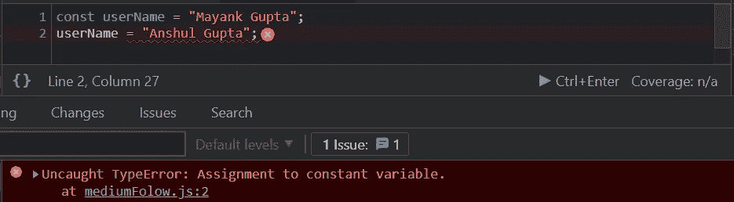
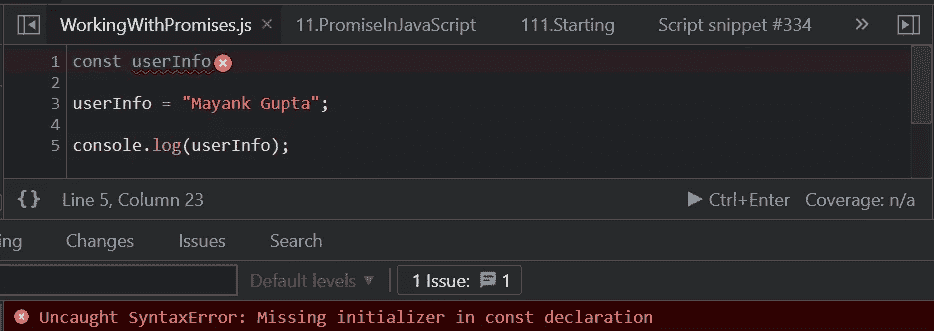
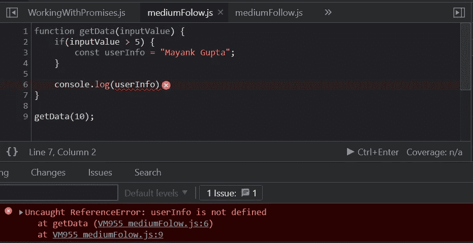
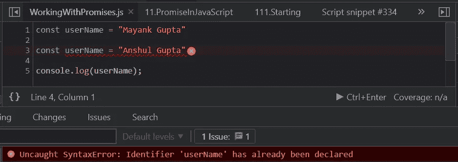

# JavaScript 中的‘const’关键字是什么？

> 原文：<https://javascript.plainenglish.io/what-is-const-keyword-in-javascript-dca4970713e8?source=collection_archive---------7----------------------->

## 理解 JavaScript 中的“const”关键字

**“const”关键字**是 JavaScript 面试中的另一个大话题。让我们来看看 JavaScript 中 const 关键字提供的特性。

“const” keyword in JavaScript

# JavaScript 中的 const 是什么？

*   **常量关键字**代表一个**常量值。**
*   常量变量是块范围的变量。
*   常量值不能重新分配。
*   常量变量值应该在声明期间定义。
*   常量变量不能重新声明。

下面让我们来详细看看这几点。

# **常量关键字**代表一个**常量值**

在下面的例子中，我们创建了一个常量变量“用户名”。如果我们试图进一步修改这个值，JavaScript 将返回一个错误。所以，一旦我们给常量赋值，我们就不能更新这个值了。任何更新常量变量值的尝试都会导致错误。

“const” values cannot be updated

尝试更新变量“userName”将导致以下错误:

const variables cannot be updated…

# 常量变量值应该在声明期间定义

在创建常量变量时，我们需要在声明变量时提供值。我们不能推迟变量的赋值。常量变量需要在声明的地方赋值。

Values should be Defined while Declaration

代码的输出如下所示:

在上面的代码中，如果用户在声明期间没有将值赋给常量变量，它将返回一个错误。上面代码中的错误说明在“const”声明期间缺少初始化。

# 常量变量是块范围的变量

用 const 声明的变量是块范围的。当变量被创建时，它将在声明它的同一个块中可用。它在当前街区之外不可用。

const variables are block scoped variable

在上面给出的例子中，常量变量“userName”在声明它的“if”块之外不可用。

# 常量变量不能重新声明

不能重新声明用“const”关键字声明的变量。在下面的代码中，我们可以看到我们试图声明同一个常量名称两次，这将返回一个错误。

该代码将给出以下错误:

const variables cannot be re-declared.

# 结论

留意你的代码，找出那些在声明后不会被更新的变量。这些变量可以修改为“常量”变量。