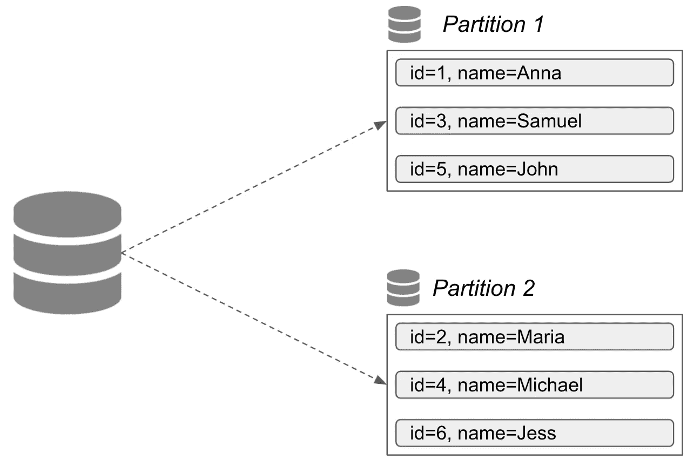

# 什么是数据库分区？

> 原文：<https://javascript.plainenglish.io/what-is-database-partitioning-71c6ca53af2d?source=collection_archive---------12----------------------->

## 探索提高数据库性能的技术

Photo by [William Felker](https://unsplash.com/@gndclouds?utm_source=unsplash&utm_medium=referral&utm_content=creditCopyText) on [Unsplash](https://unsplash.com/s/photos/boxes?utm_source=unsplash&utm_medium=referral&utm_content=creditCopyText)

每个开发人员都知道什么是数据库。这是存储一些数据的常见概念。在某些情况下相对较小，但在其他情况下数量巨大。数据库中的数据越多，对性能的影响就越大。有各种可用的实践，并且已经成功地应用于改善这种情况。其中最受欢迎的是[索引](https://betterprogramming.pub/how-database-indexing-actually-works-ba6e19e75169)和[复制](https://betterprogramming.pub/how-database-replication-works-a92ad191df20)。他们很好地满足了需求。

然而，这些技术并不能解决所有可能的问题。例如，当数据库很大时，拥有一个副本可能不足以提高访问速度。可能的解决方案是拆分数据集，以实现更快的读取访问。分割操作被称为*分割*(或*分片*)。让我们更深入地探讨它是如何工作的，以及它带来了哪些好处和挑战。

# 这个想法

数据库分区是一个相对简单的概念。它的要点是将数据分成多个块。它在分布式数据库中很受欢迎，目的是提高可用性和性能。我们将拥有多个节点，而不是将整个数据库放在一个节点上。每个节点可以有一个或多个分区——数据库的一部分。

Example of database partitioning

数据被保存在多个分区中。这减少了工作量，因为每个节点只处理某些数据。从上面的例子中，我们看到 ID 为 1 的查询条目将在分区为 1 的节点上执行。其余的节点将保持空闲。但是定义数据需要如何分割的规则是什么呢？

周围有几种想法。例如，我们可以在每个条目中选取某个键。然后，我们使用一个服务于特定键范围的分区。在这种情况下，如果我们用相同的键获得更多的数据，那么分区将变得不平衡。

最常见的做法是使用哈希函数进行分区。生成的散列标识了条目将要保存的位置。基于分区的数量，我们为每个分区指定散列的范围。这是保证数据在所有分区中均匀分布的方法。

# 挑战

就像在每个工程系统中一样，没有什么是没有缺点的。数据库分区也不例外。

数据分区最常见的问题是拥有倾斜的分区。当某些分区比其他分区更频繁地受到攻击时，就会发生这种情况。稍后，当单个分区获得大部分事务时，这个问题会导致“热点”问题。那么这个概念的整个目的就没有了:当一些节点空闲时，一个节点由于高负载而一直超时。

通过选择正确的负责分区的键，可以防止这个问题。在上一段中，我们介绍了如何选择它的最佳实践。但是如果已经太晚了，我们该怎么办呢？数据是不平衡的，我们必须解决这个问题。

我们可以添加更多节点、引入新分区并执行重新平衡(重新共享)。但是这里我们需要小心。我们不能简单地将 *mod N* 操作应用于整个数据库。因为它将产生大量在现有节点之间移动的数据。正确的解决方案是选择某些分区，并将它们重新分配给不同的节点。此操作的开销很小，性能不会受到影响。

一般来说，你不应该害怕有更多的分区。这样，我们可以确保数据偏斜很少发生。另一方面，不必要的过多分区会增加成本。供应的资源可能仍未得到充分利用。因此，理想的场景是拥有正确数量的分区。

# 最后的想法

通常，分区伴随着数据复制。每个分区都被复制，提供了更好的数据库弹性。综上所述，分区有助于提高数据库的性能和持久性，并成为一种常用的方法。

随着云计算的普及和分布式系统的增长，有效的数据管理仍然是一项有价值的技能。除此之外，我们还想确保遵守[酸](https://en.wikipedia.org/wiki/ACID)原则。对所有技术的良好理解有助于构建可靠且有弹性的解决方案。

*更多内容尽在*[***plain English . io***](http://plainenglish.io/)