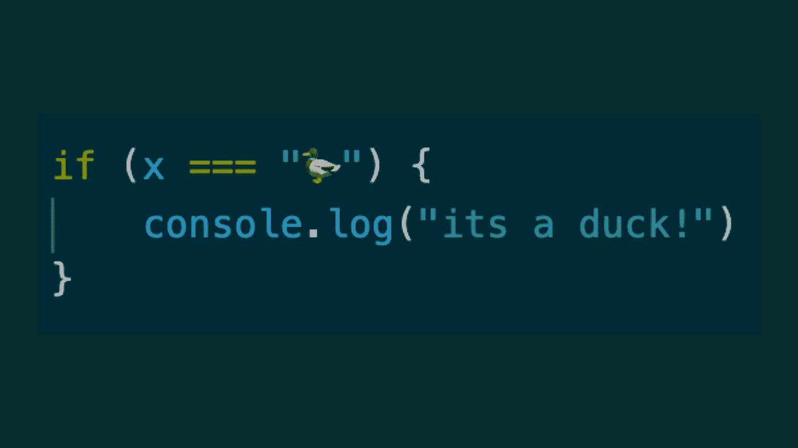

# TypeScript 中的 Duck 类型介绍

> 原文：<https://javascript.plainenglish.io/what-is-duck-typing-in-typescript-c537d2ff9b61?source=collection_archive---------0----------------------->

在本文中，我将讨论 duck-typing，这是一种实践，也是 TypeScript 的一个很酷的特性，它带来了巨大的不同——[类型谓词](https://www.typescriptlang.org/docs/handbook/2/narrowing.html#using-type-predicates)。

## 什么是“鸭子打字”？

Duck typing 是许多 OOP 语言中的常见做法。它得名于所谓的“[鸭考](https://en.wikipedia.org/wiki/Duck_test)，即:

> 如果它看起来像鸭子，游泳像鸭子，嘎嘎叫像鸭子，那么它很可能*就是*鸭子

或者用巨蟒小组的话说:

Monty Python and the Holy Grail (1975), Witch Trial Scene

*Duck Typing* 通常用于需要处理一系列不同数据的代码中，通常不知道调用者将传递什么参数。在这里想一想您遇到的 switch 语句或复杂的 if/else 块的一些用法。这些是典型的地方，鸭子打字可能会派上用场，甚至提供一个替代方案。

## 为什么是鸭型？

动态语言中鸭式输入的一个常见模式是，假设给定值符合我们的预期，尝试并执行一个动作，然后处理可能出现的任何异常。Python 就是一个很好的例子:

这显然是一个愚蠢的例子，但要点很简单——获取一个值，通过调用它的`.quack()`方法检查它是否嘎嘎作响——如果它嘎嘎作响，返回 true，如果出现属性或值错误，返回 false。

在 Python 中,`try-except`是一种被接受的模式，这种模式也被像`hasattr`这样的内置软件内部使用，并在整个标准库中使用。相比之下，在 JavaScript 中，`try-catch`更受限制——既不能根据抛出的错误的原型定义不同的 catch 块，也不能确定抛出的是不是错误的实例。

因此，在处理错误时，您必须更加详细和安全，这在某种程度上是 JavaScript 和 TypeScript 中的反模式。通常的做法是这样做:

在上面的谓词中，我们(1)检查参数*值*是否属于“object”类型，(2)它不为 null，因为 null 的类型在 JavaScript(🤦‍♂)，以及(3)使用 Reflect.get 方法，我们安全地检索“嘎嘎”的值，并检查它确实是一个函数。

这种谓词对大多数读者来说可能是熟悉的——毕竟，JavaScript 代码通常充满了布尔检查，无论它们是抽象成单独的函数还是简单地内联编写。

然而这就是 JavaScript 和 TypeScript 的不同之处——参数`value`可能是一只鸭子，但是 IDE 和 JavaScript 解释器都不知道鸭子是什么。另一方面，在 TypeScript 中，`Duck`可以并且将会是一个类型:

注意`isDuck`的返回值类型中使用的`**is**`关键字，这就是 TypeScript 中所谓的 [a 类型谓词](https://www.typescriptlang.org/docs/handbook/2/narrowing.html#using-type-predicates)，这是该语言的一个更好的特性:类型谓词是一个函数，它返回一个布尔值，充当一个自定义类型保护；实际上是告诉 TypeScript 编译器给定值*属于给定类型*。也就是说，在上面的例子中，如果函数`isDuck`返回 true，编译器将知道该值的类型为`Duck`。

为什么这是一件大事？因为我们的函数现在有双重用途——它仍然是一个谓词，返回一个布尔值，这意味着我们可以像 JavaScript 中的谓词一样使用它，但同时，它也会影响 TypeScript 编译器，从而影响 IDE 和任何其他可能链接到编译器的工具(read ESLint)。

## 示例用例:recursiveResolve

duck typing 的一个便利用途是当您的代码可能接受承诺和非承诺时。处理这种情况的内置方法是使用`Promise.resolve()`包装值，如果给定了一个 Promise 对象，这将解包 Promise 对象*——或者将值包装在 Promise 对象中，然后解包。这样做的问题是它有一点点开销——即使对于非承诺值，您也需要等待解决。*

*另一种方法是使用类型谓词“duck type”承诺，按照惯例，这将被称为`isPromise`。*

*假设我们创建了一个自定义方法来递归遍历一个对象，解析可能嵌套在其中的任何承诺(下面的代码改编自我的一个库，您可以[在这里](https://github.com/Goldziher/interface-forge/blob/59ef8140eb1315578b57ba90de55c59e867179e3/src/utils/schema.ts#L27)查看原文)，这是这种类型谓词的一个很好的用例:*

*正如您所看到的，我们在上面定义了两个谓词— `isPromise`和`isRecord`，它们都接受一个可选的泛型参数，这使得它们可以重用。然后，我们可以在 *recursiveResolve* 函数中使用它们，开销很小，并且在整个函数中正确推断类型。*

## *额外收获:谓词库*

*给定这里的常见用例，您可以在许多不同的库中找到类型谓词。如果您在 Node.js 中工作，您可以使用现成的类型谓词，它们作为 [node/util](https://nodejs.org/api/util.html#utiltypes) 包的一部分提供。还有一个[浏览器端口](https://github.com/browserify/node-util)可供选择。不过我会推荐另一个库，我自己制作的一个库，名为[*@ tool-belt/type-predicates*](https://github.com/tool-belt/type-predicates)，它提供了一个更全面、类型更好的类型谓词和类型断言集合。无论哪种方式，您都可以不使用任何库——这取决于您的用例——只需根据需要编写谓词。*

**更多内容看* [***说白了。报名参加我们的***](http://plainenglish.io/)***[***免费每周简讯这里***](http://newsletter.plainenglish.io/) ***。*******