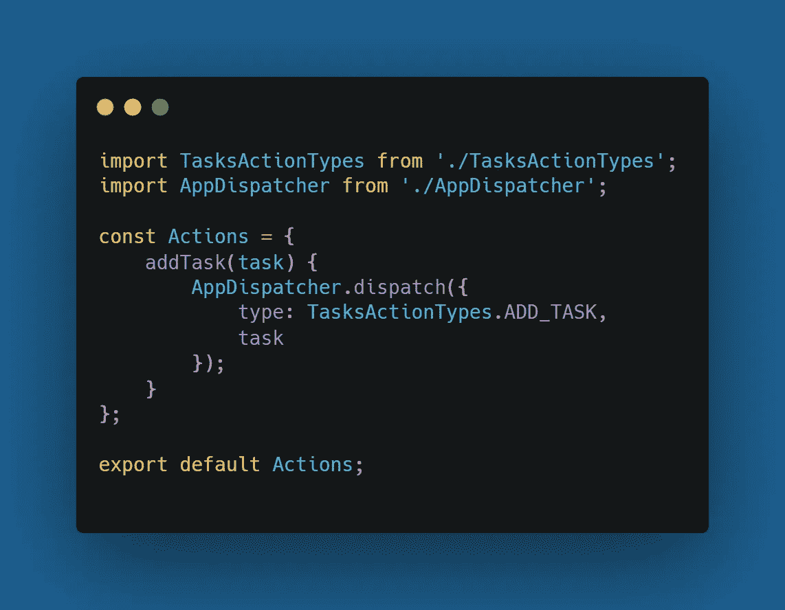

# React Native 中的 Flux 架构是什么？

> 原文：<https://javascript.plainenglish.io/what-is-flux-architecture-in-react-native-d886ce978cf0?source=collection_archive---------6----------------------->

## 关于在 React Native 中使用通量模式，您需要知道的是

# 通量架构

Flux Architecture 只是一个在 React 中构建用户界面的架构。为了理解 ***通量架构*** 我们需要首先开始什么是 React 中的**单向数据流**模式，这将引导我们进行通量。这里你需要理解两个关键点，那就是如何分离代码，以及如何使用 ***Flux*** 将一个应用拆分成几个部分。这些连接在一起模式负责现代移动应用程序中的一切。

# 什么是单向数据流模式？

为了理解通量架构，我们需要知道我们为什么需要它。观察从**模型-视图-控制器** (MVC)模式切换到 Flux 的**脸书**，在那里我们将业务模型从视图标记和编码逻辑中分离出来。逻辑由一个称为控制器的函数封装，它将工作委托给服务。

# React 中单向数据绑定的问题

在单向数据绑定中，**视图**层由一个组件维护，只有组件可以更新视图。由于产生的本机代码由组件 ***计算，呈现*** 功能并显示给最终用户。

而如果**视图**层需要响应用户的动作，它只能调度由组件处理的事件，它只能直接改变状态或道具。

*下图将更好地理解这一概念；*

*   **App** 块表示原生视图层的状态，组件被隐含成三个部分: **Props，state，**Renderfunction&事件监听器。
*   当道具或状态发生变化时，观察者调用**渲染**函数来更新本地视图。一旦用户执行了一个动作，事件监听器就会分派并接收一个事件。

> **但是在双向绑定的情况下，App 层不需要调度事件，它可以直接修改组件的状态**

此外，使用单向数据绑定是不够的，因为我们很容易陷入模拟双向数据绑定的陷阱。

因此，这里的大问题是:我们能否将它用于更大的应用程序，答案是否定的。要解决这个问题，我们需要一个可预测的模型，保证我们可以快速发现过程中发生了什么，尤其是为什么会发生。

> 如果事件发生在整个应用程序中，开发人员必须花费大量时间来找出是什么导致了检测到的错误。

**这就是** *通量架构* **发挥作用的地方:**

# 流量

主要原理是应用程序视图层通过将动作对象发送到**调度程序来响应用户动作，**调度程序的角色是将每个动作发送到订阅的商店。我们可以有尽可能多的商店，每个商店都可以对用户的行为做出不同的反应。

**例如:**

*   假设您正在构建一个基于**购物车的**应用程序，用户可以点击屏幕向购物车添加一些商品，相应的动作是 ***dispatched*** 并且您的购物车商店对其做出反应。最后，视图层用新状态更新。

为了增强 **MVC 模式**，让我们提醒自己它是什么样子:

**MVC Pattern**

*   **动作:**用户的动作，如按钮点击、滚动或导航改变。
*   **控制器:**负责处理动作和显示适当的本地视图的一块。
*   **模型:**一种保存从视图中分离出来的信息的数据结构。
*   视图:这是最终用户看到的，视图描述了所有的标记代码，这些代码可以在以后进行样式化。视图有时可以与样式结合在一起，被称为一个整体。

> **但是随着应用程序的增长，你的小架构将会如下所示:**

这种方法并不坏，即使这种架构在某种程度上以自己的方式工作。但是，当您试图识别一个 bug，却发现自己无法定位哪里以及为什么会出错时，问题就出现了。

更精确地说，你将失去对信息流的控制，并且你将结束于这样一种情况，即如此多的过程正在发生，而同时你不能容易地发现什么是失败的原因以及它为什么会发生。如果你看上面的图表，你会发现模型-视图通信中数据双向流动的问题 ***(它是双向的)。***

*   为了解决这个问题，我们可以提供**单向**数据流，这将有效地使架构可预测，如果我们的控制器只有一系列输入数据，我们应该提供一个新的视图状态，这将更加清晰。
*   单元测试可以提供一系列数据，比如输入和输出断言。

> 现在我们来看看 **Flux 数据流:**

**Flux Data Flow**

这里所有的数据经过**调度器**，然后发送到注册商店**回调**。最后，存储内容被映射到一个视图。随着应用程序的增长，这种模式也会变得复杂(类似于双向数据流的情况，但是这里我们的视图被组合成用户看到的最终视图)。

如果有什么变化，另一个动作会被发送到商店。这是一种简单得多的方法，我们可以跟踪哪个操作导致了商店中不必要的变化。

**Flux Data Flow (After Application Grows )**

# 在 React 本地应用中实现 Flux

为了进一步理解这个概念，我们将使用由**脸书**提供的 Flux 库创建一个简单的任务应用程序，包括我们根据新的 Flux 流创建应用程序所需的所有部分。

要在 React-Native 项目中安装 Flux:

***纱线添加通量不可变***

因此，首先，我们需要创建**分派器**、**任务存储库**和**任务动作。**

*   一个**分派器**将被用来分派动作，我们需要首先创建动作。

*   按照文档建议，我将首先创建操作类型:

*   所以现在我们已经创建了类型，我们将遵循 creator 的操作。

*   现在我们已经创建了动作和调度它们的工具，剩下的就是创建将对**动作做出反应的**存储**。让我们创建 TodoStore**

*   为了创建商店，我们从 ***flux/utils*** 中导入 **ReduceStore** ，并且应该扩展该类以提供必要的 ***API*** 方法。
*   另外，让我们为 **ADD-TASK** 创建 **reduce** 用例，同样的流程可以调整为您想要创建的任何其他动作类型:
*   到目前为止，我们已经创建了 Flux architecture 的所有部分(**动作、调度器、存储&视图)**，我们可以将它们连接在一起。为此，我们有 flux/utils，它提供了一个方便的容器工厂方法。
*   为了清楚起见，我删除了“喜欢”计数器:

*   现在，我们的应用程序配备了 Flux 架构工具:
*   最后一步是重构所有的原则。
*   要做到这一点，直接向视图&初始化 **JSON** 数据，创建一个添加任务表单，该表单在提交时发送一个**添加-TAKS** 动作。

*   现在我们需要使用输入组件，因为我们将创建一个负责整个特性的单独文件(我们将为**名称**和**描述**创建状态，一个 **handleSubmit** 函数调度 **ADD_TASK** 动作，一个 **render** 函数带有表单视图标记)。

