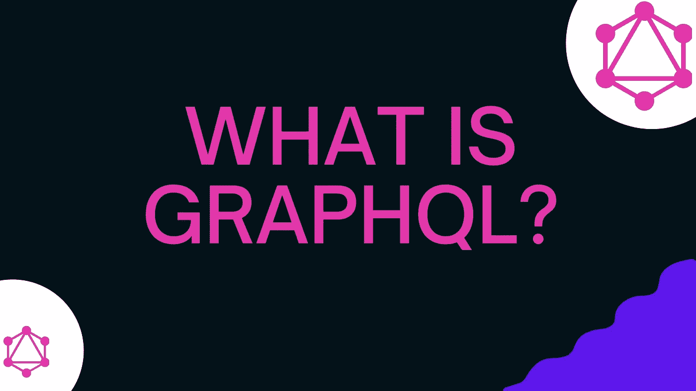

# GraphQL 是什么？带示例的初学者综合介绍

> 原文：<https://javascript.plainenglish.io/what-is-graphql-6e0e31bcba7e?source=collection_archive---------15----------------------->



简单来说，这就像你去一家披萨店，点一份“自己做披萨”——你选择基底、酱料、奶酪和配料，当披萨做好了，你就会得到你想要的东西。

有了 REST，就像你从预定义的菜单项中挑选一个披萨。你可能会得到你想要的浇头，但你也可能会得到你没有要求的其他浇头(如西红柿)，有时，我们将不得不手动从中挑选西红柿。

用技术术语来说，GraphQL 是一种查询语言——一种从任何数据源查询数据的语法——无论是 API 还是数据库。GraphQL 是 REST APIs 的替代品，提供了一种新的请求数据的方式。GraphQL 允许您指定您需要的数据字段，并准确地交付这些字段。GraphQL [规范](https://spec.graphql.org/)定义了实现 GraphQL API 的规则集。

需要注意的重要一点是，GraphQL 不是数据库的查询语言。与 SQL 不同，您的数据库没有像`SELECT * from users`这样的查询。相反，GraphQL 语法定义了如何从 API 请求数据。GraphQL 查询的语法如下所示

```
query getUsers{
    users {
        firstname
    }
}
```

所以，GraphQL 中的`QL`意味着你的 API 的查询语言，而不是数据库。

值得注意的是，GraphQL 可以用于任何数据源，比如 REST APIs & database。它可以在任何地方插入，以任何语言构建，可以安装在任何数据库和技术堆栈的顶部，这意味着您可以在 REST APIs 的顶部使用 GraphQL，并且仍然可以获得 GraphQL 的好处，而不必拆除现有的基于 REST 的架构。你可以在 Java 应用，JavaScript 应用，Python，Django，Next.js 中使用 GraphQL。

GraphQL 适用于客户端和服务器端层。您在服务器端构建一个 GraphQL API，然后通过触发 GraphQL 请求(查询、突变等)在客户端使用这个 GraphQL API。).有一些工具，如 [Apollo](https://www.apollographql.com/docs/tutorial/introduction/) 提供全栈解决方案，帮助在服务器上构建 GraphQL API，并在客户端使用它。

# REST vs GraphQL 示例:发出 API 请求

假设我们想获取一个用户名。在 REST API 中，我们有一个端点可以用来发出 GET 请求。端点可能看起来像`/users/{id}/`。如果我们使用 curl 请求进行调用并传入一个用户的`id`,它将看起来像这样

```
curl \
-H "Content-Type: application/json" \
https://www.example.com/api/users/123`
```

让我们看看 GraphQL 请求是什么样子的

1.  REST 的“GET”操作由 GraphQL 中的[“Query”](https://graphql.org/learn/queries/)完成。
2.  在 GraphQL 中，我们没有单独的端点用于`users`。每个请求都被发送到`/graphql`端点。
3.  为了描述我们对哪些数据感兴趣，我们将相关参数传递给“查询”操作，并描述我们对哪个查询感兴趣。GraphQL API 可能支持类似“getUsers”的查询，这是一个我们可以用来获取用户的查询。

对 GraphQL API 的 curl 请求看起来像-

```
curl \
-X POST \
-H "Content-Type: application/json" \
--data '{ "query": "{ user(id:123 ) { name } } " }' \
https://www.example.com/graphql
```

[在此尝试示例 GraphQL 请求](https://graphqlzero.almansi.me/api)

# REST 与 GraphQL:实现 API

在 REST 世界中，我们将为每个操作实现资源，比如`GET /user/{id}`被映射到`getUser(String id)`。`getUser`定义如果这个端点被调用，传递什么数据。如果需要的话，这个资源实现还将调用任何下游操作——其他 API 或直接从数据库获取。

在 GraphQL 中，当实现一个 GraphQL API 时，我们需要首先定义 API 的模式。模式是对允许哪些查询、突变和参数的完整描述。一个“GET”操作是由 GraphQL 中的“Query”完成的。我们可以指定查询在模式中接受什么参数。

```
type Query {
    getUser(id: $String!)
}
```

我们从这个`getUser`查询返回的内容由一个名为 resolvers 的函数定义。解析器定义了当一个字段被调用时应该返回什么数据。每个查询都映射到一个解析器。解析器函数可以调用任何 API 或数据源。我们的解析器可以这样写-

```
getUser(args){
    const { id } = args;
    //fetch from database / API 
}
```

当客户端获取`getUser`查询时，他们会得到这样的数据-

```
{
    "data" : {
        "name": "Sample name"
    }
}
```

# GraphQL 术语

1.  查询:查询类似于 GET in REST。当我们想从 GraphQL API 获取信息时，我们使用 Query。
2.  突变:当我们想要对服务器上的数据进行突变时，就会用到突变。变异类似于 REST API 中的 PUT、POST、DELETE、PATCH。
3.  模式:模式是 GraphQL API 支持的操作的完整表示。

# REST 和 GraphQL 的主要区别

*   REST 有多个端点。GraphQL 有一个端点— /graphql。
*   REST APIs 支持 PUT、GET、POST、DELETE、PATCH。GraphQL 支持查询、变异、订阅。
*   REST 端点由资源实现填充。GraphQL 字段由解析器填充。
*   REST — 200、400、500 级状态代码。GraphQL — 200 级状态代码。
*   在 REST 中，为了获取完整的数据，经常需要进行往返。使用 GraphQL，您可以获取多个字段，因此可以通过一个请求获取您需要的所有数据。
*   对于 REST，数据的形状由服务器决定。对于 GraphQL，数据的形状由调用 API 的客户端决定。

# 何时使用 GraphQL 与 REST

**何时使用 GraphQL**

1.  当您有多个下游 API 时
2.  当您有来自下游 API 的无关数据时
3.  当您关心哪些字段被哪些客户端使用时。在 GraphQL 的帮助下，您可以拥有字段级的工具。
4.  当您希望确保所有客户端都拥有最新版本的 API 时。使用 GraphQL，因为有一个端点，所以所有更新都提供给每个人。
5.  当你想构建一个 UI 优先的 API 时。
6.  当你关心蚀刻不足和蚀刻过度时。

**何时使用 REST**

1.  当您非常依赖缓存时。
2.  当您不知道一个完整的字段集时，您可以从下游 API 获得。使用 GraphQL，您需要提前了解模式。
3.  当您非常依赖下游 API 的状态代码时。GraphQL 中的所有内容都是 200，因此您需要解析响应对象或错误对象。

# 学习 GraphQL 的先决条件

虽然我不认为有任何必要的先决条件，但了解以下内容会有所帮助-

1.  API 开发的基础
2.  REST APIs
3.  超文本传送协议
4.  实现 GraphQL API 的首选语言——JavaScript、Go、Java、Python 等。

# 学习 GraphQL 的资源

1.  [GraphQL.org](https://graphql.org/)
2.  [howtographql](https://www.howtographql.com/)
3.  伊芙·波尔切洛的书
4.  斯蒂芬·格里德的《我的课程》

# TL；速度三角形定位法(dead reckoning)

简单地说，GraphQL 是一种请求数据的语法。REST 和 GraphQL 之间的最大区别是只有一个端点— `graphql`，除了调用 API 端点和传递所需参数之外，我们还需要准确地提供我们想要访问的字段。

用技术术语来说，GraphQL 是一种规范，提供了一种查询数据的方式。该规范规定了当数据被请求和变异时应该发生什么。GraphQL 指定了一种请求数据的方式，并准确地传递所请求的数据。既然是规范，GraphQL APIs 就可以用语言来创建——JavaScript、Java、Go、Python。

我发表的其他 GraphQL 资源-

1.  [什么是 GraphQL，为什么要使用它——前端欢乐时光播客](https://frontendhappyhour.com/episodes/no-rest-with-quintessential-libations-graphql/)
2.  [常见的 GraphQL 误解](https://dev.to/shrutikapoor08/what-is-graphql-the-misconceptions-57b9)
3.  [在企业中使用 graph QL](https://www.youtube.com/watch?v=axQzCQ2Q4Rc)
4.  [从 Redux 移动到 GraphQL](https://www.youtube.com/watch?v=HL7gZnrEy68)
5.  [GraphQL &状态管理](https://www.youtube.com/watch?v=7raJccyHh0Y)
6.  [graph QL Hub——在建](https://learninggraphql.com/)

[*在您的收件箱中获得这样的文章*](https://tinyletter.com/shrutikapoor)[*与我实时合作*](https://twitch.tv/shrutikapoor)

*更多内容请看*[***plain English . io***](http://plainenglish.io/)