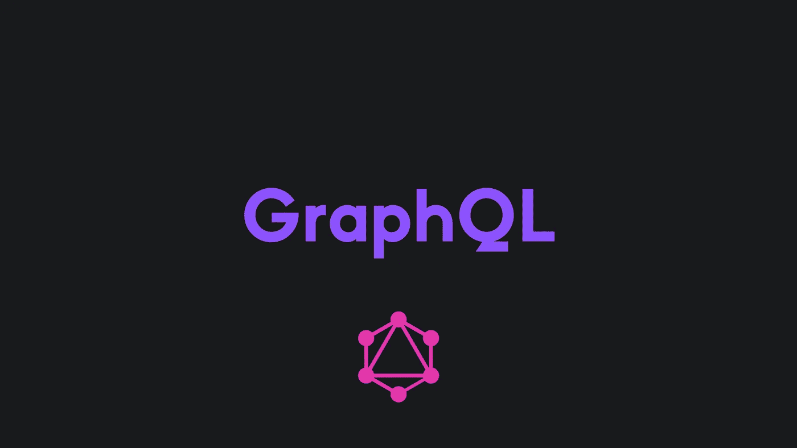

# GraphQL 是什么，比 REST 好吗？

> 原文：<https://javascript.plainenglish.io/what-is-graphql-and-is-it-better-than-rest-a36664ad82bc?source=collection_archive---------3----------------------->

了解为什么您可能想要切换到 GraphQL。

在这个故事中，我将谈论什么是 GraphQL，它的优点和缺点，以及为什么你可能想学习它。

我将给出我对 GraphQL 和 REST 的真实看法，我希望在这篇文章的结尾，你能决定你更喜欢哪种技术。

开始吧！

# 首先，GraphQL 是什么？

> GraphQL 是一种 API 查询语言，也是一种用现有数据完成这些查询的运行时语言。GraphQL 为 API 中的数据提供了完整且易于理解的描述，使客户能够准确地要求他们需要的东西，使 API 更容易随时间发展，并支持强大的开发工具。

这是 GraphQL 官网对它的描述。是的，这就是 GraphQL。

在 GraphQL 中，您只能得到您需要的东西。它是一种查询语言，允许您准确地请求您想要的内容，而没有任何取多或取少。

这也使得大多数请求更快，因为正在处理的数据更小。

# GraphQL 的利与弊

## 优点:

*   它比休息更快
*   复杂系统和微服务令人惊叹
*   严格类型化
*   你可以分享代码

## 缺点:

*   更难缓存
*   更难评级限制
*   GraphQL 查询有时可能太复杂

# 但是，我应该使用哪种技术呢？

## 何时使用 GraphQL 胜过 REST:

*   适用于手机、智能手表和物联网设备等设备的应用，其中带宽使用至关重要。
*   需要在一次调用中获取嵌套数据的应用程序。
*   一种复合模式，其中应用程序从多个不同的存储 API 中检索数据。

## 何时在 GraphQL 上使用 REST:

*   您需要更简单、更快速的缓存。
*   您需要更好的错误处理和工具。
*   您已经有了一个 REST API，并且不想切换到 GraphQL。

# 那么，GraphQL 真的比 REST 好吗？

嗯，是的，但实际上不是。

GraphQL 是一个强大的工具，有很多理由选择 GraphQL 而不是 REST。但是如果您对缓慢的性能和复杂性的容忍度较低，那么您可能希望避开它，考虑使用 REST 架构。

这种情况下没有明显的赢家。在使用 GraphQL 而不是 REST 之前，或者相反，有很多事情需要考虑。

# 如何学习 GraphQL？

GraphQL 在线上有许多指南，如果您对 GraphQL 感兴趣，请随意学习。

几乎任何语言都有 GraphQL 库和框架，所以我相信你会找到很多学习它的指南。

## 我的建议:

*   YouTube 上的本·阿瓦德
*   [如何制图](https://www.howtographql.com/)
*   [GraphQL 官网](https://graphql.org/learn/)

# 最后的想法

总的来说，我喜欢 GraphQL。有些情况下我更喜欢 REST，但总的来说，GraphQL 更简单，更快，也更有趣。至少在我看来是这样。

希望这个故事对你有帮助。我很想知道你是否已经决定试用 GraphQL！

# 仅此而已。感谢您阅读这个故事！

如果你喜欢这个故事，一定要为它鼓掌！你想问我什么都可以。

在 Twitter 上关注我:

 [## re _ ally 边缘

twitter.com](https://twitter.com/Re_allyedge) 

在 Patreon 上支持我:

 [## 阿里木阿尔斯兰卡亚是创造编程故事和教程。帕特里翁

### 今天就成为阿里木阿尔斯兰卡亚的赞助人:在世界上最大的…

www.patreon.com](https://www.patreon.com/allyedge) 

*更多内容看* [*说白了. io*](http://plainenglish.io/) *。在这里注册我们的* [*免费周报*](http://newsletter.plainenglish.io/) *。*