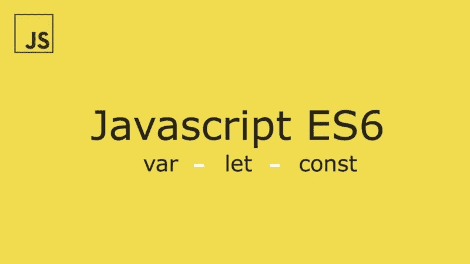

# JavaScript 中的提升和执行上下文是什么？

> 原文：<https://javascript.plainenglish.io/what-is-hoisting-and-execution-context-in-javascript-4910459d66b0?source=collection_archive---------23----------------------->

提升是对与“创建”和“执行”阶段相关的执行上下文的概念性理解。然而，提升可能会令人困惑，因为不像名字所暗示的那样，提升不会将代码移动到任何地方。对提升的通常理解是变量和函数被转移到你的代码的顶部，但事实并非如此。代码的物理位置将保持在您在文本编辑器中编写它的位置。为了让事情更容易理解，让我简要回顾一下 JavaScript 运行时环境。

# JavaScript 运行时简介。

我想从简单开始。我将跳过许多信息，直接进入重点。所以首先，当你写一个 JavaScript 程序时，比如这样。

simple function expression or arrow function

该程序将经历五个基本步骤，这五个步骤对于开发人员来说都是非常重要的。

1.  **全局执行上下文** —这被称为`main()`，运行任何代码都需要它
2.  **上下文堆栈** —你可以把它想象成一个队列或一系列任务。
3.  当另一个“任务”被放置在上下文堆栈上并保存在上述代码体中时，执行上下文将被运行。
4.  **创建阶段** —这是您的代码被读取并准备执行的阶段。
5.  **执行阶段** —最后，我们来到执行阶段。一旦以上的一切都完成了，开始执行我们的代码。

下面更多的是 JS 运行时环境及其与执行上下文的关系的可视化表示。下面的代码实际上都不能或不会在浏览器中运行。

现在我们已经对 JavaScript 运行时环境以及与执行上下文的关系有了一个大致的了解，我们可以深入一点，演示一些实际的提升。

请记住，只提升“声明”，不提升“初始化器”另外请记住。`const`、`let`直到“创建阶段”之后才会初始化，但是`var`和`function`会初始化。

既然我们已经对执行上下文和 JavaScript 运行时有了基本的了解，让我们来看看更复杂的代码。

首先，我将为我们的方法创建一些静态数据。

然后我们可以写一些代码，并评估它。

我想指出的是，我们上面的代码片段是糟糕的代码，你绝不应该这样写代码，你可能知道，这不是好代码。上面的代码片段仅仅是为了演示。

定义完数据后，我们在函数体中定义的第一件事是这样的。

正如我们之前讨论的，有两个主要阶段，“创建”和“执行”在创建阶段，为所有提升的关键字(如`function`和`var`)创建一个执行上下文。这就是为什么我们的`bigFunc`函数甚至可以在所有其他代码之上运行，也是为什么`realisingSoon`变量可以在设置值之后声明。

这被称为类似于函数表达式的箭头函数，行为相同，不被提升。虽然每个函数体，是的，甚至是箭头函数，都有闭包，但是它们有自己的执行上下文，所以我们不能在声明之前调用它。

上面你会注意到我们在声明之前调用了我们的`orderByPrice`函数，因为它也被提升了。这意味着我们声明并初始化了它，以便在执行过程中在执行上下文中的任何点调用它。

# 关于执行上下文的更多信息。

每当我们声明一个新函数时，无论是用`function`关键字还是函数表达式，我们都会得到一个新的执行上下文或新的作用域。但是我们可以通过简单地利用`let`关键字在执行上下文之外声明一个变量来解决这个问题，如下所示:

我希望这有助于澄清您对执行上下文和提升的理解。如果你有什么要补充的或者想要更多的信息，请留下评论，我会尽力回答任何问题或者根据反馈进行更新。

*更多内容请看*[*plain English . io*](http://plainenglish.io/)