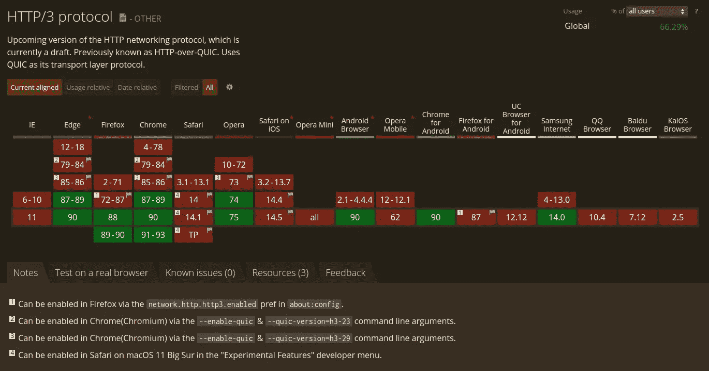

# 什么是 HTTP/3，为什么它很重要？

> 原文：<https://javascript.plainenglish.io/what-is-http-3-and-why-does-it-matter-cb7d7b4b600f?source=collection_archive---------0----------------------->

## HTTP/3 或 HTTP over QUIC 为 HTTP 带来了许多新的性能特性

Photo by [JJ Ying](https://unsplash.com/@jjying?utm_source=medium&utm_medium=referral) on [Unsplash](https://unsplash.com?utm_source=medium&utm_medium=referral)

在研究互联网及其背后的技术时，你可能会碰到这个术语:HTTP。HTTP 或超文本传输协议是网络的主干，也是传输文本数据的通用协议。毫无疑问，您使用过它，因为您在上面学习 HTTP 的网站使用 HTTP。

# 介绍

## HTTP 简史

HTTP 发布的第一个版本是 HTTP/0.9。蒂姆·伯纳斯·李在 1989 年创建了它，并在 1991 年将其命名为 HTTP/0.9。HTTP/0.9 受到限制，只能做基本的事情。除了网页，它不能返回任何东西，也不支持 cookies 和其他现代功能。1996 年，HTTP/1.0 发布，带来了新的特性，如 POST 请求和发送网页以外的内容的能力。然而，它离今天还有很长的路要走。HTTP/1.1 发布于 1997 年，修订了两次，一次在 1999 年，一次在 2007 年。它带来了许多主要的新功能，如 cookies 和持续存在的连接。最后，在 2015 年，HTTP/2 被发布并允许提高性能，实现了服务器发送事件和一次发送多个请求的能力。HTTP/2 仍然是新的，只有略少于一半的网站使用。

## HTTP/3:HTTP 的最新版本

HTTP/3，或者说 HTTP over QUIC，对 HTTP 的改变很大。传统上，HTTP 是通过 TCP(传输控制协议)完成的。然而，TCP 是在 1974 年开发的，在互联网出现之初。当 TCP 最初被创建时，它的作者无法预测 web 的增长。因为 TCP 是如何过时的，TCP 在速度和安全性两方面都限制了 HTTP 一段时间。现在因为有了 HTTP/3，HTTP 不再受限。HTTP/3 使用的不是 TCP，而是一种新协议，由谷歌在 2012 年开发，名为 QUIC(发音为“quick”)。这为 HTTP 引入了许多新特性。

# 特征

## 更快的请求多路复用

Photo by [PAUL SMITH](https://unsplash.com/@sumo?utm_source=medium&utm_medium=referral) on [Unsplash](https://unsplash.com?utm_source=medium&utm_medium=referral)

在 HTTP/2 之前，浏览器一次只能向服务器发送一个请求。这使得网站加载明显变慢，因为浏览器一次只加载一种资源，如 CSS 或 JavaScript。HTTP/2 引入了一次加载多个资产的能力，但是 TCP 并不是为此而设计的。如果其中一个请求失败，TCP 会让浏览器重做所有的请求。因为 HTTP/3 中去掉了 TCP，取而代之的是 QUIC，HTTP/3 解决了这个问题。使用 HTTP/3，浏览器只需要重做失败的请求。正因为如此，HTTP/3 更快更可靠。

## 更快的加密

Photo by [Franck](https://unsplash.com/@franckinjapan?utm_source=medium&utm_medium=referral) on [Unsplash](https://unsplash.com?utm_source=medium&utm_medium=referral)

HTTP/3 优化了允许浏览器 HTTP 请求被加密的“握手”。QUIC 将初始连接与 TLS 握手结合起来，使它在默认情况下更安全，速度更快。

# 履行

## 标准化

在撰写本文时，HTTP/3 和 QUIC 还没有标准化。IETF [工作组](https://quicwg.org/)目前正在起草一份草案来标准化 QUIC。QUIC for HTTP/3 的版本稍微修改了一下，用 TLS 代替 Google 的加密，但是优点一样。

## 浏览器支持

目前，Chrome 默认支持 HTTP/3，因为 Google 创建了 QUIC 协议和 HTTP over QUIC 的提议。Firefox 在 88+版本中也支持不带标志的协议。Safari 14 支持 HTTP/3，但前提是启用了实验功能标志。

Browser support for HTTP/3 (Source: [Can I Use](https://caniuse.com/http3))

## 无服务器/CDN 支持

到目前为止，只有部分服务器支持 HTTP/3，但其份额正在增长。Cloudflare 是除 Google 之外最早支持 HTTP/3 的公司之一，所以他们的无服务器功能和 CDN 都是 HTTP/3 兼容的。此外，谷歌云和 Fastly 符合 HTTP/3 标准。遗憾的是，微软 Azure CDN 和 AWS CloudFront 目前似乎都不支持 HTTP/3。如果你想试试 HTTP/3， [QUIC。Cloud](https://quic.cloud/) 是一种在服务器前设置缓存 HTTP/3 CDN 的有趣(尽管是实验性的)方式。Cloudflare、Fastly 和 Google Cloud 也有很好的 HTTP/3 支持，更适合生产。

# 结论

HTTP/3 仍然是 HTTP 的一个非常实验性的更新，它很可能会改变。但是，超过一半的用户支持 HTTP/3 的当前形式。如果您准备更新您的实现，那么这将是一个受欢迎的性能提升。我希望你喜欢阅读，并从这篇文章中学到一些东西。

# 资源

*   【w3techs.com 2021 年 5 月网站 HTTP/2 使用统计
*   [QUIC 工作组(quicwg.org)](https://quicwg.org/)
*   [我可以使用…支持 HTML5、CSS3 等的表格吗](https://caniuse.com/http3)
*   [首页— QUIC.cloud](https://quic.cloud/)

*更多内容请看*[***plain English . io***](http://plainenglish.io)