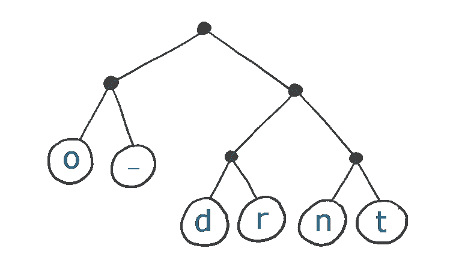
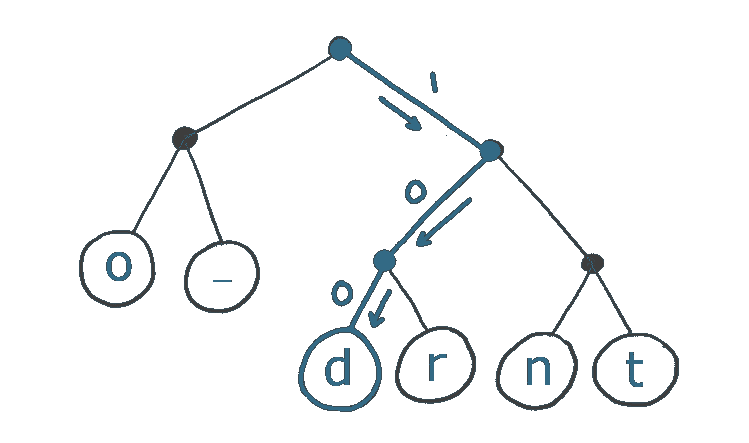
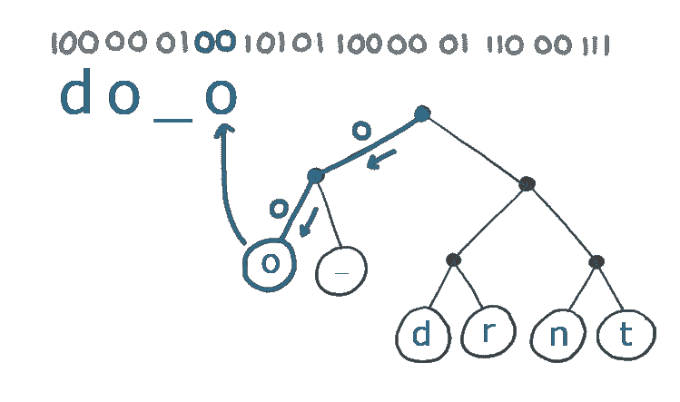

# 什么是霍夫曼编码？

> 原文：<https://javascript.plainenglish.io/what-is-huffman-coding-a5c09bc60184?source=collection_archive---------9----------------------->

霍夫曼编码算法是许多压缩算法的一个组成部分，例如 PNG 图像格式和 GZIP 使用的 DEFLATE 算法。

(我的[时事通讯](https://www.baseclass.io/newsletter/)的订阅者首先收到了这个)

## 我为什么要在乎？

您是否曾想过:

*   我们如何在不丢失任何数据的情况下压缩一些东西？
*   为什么有些东西压缩得比其他的好？
*   GZIP 是如何运作的？

假设我们想压缩一个字符串(哈夫曼编码可以用于任何数据，但字符串是很好的例子)。

不可避免的是，在要压缩的文本中，某些字符会比其他字符出现得更频繁。霍夫曼编码利用了这一事实，并对文本进行编码，使得最常用的字符比不常用的字符占据更少的空间。

## 编码字符串

让我们使用霍夫曼编码来压缩来自尤达的(部分)报价；“做还是不做”。

“做或不做”是 12 个字符长。它有一些重复的字符，所以应该压缩得很好。

为了便于讨论，我们假设存储每个字符需要 8 位(字符编码完全是另一个话题)。这句话将花费我们 96 位，但我们可以做得更好的霍夫曼编码！

我们从建立一个树形结构开始。我们的数据中最常见的字符会更靠近树的根，而离根最远的节点代表不太常见的字符。

以下是字符串“做或不做”的霍夫曼树:

字符串中最常见的字符是“o”(4 次出现)和空格(3 次出现)。请注意，这些字符的路径离根只有两步，而最不常见的字符(' t ')只有三步。

现在，我们可以存储字符的路径，而不是存储字符本身。

我们从根节点开始，沿着树向我们想要编码的字符前进。如果我们走左边的路，我们会存储一个`0`，如果我们走右边的路，我们会存储一个`1`。

以下是我们如何使用此树对第一个字符`d`进行编码:

最终结果是`1` `0` `0` - 3 位而不是 8 位。这是一个很大的进步！

整个编码字符串如下所示:

这是 29 位，而不是 96 位，没有数据丢失。太好了。

## 解码我们的字符串

为了解码我们的文本，我们只需跟随每个`0`(左分支)或`1`(右分支)直到我们到达一个字符。我们记下这个角色，然后从头开始:

## 发送编码文本

但是等等..当我们将编码文本发送给其他人时，他们不也需要树吗？是的。另一方需要相同的哈夫曼树，以便正确解码文本。

最简单但效率最低的方法是简单地将树和压缩文本一起发送。

我们也可以先在树上达成一致，在编码或解码任何字符串时都使用该树。当我们可以提前预测字符的分布时，这是可行的，并且可以建立一个相对有效的树，而不必先看到我们正在编码的特定内容(例如，我们可以对英文文本进行编码)。

另一种选择是发送足够的信息，让另一方建立和我们一样的树(这就是 GZIP 的工作方式)。例如，我们可以发送每个字符出现的总次数。但是我们必须小心。同一个文本块有不止一个可能的 Huffman 树，所以我们必须确保我们都以完全相同的方式在*中构造树。*

**延伸阅读:**

*   [如何构建霍夫曼树(比你想象的要简单)](https://www.programiz.com/dsa/huffman-coding)
*   [这在 GZIP 是如何使用的](https://jvns.ca/blog/2015/02/22/how-gzip-uses-huffman-coding/)