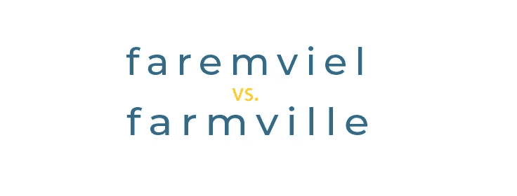
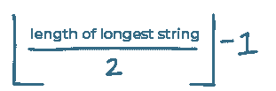
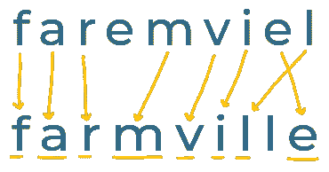
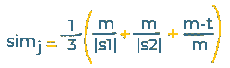
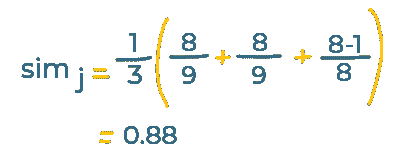
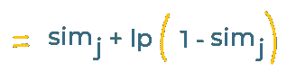
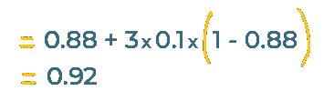

# 什么是 Jaro-Winkler 相似性？

> 原文：<https://javascript.plainenglish.io/what-is-jaro-winkler-similarity-7448cad41a6d?source=collection_archive---------13----------------------->

Jaro-Winkler 相似性是衡量两个字符串相似程度的一种方法。这是相当容易理解和快速实施。

# 我为什么要在乎？

字符串相似性度量有多种用途；从面向用户的搜索功能到拼写检查。

有一些常见的字符串相似性度量。如果您需要自己实现类似的东西，对每一个都有所了解将有助于您选择正确的方法。

Jaro 相似性和修改版本——Jaro-Winkler——是两种常见的相似性。

# 在 5 分钟或更短时间内:

假设我们正在为一个应用商店构建搜索功能。

如果用户拼错了他们的搜索，我们希望能够推荐我们认为他们正在寻找的应用。

比如说；用户正在搜索 2009 年的热门病毒，`farmville`，但却错误地输入了:

如果我们可以将这个搜索字符串与我们的应用商店中的所有标题进行比较，我们就可以向用户展示与他们输入的内容最匹配的应用。

这就是 Jaro 相似性度量的用武之地…

# Jaro 相似性

让我们计算一下用户的搜索字符串和正确的应用标题之间的相似度:

由 Matthew A. Jaro 于 1989 年创建的 Jaro 相似性度量比较了两个字符串，并给出了表示它们相似程度的分数。

结果是一个介于`0`和`1`之间的数字，其中`0`表示字符串完全不同，`1`表示它们完全匹配。

计算 Jaro 相似性的第一步是计算两个字符串之间匹配的字符数。

但是，要被视为“匹配”,字符不需要在两个字符串中出现在相同的位置——它们只需要彼此靠近*和*。

这解释了常见的打字错误，即你不小心按错误的顺序输入了一些字符。

在我们认为这些字符匹配之前，它们需要有多接近，计算方法如下:

我们的两个字符串都是`9`字符长。这给了我们一个结果`3`。

这意味着字符串中的任意两个字符“匹配”,如果它们是:

*   在两根弦的同一个位置
*   彼此相距不超过`3`个字符

如果我们画出这些匹配，看起来是这样的:

如果没有匹配，我们就不需要再进一步了 Jaro 相似性将只是`0`。

我们已经有了匹配的字符，所以下一步是计算“换位”的数量。

换位是匹配的字符，但是顺序不对。我们数了数，然后减半。

我们的字符串中有顺序不同的`2`匹配字符(最后的`e`和`l`在用户的搜索词中是向后的)。减半这给了我们`1`‘换位’。

现在我们所要做的就是将这些数字代入下面的公式(我们使用术语`simj`来表示‘贾罗相似性’——我们正在计算的东西):

这看起来很复杂，但我们实际上只需要几个值:

*   `|S1|`和`|S2|`是我们正在比较的两个字符串的长度(我们的都是`9`字符长)
*   `m`是匹配的数量——我们有`8`
*   `t`是‘换位’的次数——我们有`1`

给定这些值，这是`faremviel`与`farmville`的 Jaro 相似度:

我们的字符串相似度为`0.88`，也就是说非常相似。

如果我们计算用户的搜索词与我们应用商店中其他游戏的 Jaro 相似度，用户想要搜索什么就变得很清楚了:

*   《farmviel》vs《farmville》:`0.88`
*   《farmviel》vs《farmville 2》:`0.83`
*   faremviel vs《部落冲突》:`0.46`
*   《faremviel》vs《minecraft》:`0.31`

# Jaro-Winkler 相似性

这种对 Jaro 相似性的修正是由 William E. Winkler 在 1990 年提出的。

“Jaro-Winkler”度量采用上面的 Jaro 相似性，如果两个字符串开头的字符相同，则增加分数。

换句话说，Jaro-Winkler 喜欢两个有相同开头的弦。

这是“Jaro-Winkler 相似性”的公式:

我们需要以下值来使用它:

*   `simj`是我们上面比较的 Jaro 相似性(`0.88`)
*   `l`是两个字符串开头相同的字符数(最多 4 个)。我们的字符串都是以`f` `a` `r`开头的，所以我们为此使用了一个值`3`。
*   `p`是‘比例因子’。通常使用`0.1`。

这是`faremviel`对`farmville`的 Jaro-Winkler 计算:

开头有*没有*匹配字符的两个字符串将保持相同的分数，但是因为我们的字符串开头有共同的字母，这个版本的指标将我们的分数从`0.88`提高到了`0.92`。

Jaro 或 Jaro-Winkler 是否是正确的选择取决于您的具体用例。尝试这两种算法(和其他字符串相似性算法)，看看哪种算法最适合您的数据。

(原贴至我的[简讯](https://www.baseclass.io/newsletter))

*更多内容请看*[*plain English . io*](http://plainenglish.io/)