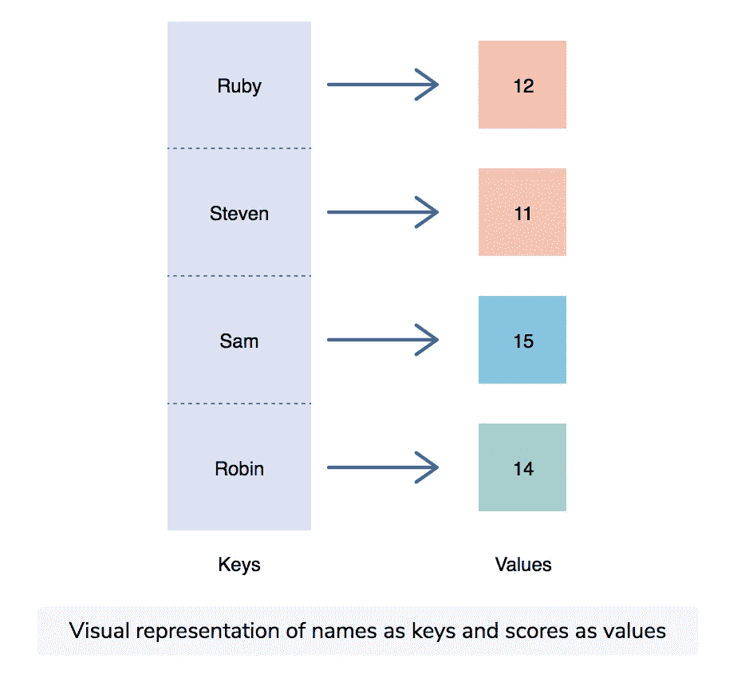
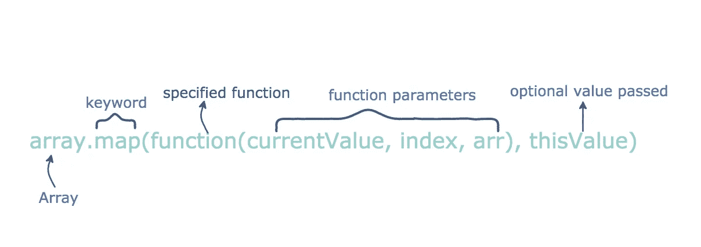

# 什么是 JavaScript Map？

> 原文：<https://javascript.plainenglish.io/what-is-javascript-map-8172bc42265a?source=collection_archive---------8----------------------->


JavaScript 曾经受到集合功能的限制。在其他语言中，您可以使用集合、关联映射、列表和字典，但是 JavaScript 只允许您使用数组。JavaScript 开发人员找到了一种将键映射到值的方法，但是他们的方法有其自身的局限性。

在 ES6 版本中，JavaScript 为地图引入了一个新的内置类，使得使用集合更加容易。在这个简短的教程中，我们将讨论 JavaScript `Map`代码示例、方法和用例，并且我们将介绍要学习的高级概念。

**我们将介绍:**

*   什么是 JavaScript map？
*   JavaScript 映射语法
*   JavaScript 映射方法和用例
*   高级地图概念

# 什么是 JavaScript map？

在 ES6 之前，JavaScript 开发人员使用对象将键映射到值，但是使用对象作为映射有一些限制:

*   没有可靠的方法来迭代键
*   `keys()`方法将字段转换成字符串，这会造成键冲突
*   添加新键和新值没有简单的方法

当引入`Map`集合类型时，这些问题在 ES6 版本中得到了解决。它可以**保存任何类型的键-值对**并且可以记住**键插入顺序**。任何值(对象和原语)都可以用作键或值。

JavaScript `Map`创建一个新的数组，其中包含数组元素迭代的结果，并按顺序为每个元素调用一次提供的函数。它是一种重要的数据结构，有许多重要的用途。

> ***注:*** `*WeakMap*` *与* `*Map*` *类似，但* `*WeakMap*` *中的所有键都是对象。*

要创建新的`Map`，请遵循以下语法:

```
let map = new Map([iterable]);
```

假设我们想要创建一个将名称存储为键，将分数存储为值的程序。

```
'use strict';

//START:DEFINE
const scores =
    new Map([['Ruby', 12], ['Steven', 11], ['Sam', 15], ['Robin', 14]]);

scores.set('James', 14);

console.log(scores.size);
//END:DEFINE
```

> ***输出:*****

**

*我们在这里做了三件事:*

1.  *用名字和分数初始化`scores`地图*
2.  *使用`set()`方法向映射添加了一个键和值(第 7 行)*
3.  *使用`size`属性确定地图中有多少个键(第 9 行)*

***我们可以用 JavaScript 地图做更多的事情，比如:***

*   *遍历地图*
*   *用可迭代对象初始化映射*
*   *通过键从地图中获取元素*
*   *获取地图中元素的数量*
*   *将映射键或值转换为数组*
*   *按照插入顺序调用每个键值对的回调*
*   *等等。*

*在我们深入研究一些方法和用例之前，让我们先来学习 JavaScript map 语法。*

# *JavaScript 映射语法*

*这个 JavaScript 映射语法如下:*

**

*描述:*

*   ***数组:**调用特定函数的数组*
*   ***映射:**使用所需参数调用数组的方法*
*   ***function(currentValue，index，arr):** 带参数的函数，需要对数组中的每个元素运行*
*   ***当前值:**当前元素的值*
*   ***索引:**当前元素的索引*
*   ***arr:** 调用`map()`的数组对象*
*   ***thisValue:** 执行时用作函数的`this`值的值*

*既然我们已经学习了语法，让我们来看一个`map()`函数的示例实现:*

```
*//creating an array
var an_array = [5, 3, 1, 4, 2]

//map calls a function with “item” as parameter
//map will pass each element of an_array as “item” in this function
//the function will triple each element passed and return it as the return value
result = an_array.map(function(item) {
    return item*3;
});

//new list will print with the tripled values
console.log(result);*
```

> ****输出:*** `*`*[ 15, 9, 3, 12, 6 ]``*
> 
> ****注:*** *原地图数组不变。**

# *JavaScript 映射方法和用例*

*既然我们已经知道了 JavaScript map 语法，并浏览了一个示例实现，那么让我们讨论一些常用的 map 方法及其用例。*

# *用可迭代对象初始化映射*

*`Map()`构造函数用一个 iterable 对象初始化一个 map:*

```
*let userRoles = new Map( [
    [ruby, 'director'],
    [steven, 'producer'],
    [foo, 'writer'],
    [robin, 'actress']
]);*
```

# *返回映射到特定键的值*

*`get()`返回映射到特定键的值:*

```
*userRoles.get(robin); // actress*
```

*如果你传递一个不在地图中的键，它将返回*未定义:**

```
*let emma = {name: 'Emma'};
userRoles.get(emma); // undefined*
```

# *返回一个布尔值，显示指定的键是否存在*

*`has()`返回一个布尔值，显示指定的键是否存在:*

```
*userRoles.has(emma); // false
userRoles.has(ruby); // true*
```

***预览***

# *返回地图中条目的数量*

*`size`属性返回地图中条目的数量:*

```
*console.log(userRoles.size); // 4*
```

# *返回一个新的迭代器对象，包括每个元素的值*

*`values()`返回包含每个元素值的新迭代器对象:*

```
*for (let role of userRoles.values()) {
    console.log(role); 
}
// director
// producer
// writer
// actress*
```

# *从地图对象中移除指定的元素*

*`delete()`从地图对象中删除指定元素:*

```
*userRoles.delete(ruby);*
```

# *移除地图对象中的所有元素*

*`clear()`删除地图对象中的所有元素:*

```
*userRoles.clear();*
```

*如果我们检查大小，它将返回零:*

```
*console.log(userRoles.size); // 0*
```

# *更重要的地图方法:*

*   *`forEach(callback[, thisArg])`:按照插入顺序为映射中的每个密钥对值调用回调*
*   *`set(key, value`):设置地图对象中关键点的值*
*   *`keys()`:返回一个新的迭代器，其中元素的键按插入顺序排列*
*   *`entries()`:遍历键和值的集合*

# *高级地图概念*

*JavaScript `Map`是一个有价值的集合类型，它使得用 JavaScript 编程更加简洁和高效。我们已经学习了地图语法、方法和用例。现在你已经准备好处理更高级的概念了。接下来推荐的一些概念包括:*

*   *元编程*
*   *原型遗传*
*   *实现构造函数*
*   *文字*

**快乐学习！**

**更多内容请看*[***plain English . io***](https://plainenglish.io/)*