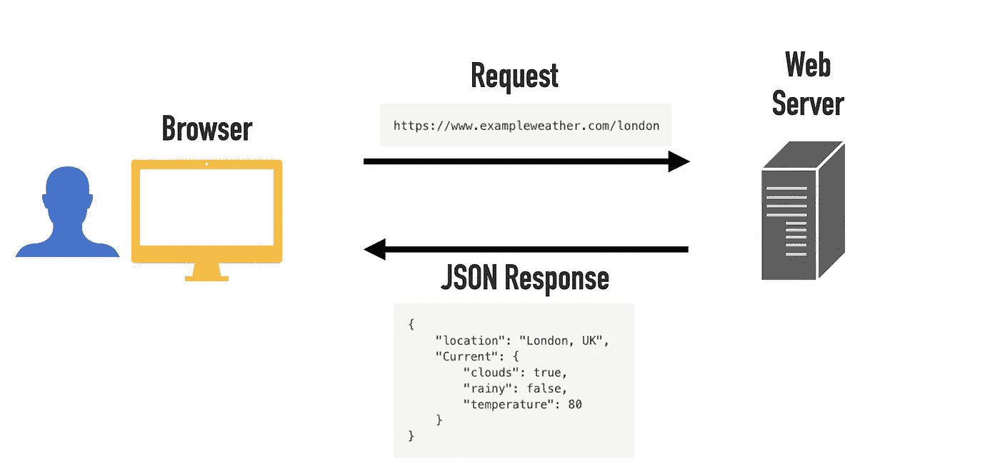

# 什么是 JSON 以及如何使用它

> 原文：<https://javascript.plainenglish.io/what-is-json-519751ee0435?source=collection_archive---------12----------------------->

## JSON 或 JavaScript 对象符号是一种广泛使用的轻量级数据格式。


Photo by [Fotis Fotopoulos](https://unsplash.com/@ffstop?utm_source=medium&utm_medium=referral) on [Unsplash](https://unsplash.com?utm_source=medium&utm_medium=referral)

JavaScript Object Notation (JSON)是一种基于文本的数据格式，用于表示结构化数据。它通常用于在 web 应用程序中传输数据。

例如，JSON 可以用来将数据从服务器发送到客户机，以显示网页。

JSON 数据可能是这样的:

```
{
    "name": Jack,
    "age": 30, 
    "married": false,
    "hobbies": ["Jogging", "Tennis", "Gym"]
}
```

今天，您将了解 JSON 是什么，为什么它如此流行，如何产生 JSON，以及如何在 JavaScript 中使用它。

# 是什么让 JSON 如此受欢迎？

JSON 被广泛使用是因为它

*   轻量级——JSON 只不过是文件中的结构化文本。
*   便于人类阅读和制作。
*   大多数现代编程语言都支持 JSON。
*   与 JavaScript 兼容—有效的 JSON 始终是有效的 JavaScript。这在构建 web 应用程序时非常有用。

# JSON 的主要用途是什么？

JSON 通常用于通过网络连接序列化和传输数据。它主要用于在服务器和 web 应用程序之间传输数据。

例如，当浏览器打开天气应用程序时，浏览器向天气应用程序的 web 服务器发出 API 请求。web 服务器发回一个 JSON 响应。然后，浏览器将这些 JSON 数据转换成人类可读的网页。



# 如何使用 JSON

在写 JSON 之前，我们先来看看 JSON 支持什么样的数据类型。

## JSON 支持基本数据类型

JSON 代表结构化数据。这意味着它应该处理不同类型的数据。JSON 本身支持以下数据类型:

*   **琴弦**。比如:`"Test"`、`"Example"`、`"How are you?"`
*   **数字**。比如:`1000`、`3.141`、`6.022e23`
*   **布尔型**。比如:`true`或者`false`
*   **Null** (没有值)。例如:`null`
*   **数组**(可以包含上述任何一项的列表)。比如:`[3, 0, 4]`，`["Apple", 10, true, null]`
*   **对象**(花括号内逗号分隔的键值对)。例如:`{"name": "Matt", "age": 40, "married": false}`

## 如何写 JSON

要编写 JSON，您只需要一个 JSON 文件，然后在其中编写用大括号括起来的逗号分隔的键值对。

**举例。让我们创建一个 JSON 文件，并将一个示例 JSON 对象写入其中。**

1.  创建一个文件，例如`student.json`。
2.  向其中添加以下 JSON 内容:

让我们检查一下上面的 JSON 数据，以了解它是如何工作的:

*   整个 JSON 数据都用花括号括起来。这使它成为一个 **JSON 对象**。
*   JSON 对象由逗号分隔的键值对组成，比如`"Name": "Charlie"`。
*   JSON 对象的每个**键**都必须用双引号括起来。(如果该值是字符串，则只需要用双引号括起来)。比如不能写`Graduated: false`。相反，你必须写`"Graduated": false`。
*   在 JSON 对象内部创建 JSON 对象是很常见的。以`"Grades"`为例看一看。

# 如何在 JavaScript 中使用 JSON

大多数现代编程语言，比如 Python，都支持 JSON。在本指南中，我们将使用 JavaScript 和 JSON。

创建一个名为`students.json`的 JSON 文件，在其中存储学生列表。每个学生都是数组中的一个 JSON 对象:

让我们将这个 JSON 对象转换成 JavaScript。如你所知，有效的 JSON 总是有效的 JavaScript。这意味着您可以复制上面的 JSON 并将其添加到 JavaScript 文件中。

例如，让我们通过将上面的 JSON 复制粘贴到一个名为`students.js`的新文件来创建一个 JavaScript 数组:

现在您可以使用 JavaScript 来玩这个`students_data`。例如，您可以将第一个学生的名字打印到控制台:

```
console.log(students_data[0].name);
```

或者你可以记录学生的成绩:

```
console.log(students_data.forEach(*s* => console.log(s.grades)))
```

这里的要点是展示 JSON 数据如何自动成为有效的 JavaScript，可以在 web 应用程序中使用。

# 如何处理网络请求中的 JSON 响应

让我们通过展示 web 应用程序如何执行网络请求来从 web 服务器检索 JSON 数据来结束本指南。

在 JavaScript 中，您可以使用`[fetch](https://developer.mozilla.org/en-US/docs/Web/API/Fetch_API)`库从 web 上获取资源。它通过向网络服务器发出网络请求来检索数据。

让我们使用 JavaScript 中的`fetch`以 ToDo 列表的形式从 web 服务器检索一些[虚拟 JSON 数据](https://jsonplaceholder.typicode.com/)。

为此，请将以下代码复制粘贴到 JavaScript 文件中:

这段代码从 web 服务器上的 ToDo 列表中检索第一个 ToDo 项。web 服务器将这些数据作为 JSON 返回。然后，您的代码将其解析为一个 JavaScript 对象，并将其打印到控制台。

输出:

```
{
  completed: false,
  id: 1,
  title: "delectus aut autem",
  userId: 1
}
```

现在，您可以构建一个简单的 web 应用程序，使用这个过程为用户检索和显示待办事项列表数据。

这是一些 web 应用程序工作的基本思路:它们向 web 服务器发出网络请求。然后服务器返回一个 JSON 响应，这个响应很容易用 JavaScript 处理。

# 结论

JSON 或 JavaScript 对象符号是表示结构化数据的一种流行方式。它是一种轻量级的基于文本的数据格式，用于在 web 服务器和客户端(如浏览器)之间传输数据。

您几乎可以将任何东西存储为 JSON:字符串、布尔值、数字、数组、对象和一个`null`。

使用 JSON 不一定要懂 JavaScript。比如 Python 或者 Swift 都支持 JSON。

感谢阅读。

编码快乐！

# 进一步阅读

[](https://www.codingem.com/json-parsing-with-codable-in-swift/) [## Swift 中的可编码:JSON 解析变得简单(2022 年)- Codingem

### 在 Swift 中，Codable 是可编码和可解码的组合。可编码意味着一个对象可以从 Swift 转换成…

www.codingem.com](https://www.codingem.com/json-parsing-with-codable-in-swift/) [](https://betterprogramming.pub/100-javascript-interview-questions-58e22e30f7f1) [## 2021 年 100 个 JavaScript 面试问答

### 赢得下一次编程面试

better 编程. pub](https://betterprogramming.pub/100-javascript-interview-questions-58e22e30f7f1) 

# 参考

[](https://www.json.org/json-en.html) [## JSON

### 编辑描述

www.json.org](https://www.json.org/json-en.html) [](https://developer.mozilla.org/en-US/docs/Learn/JavaScript/Objects/JSON) [## 使用 JSON

### 在本文中，我们给出了在程序中使用 JSON 的简单指南，包括如何创建和解析 JSON…

developer.mozilla.org](https://developer.mozilla.org/en-US/docs/Learn/JavaScript/Objects/JSON) 

*更多内容尽在*[***plain English . io***](http://plainenglish.io/)