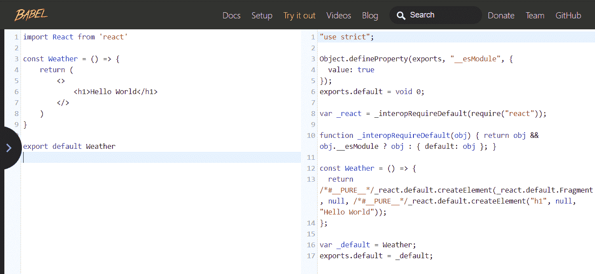
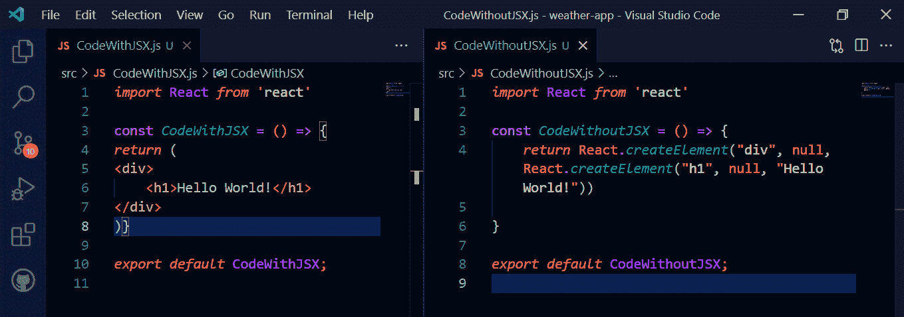
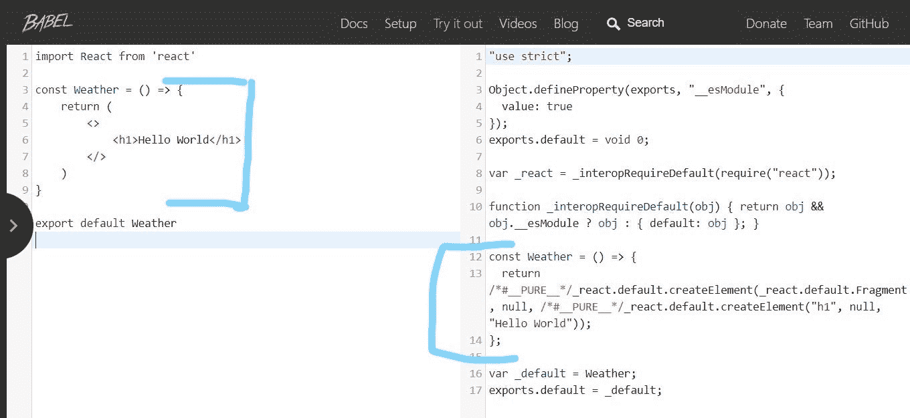
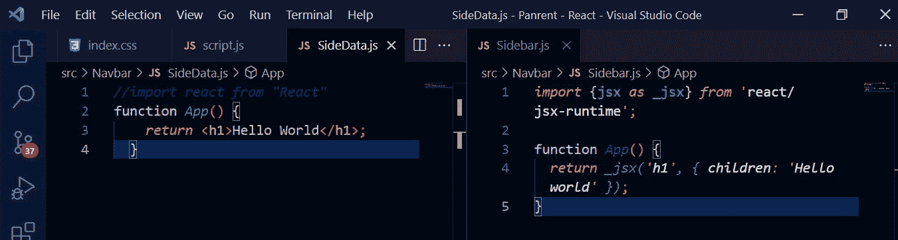

# JSX 在作出什么反应？

> 原文：<https://javascript.plainenglish.io/what-is-jsx-in-react-a2f3e9019905?source=collection_archive---------9----------------------->


BY Author

JSX 是 JavaScript 语法扩展的缩写。它是一种结合 JavaScript 和 HTML 代码的语法，或者更准确地说，是在 JavaScript 代码中编写 HTML 代码。

> JSX 是一种模板语言，具有 JavaScript 的全部功能。

# **语法**

```
***const element = <h1>Hello World!</h1>;***
```

正如我们在上面的语法中看到的，HTML 和 JS 代码都是在一行中编写的。它既不是 HTML 也不是 JS 代码，它是 JSX，在一个代码中编译两种语言。

在 JSX 编写 React 代码是一个很好的实践，但这不是强制性的。我们将在本文中看到这两种方法的区别，但首先，让我们讨论为什么 JSX 比其他方法更好？

这里有一些在 JSX 写代码的优势

1.  用 JSX 语言编写 React 代码便于阅读和理解。
2.  如上所述，我们可以简单地在 JS 内部编写 HTML 代码，它将被称为 React 代码。
3.  与常规 JavaScript 相比，代码的呈现速度更快
4.  用 JSX 写代码不仅使代码简洁易懂，甚至有助于防止错误。

JSX 的主要问题是浏览器不能读取它的语法，因为它同时包含 HTML 和 JavaScript。为了解决这个问题，2014 年推出了 Babel，它通过将 JSX 代码转换成普通的 JS 来帮助浏览器阅读它。

> ***Babel*** 是一款 JavaScript 编译器，主要用于将***ecmascript 2015/ES6***及其更新版本转换成浏览器能够理解的普通 JavaScript。
> 
> ECMAScript 2015 或 ES6 是 JavaScript 的第六个版本，完全打包了新功能，包括箭头函数、let 和 const 关键字、承诺、类和更多。

让我们试着通过一个例子来更好地理解巴别塔。

下面是一张左侧有 JSX 代码的照片，它是通过 Babel 转换成普通 JS 的，这样浏览器可以更清楚地理解它。



Conversion of JSX into simple JS that browser can Read

右边的代码非常复杂冗长，仅仅是为了写一个简单的***“Hello World！”。***

因此，使用 JSX 使代码更干净、更容易理解，并能发现错误。

# **没有 JSX 的 React 代码**

在本文的开始，我已经说过 JSX 并不是 React 中编写代码的唯一方式，但是由于它的简单性，它被广泛使用。

React 中编写代码的另一种方法是通过 ***createElement()。*** 在 JSX 之前，React 的每一段代码都是用这种方法编写的，但是这种方法比较冗长。

一个比较这两种方法的例子可能会帮助你更好地理解事情



Comparison Between React with JSX and without JSX

从上图中，我们可以很容易地看到，对于每个 HTML 元素，我们必须调用***react . createelement()***函数来利用其预定义的属性，就像本例中的< h1 >。

它是 react 中最纯粹的 w 代码形式。

> 了解他们的转换和差异是 React 的一个非常重要的部分，也是面试中常见的。

# **React.createElement()**

如前所述，这是用 React 编写的最纯粹的代码形式，没有 JSX 和巴别塔，每一段代码都被转换成这种形式，只是因为它更容易被浏览器理解。



正如我们在代码中看到的，React.createElement()的语法是

```
***React.createElement(“type”, props, “children”)***
```

哪里-

***type*** —是 HTML 中的属性类型，如 div、h1、p 等

***道具***——用于 id、类等属性

***children*** —可以是要呈现的语句，也可以包含其他属性，如上例所示。

有关该主题的更多详情，请访问[官方网站](https://reactjs.org/docs/react-without-jsx.html)。

# 编写 JSX 代码的规则

每种语言都有一定的规则，JSX 也有。他们是-

1.  每个 HTML 标签都必须有它的结束标签
2.  我们可以用{}包装 HTML 来编写 JS 代码
3.  如果我们有大量的 HTML 代码，我们将不得不把它放在()& [] / <> >里面
4.  它使用 camelCase 符号来命名 HTML 属性，如 onClick、tabIndex 等等。
5.  如果遗漏或未遵循任何规则，控制台将会出错。

# React JSX 从 React v.17.0 进行了更改

React17 的发布没有引入新功能，但引入了一个新的 JSX，将从此版本开始生效。

React 的开发团队希望改进 JSX，但不能以旧版本为代价。因此他们想出了这些调整—

1.  有了新的 JSX，我们每次创建一个新组件都不需要在顶部导入 React，但是当涉及到 ***状态时，****b*oth***React***和 ***状态*** 会像 ***一样在顶部导入 React，{state}从【React】***
2.  根据您使用的设置，包的大小会略有变化。

我们使用的 JSX 语法没有变化，也没有必要仅仅因为 JSX 有变化就改变 React 代码。React 将仍然支持 JSX 的旧版本，但不需要在每个文件的顶部 ***导入 React 组件*** 。

举个例子可能会帮助你更好地理解事情。

我们将使用与上面 ***Hello World 相同的代码。***



NEW JSX

正如您已经发现的那样， ***React*** 组件已经被注释掉了，并且不是代码的一部分，或者只是它还没有被导入到代码中，但是我们仍然以 React 文件的形式接收它的输出，没有 JSX，但是不同之处在于它使用了 ***_jsx()*** 来代替***React . createelement()***，其余的都是一样的。

欲了解更多信息，请阅读[官方文档](https://reactjs.org/blog/2020/09/22/introducing-the-new-jsx-transform.html#how-to-upgrade-to-the-new-jsx-transform)。

# 结论

1.  JSX 是一种语法，借助括号将 HTML 和 JavaScript 代码编写在一个文件中。
2.  在 JSX 的帮助下，我们可以写出清晰易懂、易于编辑的代码。
3.  不强制只在 JSX 写 React 代码。我们还有一种不用 JSX 来编写 React 代码的方法，但是它变得复杂，有时会很冗长。
4.  从 React 17 开始，没有必要每次都在组件顶部导入 React，但是如果涉及到状态，情况就不同了，因为我们必须导入 React 和我们在顶部使用的状态。

更多精彩的文章请访问我的网站—[Tekolio.com](https://tekolio.com/)

[](https://akd3257.medium.com/subscribe) [## 每当 Ateev Duggal 发表文章时，就收到一封电子邮件。

### 每当 Ateev Duggal 发表文章时，就收到一封电子邮件。注册后，如果您还没有，您将创建一个中型帐户…

akd3257.medium.com](https://akd3257.medium.com/subscribe) 

*更多内容请看* [***说白了就是***](https://plainenglish.io/) *。报名参加我们的* [***免费每周简讯***](http://newsletter.plainenglish.io/) *。关注我们*[***Twitter***](https://twitter.com/inPlainEngHQ)*和*[***LinkedIn***](https://www.linkedin.com/company/inplainenglish/)*。加入我们的* [***社区不和谐***](https://discord.gg/GtDtUAvyhW) *。*