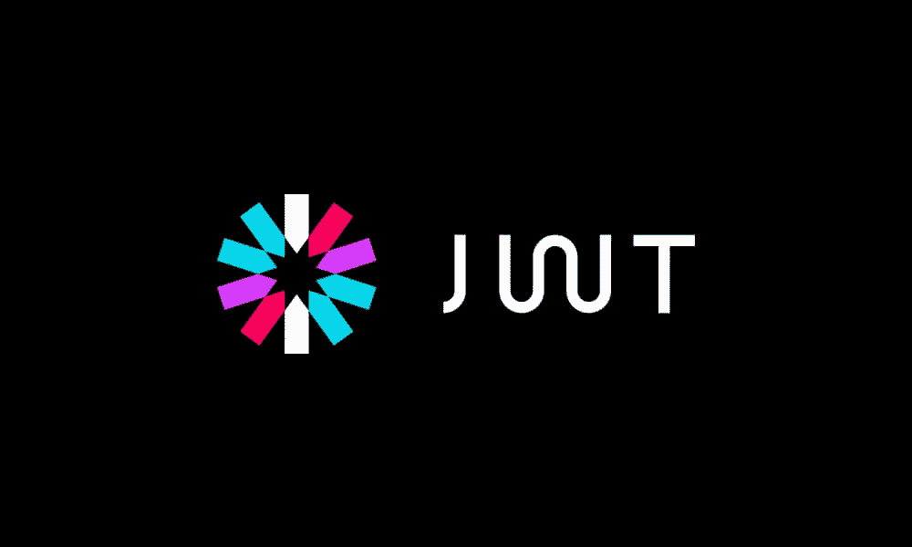

# 什么是 JWT，它是用来做什么的？

> 原文：<https://javascript.plainenglish.io/what-is-jwt-and-what-is-it-used-for-dcc1c1c160a8?source=collection_archive---------6----------------------->

JWT 是一个编程新手不常遇到的东西，但在我看来是绝对需要学习的东西，即使只是为了理解概念。

# 介绍

JWT 代表 JSON Web Token，JSON 代表 JavaScript Object Notation。当我们打开这个双缩写词时，我们知道我们正在处理一个 JavaScript 形式的对象，它将被用作 web 令牌，或者换句话说，获得访问权限，就像您使用 arcade 令牌获得游戏访问权限一样。

# 它是用来做什么的？

JWT 用于安全地访问不同的对象并与之通信，它使用密钥来加密对象，同时确保没有人可以在没有密钥的情况下手动制作和发送这些对象。

这一切意味着什么？简单地说，您使用一个随机密钥来真实地生成和检查 JWT，然后将对象传入。

让我们来看一个例子，看看你如何让它更好地理解它的目的是什么。

# 如何使用它

您使用一组随机的字符和数字(最好是长的)，如下所示:

> 342789 rowacy 847 qoacty 4387 qoctywoq 387

并使用它作为你的密钥，你将传递它来生成 JWT，并确保它是由正确的人或程序生成的。

实际的 JWT 本身也是一长串字符，就像这样:

> eyj 0 exaioijkv 1 qilcjhbgcioijiuzi 1 nij 9 . eyjzdwiiiixmjm 0 nty 3 odkwiiwibmftzsi 6 ikp vag 4 rg 9 liiwiywrtaw 4 ionrydwusimp 0 ASI 6 imfhntcwngfhllodgtngy 1 OS 1 imtgzlwiody 1 ngfjnjbinsisimlhdci 6 mtyynde5 otg 1 cwizxhjoxnji 0 mjazndu 4 FQ . ismbaozlo E4 ze x7 wbo 6 hdg

我们可以用这个，这是当你第一次去现场时，[https://www.jsonwebtoken.io/](https://www.jsonwebtoken.io/)给出的一个例子。这个网站也是你可以手动创建 JWT 的地方，但是只能用于测试。

## 三个部分

在我们的例子中，假设我们需要访问一个 API，并告诉它我是一名管理员，我的名字是 John Doe。我们将把这些信息作为 JS 对象(有效载荷)传递给 JWT 生成器，这占了 JWT 的 1/3。

JWT 的另一部分是报头，它定义了类型以及用于加密和解密的算法。在这种情况下:

> {
> "typ": "JWT "，
> "alg": "HS256"
> }

最后一部分是我们之前谈到的实际密钥，在示例情况下是“secret ”,但千万不要这样做，尽可能随机，因为否则您的秘密代码可能会被泄露，这非常糟糕。

这三个部分构成了 JWT，这也是您如何以安全的方式传递信息以接收、更新、查询等等。

# 增加有效载荷

有很多东西可以添加到有效载荷中，也就是 JWT 的信息部分。这可以是来自角色、访问布尔值或单词、额外信息以及日期的任何内容。

日期非常重要，因为您可以传递创建日期和到期日期，这增加了一层额外的安全性，不允许 JWT 被重用，这也是为什么一些网站会将您从您的帐户中注销，并告诉您会话已过期。

此外，如果您有一个角色系统或权限系统，您可以控制谁可以访问什么。基本用户可能只能更改用户名，而管理员可以更改更多，未登录的用户可能只能看到有限的信息。

# 结论

总之，JWT 是验证和控制谁有权访问什么并尽可能保护您的数据安全的绝佳方式。最初的流程可能会让许多人感到困惑，但是一旦你掌握了窍门，建立一个强大的系统就会变得非常快速和高效。

每个开发人员都应该知道这是如何更好地控制一切的，不管你是前端、后端还是全栈开发人员。

*更多内容看*[***plain English . io***](http://plainenglish.io/)