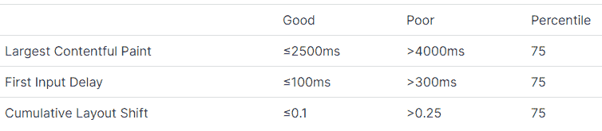
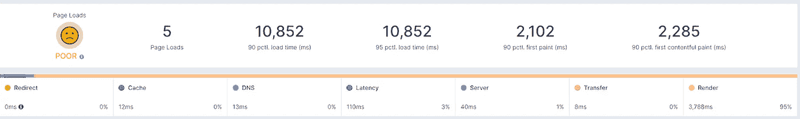

# 什么是网络延迟？您能做些什么？

> 原文：<https://javascript.plainenglish.io/what-is-network-latency-and-what-can-you-do-about-it-849bdfe0b135?source=collection_archive---------15----------------------->

潜伏期。

滞后。

延迟。

你可以用不同的名字称呼它，但结果是一样的。这些天来，你的网站加载缓慢，人们的注意力分散，这可能意味着他们会转向不同的网站、服务或平台。至少可以说，不理想。

# 但是，网络延迟到底是什么呢？

延迟是请求从发送方传递到接收方以及接收方处理该请求所花费的时间。换句话说，就是服务器处理和返回从浏览器发送的请求所花费的时间。

想想一家迎合全球用户的简单电子商务商店。高延迟会让浏览类别和产品变得非常困难，在一个像在线零售这样竞争激烈的领域，额外的几秒钟可能会造成大量的销售损失。

# 网络延迟的原因是什么？

有很多原因可以解释为什么你的站点加载时间会滞后。它可以是任何东西，但最常见的因素是:

*   大量使用 CSS 和 JavaScript
*   糟糕的服务器/托管计划
*   大图像尺寸
*   不使用浏览器缓存
*   太多的小部件和插件
*   从慢速服务器上热链接图像和其他资源
*   交通量
*   旧的浏览器
*   网络连接缓慢(尤其是在移动设备上)

这意味着您可以采取一系列措施来提高页面速度，我将在后面的文章中解释。但是在您开始故障诊断以提高网站性能之前，您需要测试您的页面加载时间。

您可以在我们的博客文章中了解更多关于页面速度的信息，了解有助于优化您的网站和改善用户体验的十大网站性能指标。

# 如何测量延迟？

进行任何更改之前，首先进行测量很重要。衡量具体的指标可以让你比较改变前后的网站表现，并让你知道你的改变是否真的有效。

作为网站所有者，有许多度量标准可以衡量，但我建议关注最大内容绘制、首次输入延迟和累积布局偏移。

这三个指标被谷歌定义为[核心网络生命周期](https://web.dev/vitals/#core-web-vitals)。

# 什么是良好的延迟？

好吧，您设法测量了您的延迟，但是您到底要将它们与什么进行比较？根据上述核心网络生命周期指标，您应该在 3 秒钟内将内容提供给用户。基本上，您应该达到的推荐阈值如下:

您可以在这里阅读更多关于谷歌用来达到这些阈值的标准[。](https://web.dev/defining-core-web-vitals-thresholds/#criteria-for-the-core-web-vitals-metric-thresholds)

# 如何提高网站的性能？

太好了，你的网站很慢。你下一步应该做什么？如果你发现自己在问这些问题，那么下一部分就是为你准备的。这里有一些方法可以加速你的网站，但是请注意，这里有很多因素在起作用，这些只是最受欢迎的，而不是全部。

# 压缩

这是显而易见的。小文件加载速度更快，最小化文件大小的最简单方法是使用 [Gzip](https://www.gnu.org/software/gzip/) 来压缩 CSS、HTML 和 JavaScript 文件。

它对图像不起作用，所以你必须确保以不同的方式最小化这些图像，或者使用 CDN，但我们稍后会谈到这一点。

# 缩小文件

为了提高你的网页速度，你需要优化运行你网站的代码。谷歌推荐你对 HTML 使用 [HTMLMinifier](https://github.com/kangax/html-minifier) ，对 CSS 使用 [CSSNano](https://github.com/ben-eb/cssnano) ，对 Javascript 使用 [UglifyJS](https://github.com/mishoo/UglifyJS2) 。

# 渲染阻塞代码

每次你加载一个脚本，你都会增加 DOM 渲染的时间。虽然这对于不太复杂的小型网站来说可能不是问题，但是在某些情况下，渲染阻塞代码可能会导致严重的延迟。

# 加拿大

内容分发网络是一个服务器网络，它将您的站点副本存储在全球多个位置，以优化资源的交付时间，而不管用户从哪个位置请求资源。

# 隐藏物

您可以将数据存储在临时位置，以便更快地访问它们，而不必每次都下载它们。这是降低成本和减少网站加载时间的有效方法。如果你想了解更多，这里有一篇关于缓存的很棒的文章。

# 优化的图像

图像通常是许多与速度相关的问题的根源，因为未经优化的图像往往是网站加载时间长的主要原因。有很多方法可以优化图像，可能没有一个放之四海而皆准的方法，但我推荐以下方法。

如果你有一些图片，在重新上传之前，你可以用 Photoshop 或者类似的软件来优化它们。如果你没有 Photoshop，你可以使用免费的网络替代软件，比如 Photopea.com。如果你有很多，我推荐一个工具，可以做批量优化，像[ezgif.com](https://ezgif.com/optimize)。

第三种选择是使用 CSS Sprites，它是由 CSS 控制的多个图像的集合。这允许您通过只加载一个图像并让您的 CSS 控制显示的内容来最小化请求的数量。使用这个[工具](https://cssspritestool.com/)创建你的精灵，然后上传到网站。

# 贸易工具

我知道整个网站优化是一个很大的课题，虽然我还没有仔细研究这个冗长课题的每个方面，但我相信我已经涵盖了最常见的部分。棘手的部分是不知道可能会出现什么问题，但确切地了解你的网站有哪些不足，哪些领域需要立即关注。

这就是[语义体验](https://sematext.com/experience)发挥作用的地方。这是一个[朗姆解决方案](https://sematext.com/blog/real-user-monitoring-tools/)，通过直接从用户那里实时测量数据，提供关于你的 webapp 在世界各个角落的表现的深刻数据。

# 结论

延迟总是会影响网站的性能，但是通过适当的工具，您可以通过首先解决导致延迟的主要问题来减轻其影响。

*阅读更多尽在* [***说白了. io***](https://plainenglish.io/)