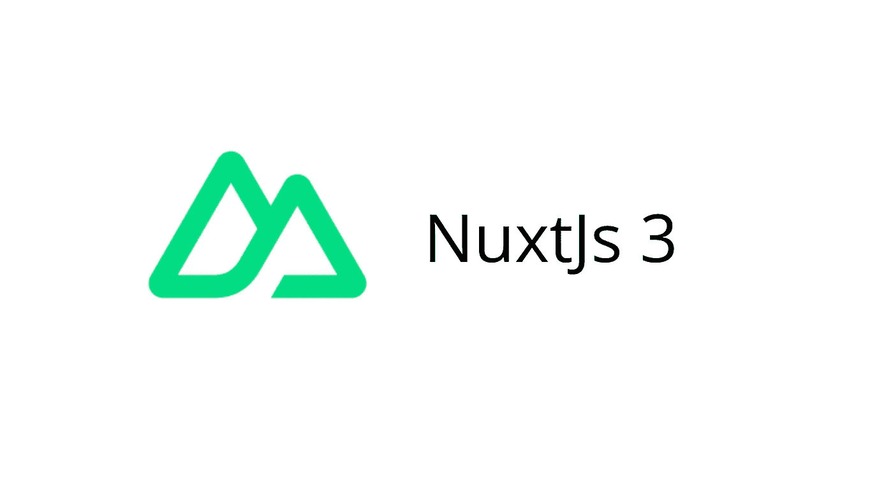

# NuxtJS 3 有什么新功能？

> 原文：<https://javascript.plainenglish.io/what-is-new-in-nuxtjs-3-42df1b55921e?source=collection_archive---------11----------------------->

## 我参加了为期两天的 NuxtJS 会议，NuxtJS 3 推出了一些令人惊叹的功能。

Image by [John Philip](https://medium.com/u/c2cdb19c0977?source=post_page-----42df1b55921e--------------------------------)

NuxtJS 是一个建立在 Vue.js 之上的直观框架。这意味着 VueJS 的大部分核心特性和功能在 NuxtJS 中都可以实现。

作为 Vue.js 框架的爱好者，我发现使用 NuxtJS 是一件轻而易举的事情，因为它提供了许多开箱即用的功能。

**它提供的一些核心功能有:**

✔️零配置——马上开始编写你的应用程序，Nuxt 会处理剩下的事情。

✔️文件系统路由—自动路由和每页代码拆分。

✔️呈现模式—在静态站点生成或按需服务器呈现之间切换。

✔️数据获取—从您的 Vue 组件中的任何来源获取您的内容，SSR 就绪。

✔️强约定——具有强目录结构和约定的高效团队合作。

✔️搜索引擎优化友好-元标签管理和更快的时间到内容的伟大索引。

✔️组件自动导入——使用您的组件，Nuxt 将通过智能代码拆分导入它们。

✔️模块生态系统—使用 160 多个 Nuxt 模块扩展您的应用程序，并创建您自己的模块。

所以我有机会参加了 9 月 15 日至 16 日举行的 NuxtJS 会议。

为期两天的活动相当成功，从不同的人那里学到了很多东西，也听到了很多东西。

从谈话和公告中，我碰巧在改进 NuxtJS 3 的过程中做了一些笔记。

因此，让我们来看看这次会议带来的关于 NuxtJS 3 的一些改进。

## **NuxtJS 硝基。**

Nitro 是 NuxtJS 3 附带的特性之一。Nitro 是一个服务器引擎，它接受一个传入的请求并将其转换为标准 HTML。

Nitro 很像是一个电话接线员，他获取一段代码并加载它。Nitro 还负责处理加载或请求的每一位代码。

Nitro 还将能够使用 express.js 等其他框架与服务人员合作。

NuxtJS nitro 的另一个惊人之处是它将被插件和 Web 3 所包围。

NuxtJS Nitro 也将上市，可用于生产环境。

Nitro 也将能够在动态页面生成的基础上构建变化的页面。

## **NuxtJS 硝基有多稳定？**

会议期间经常被问到的一个问题是 NuxtJS Nitro 服务器引擎有多稳定。

从 NuxtJS 核心团队来看，就 NuxtJS Nitro 的稳定性而言，它的稳定性将完全基于社区和整个社区的支持，类似于框架本身。

## NuxtJS 命令行界面的变化。

NuxtJS 也改变了对 Nuxt 3 的 CLI 支持。同样，这种变化与框架的功能无关。

它仅仅是一个全球独立的，你可以很容易地根据你的喜好集成它。

NuxtJS 3 还提供了默认的内置类型脚本支持。

## 什么是 H3？

会议期间，介绍了 H3。那是什么呢？H3 是一个为高性能和可移植性而构建的最小 h(ttp)框架。

NuxtJS 的核心团队还提到，h3 的统计数据显示，它比 fastify 快得多，这是一个巨大的提升。

## **特色:**

✔️可移植性:在无服务器、Workers 和 Node.js 中运行良好

✔️兼容:支持连接/快速中间件。

最小✔️:小，树摇摇和零依赖。

✔️现代:本地承诺支持。

✔️Extendable:附带了一组可组合的实用程序，但是可以扩展。

要了解更多关于 H3 的信息，请查阅本 [***资源库***](https://github.com/unjs/h3) 。

## **谷歌极光+ NuxtJS。**

google aurora 最近在 Google aurora 项目中加入了 NuxtJS，目的是提高 web 的性能。

我认为这对 NuxtJS 来说是一个巨大的胜利，因为一些大玩家已经注意到了这些框架并实现了它们的使用。

要了解更多关于谷歌极光项目的信息，请点击 [***链接。***](https://www.pathcheck.org/en/blog/a-new-open-source-solution-for-the-google-apple-exposure-notification-api)

## **终端思想。**

NuxtJS 3 包含了一些惊人的特性和功能。在社区的帮助和支持下，这个框架将不断地以惊人的特性将我们推向极限。

感谢您阅读这篇文章。另外，如果你觉得我的内容有用，而你不是媒体会员，你可以在这里(媒体推荐链接)获得你的媒体会员资格，无限制地访问所有内容，并支持我们的写作

## **多读书。**

 [## 没人告诉你关于编程的残酷事实

### 当你进入科技和编程领域时可能会遇到的事情。

javascript.plainenglish.io](/harsh-truths-no-one-tells-you-about-programming-1fa6c7a40c2c)  [## 如何在 Nuxt.js 中用 Particles.js 创建动画背景

### 为你的网站创建 JavaScript 粒子动画背景。

javascript.plainenglish.io](/how-to-create-animated-backgrounds-with-particles-js-in-nuxt-js-6982df35f75c) 

*更多内容请看*[***plain English . io***](http://plainenglish.io/)