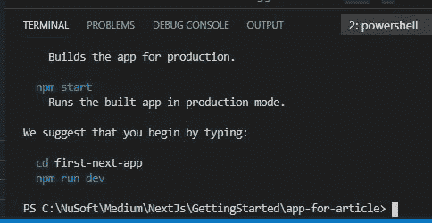
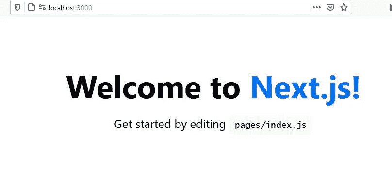
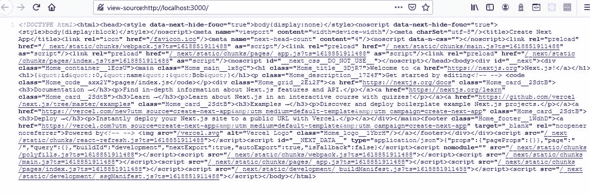
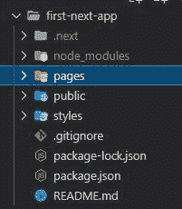
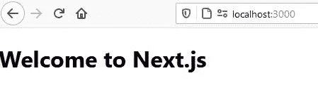
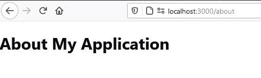
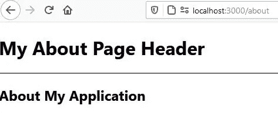

# 什么是 Next.js 和服务器端渲染

> 原文：<https://javascript.plainenglish.io/what-is-next-js-and-server-side-rendering-9e24ea21c144?source=collection_archive---------4----------------------->

## 基于组件的开发

## 开始使用 React 框架。


Photo by [Arnold Francisca](https://unsplash.com/@clark_fransa?utm_source=medium&utm_medium=referral) on [Unsplash](https://unsplash.com?utm_source=medium&utm_medium=referral)

在本教程中，我们将研究:

*   Next.js 是什么，它与 just React 有何不同。
*   什么是服务器端渲染。
*   如何引导 Next.js 应用程序？
*   创建路线的基础。
*   使用 React 组件。

这个的源代码可以在 [GitHub](https://github.com/Gravity-Well/getting-started-with-nextjs) 上找到。

# 假设

本教程假设您熟悉 React 的基础知识，如**功能组件**和路线的概念。如果您不熟悉这些，您可能想阅读:

[](/creating-your-first-react-application-db9dfe93b4f5) [## 如何在你的第一个 React 应用中使用 Props

### 建立一个产品展示器，而不是简单的 Hello World！

javascript.plainenglish.io](/creating-your-first-react-application-db9dfe93b4f5) 

可能还有这个:

[](/react-router-and-spas-made-easy-19fd1db0d6fc) [## 如何使用 React-Router 创建 SPA

### 使用客户端路由创建单页应用程序

javascript.plainenglish.io](/react-router-and-spas-made-easy-19fd1db0d6fc) 

# 工具和设置

你需要安装 [**Node.js**](https://nodejs.org/en/) 以及一个代码编辑器。我将使用 [**VS 代码**](https://code.visualstudio.com/) 。

# 那么，Next.js 是什么？

首先，尽管你仍然要编写 React JSX 代码，React 是一个库，Next.js 是一个框架。

Next.js 是 Vercel 创建的一个 **React 框架**。与使用**客户端渲染**的 React 不同，Next.js 使用**服务器端渲染，默认为**(参见下面的注释)。

## 库 vs 框架

> a **框架**和**库**的技术**区别在于**中有一个**术语叫做控制反转。当你使用一个**库**时，你是**在**负责应用流程。你选择何时何地调用**库**。当您使用**框架**时，**框架负责**流程。**

听起来很复杂，但本质上这意味着一个框架强加了一些你**必须**遵守的结构和惯例。

但是，正因为如此，在 Next.js 中，有些东西，比如路由，是内置的，更容易实现。Next.js 不需要安装单独的 npm 包，比如 react-router-dom。

## 服务器端渲染

> **服务器** - **端渲染** (SSR)是**在**服务器**上渲染**网页并传递给浏览器(客户端)的过程，而不是**在浏览器中渲染**。SSR 向客户端发送一个完全由**呈现的**页面；客户端的 JavaScript 包接管并支持 SPA 框架运行。

服务器端呈现应用程序的一个常见优点是，当查看页面源代码时，HTML 标签(和其他项目)会暴露在浏览器中，从而带来出色的 SEO。在 React 应用程序中，查看页面源代码暴露出的信息很少，搜索引擎爬虫可以使用这些信息。

与 React 相比的另一个区别是 Next.js 允许第一个页面加载由服务器呈现。这使得它可能比 React 应用程序更快，React 应用程序必须在访问页面之前加载整个应用程序。

使用 Next.js 的一般过程是，在服务器上执行 React JSX 代码，用 HTML 创建一个页面，并将其发送到用户的浏览器，完全呈现 HTML、CSS、数据等等。

***注意*** *: Next.js 还是可以做客户端路由的。所以你可以两全其美。*

Next.js 的一个非常有趣的特性是，虽然您可以像在 React 应用程序中经常做的那样，对单独的 Node.js/Express 服务器进行 API 调用，但是 Next.js 还能够让您直接在 Next.js 文件结构中编写 API routes *！*本质上，这些路由是 lambda 处理程序。然而，在大规模应用中，这是不鼓励的，因为它会导致我们在 2010 年之前看到的单片应用。

# 我们开始吧

## 创建基本的 Next.js 项目结构

1.  创建一个应用程序所在的文件夹。
2.  启动 VS 代码，打开刚刚创建的文件夹。
3.  打开终端窗口。
4.  在终端中，键入以下命令来创建名为 **first-next-app 的项目。**

```
**npx create-next-app** first-next-app
```

在安装了核心库、文件和核心/必需的文件结构之后，我们得到了一些有用的 npm 命令。请注意 cd 和 npm run dev 命令。



After typing npx create-next-app

5.将(cd)更改到目录**下一个应用**。

```
cd first-next-app
```

6.通过在终端中键入以下命令来运行应用程序。默认情况下，它运行在端口 3000 上。

```
npm run dev
```

你应该在你的终端上看到这个。

```
ready - started server on 0.0.0.0:3000, url: [http://localhost:3000](http://localhost:3000)
info  - Using webpack 4\. Reason: future.webpack5 option not enabled [https://nextjs.org/docs/messages/webpack5](https://nextjs.org/docs/messages/webpack5)
event - compiled successfully
event - build page: /
wait  - compiling...
event - compiled successfully
```

7.打开你的**浏览器**进入 localhost:3000。

```
LocalHost:3000
```

你会看到类似这样的东西。



Navigating to LocalHost:3000 in your browser

您可以在终端窗口中使用 **CTRL-C** 在需要时停止服务器。

# 查看页面源

在浏览器中打开默认页面，右键单击屏幕并选择**查看页面源**。如有必要，再次右击并选择**换行。**



The Server-Side Rendered Page

哇！你永远不会在 React 应用程序中看到这一点。这就是为什么渴望 SEO 的人经常选择 Next.js。

如果有从 API 获取的数据，那么数据应该是从服务器端获取的，用 CSS 封装在 HTML 中，然后发送到客户端浏览器。

# 查看文件结构和一些文件

回到 VS 代码中，您会看到这样的文件结构。



File Structure Created By create-next-app

因为这是一个框架，所以您不想删除这些文件夹中的任何一个。我们可以添加额外的，但这些都有一个非常具体的目的。我们将研究对本教程很重要的几个问题。

## 页面文件夹

**放在 pages 文件夹中的任何文件都是用户可以导航到的路径**。该页面可以并将包含 React 代码。*按照惯例，页面以小写字母开头。*

你会看到一个叫做 **index.js** 的页面。这是**默认的**页面/路径，也是当你转到 localhost:3000 时默认加载的内容。

*虽然页面将包含要呈现的 React 代码，但我们也可以拥有呈现但不是路由的 React 组件。*

index.js 中函数 Home()的名字没有什么特别的，可以是任何东西。

## 样式文件夹

这是放置样式表的地方。注意一个叫做 **Home.module.css** 的。如果你打开 **index.js** 并查看顶部，你会看到一个导入。

```
import Head from 'next/head'
**import styles from '../styles/Home.module.css'**export default function Home() {
  return (
```

*   按照*惯例*，我们用页面功能代码的名称来命名我们的样式。
*   根据*要求*(这毕竟是一个框架)**我们必须**把 **.modules.css** 放在样式表的名字后面。

外部 CSS 库可以与或一起使用。

# 进行一些更改并添加页面/路线

1.  打开 **index.js** 用这段代码替换并保存。

```
import Head from 'next/head'
import styles from '../styles/Home.module.css'export default function Home() {
  return (
   <div>
     <h1>Welcome to Next.js</h1>
    </div>
  )
}
```



The default route

2.打开 **Home.module.css** ，观察类名**。容器**。现在修改你的 **index.js** 中的 **div** 来使用这个类名，并保存。

```
import Head from 'next/head'
import styles from '../styles/Home.module.css'export default function Home() {
  return (
  ** <div className={styles.container}>**
     <h1>Welcome to Next.js</h1>
    </div>
  )
}
```

请注意，您仍然在编写熟悉的 React JSX 代码。

您的“欢迎使用 Next.js”文本现在已经完成了样式化。

## 使用头部

Head 是一个**内置组件**，用于将元素追加到页面的头部。例如，浏览器选项卡文本。

把鼠标放在浏览器标签上，它会说， **next/head|Next.js** 。这是默认的。

1.  打开 **index.js** ，观察第一条导入语句。

```
import Head from 'next/head'
```

2.修改 index.js 中的 Home()函数，使用内置的组件并保存。

```
import Head from 'next/head'
import styles from '../styles/Home.module.css'export default function Home() {
  return (
   <div className={styles.container}>
    ** <Head>
       <title>
          My App
       </title>
     </Head>**
     <h1>Welcome to Next.js</h1>
    </div>
  )
}
```

现在查看或将鼠标悬停在浏览器选项卡上，观察文本(您可能需要刷新页面)。

## 创建路线-关于页面

虽然在这个入门教程中我们不会讨论路由之间的链接，但是如果我们没有创建一个用户可以访问的路由，那就是失职了。

1.  在 VS 代码中，点击 **pages** 文件夹，创建一个名为 **about.js** 的文件。记住，约定是让它小写。将以下代码放入该文件并保存。

```
import React from 'react'function about() {
    return (
        <div>
            <h2>About My Application</h2>
        </div>
    )
}export default about
```

您现在已经创建了一条路线！

2.在浏览器的地址中，导航至“关于”页面/路线。

```
[localhost:3000/about](http://localhost:3000/about)
```



Your first Route

# 创建组件

如果我们不创建一个 React 组件，我们将再次失职。我们将保持简单，因为这只是一个“入门”教程。

1.  点击主文件夹 **first-next-app** ，创建一个名为 **components** 的文件夹(可以是任何名字)。
2.  点击**组件**文件夹，创建一个名为 **AboutHeader.js** 的文件，内容如下。记住，React 组件以大写字母开头。

```
import React from 'react'function AboutHeader() {
    return (
        <div>
               <h1>My About Page Header</h1>
               <hr/>
        </div>
    )
}export default AboutHeader
```

我们希望这是我们的“关于”页面的标题。

3.在 **pages** 文件夹中打开您的 **about.js** 页面，将这个 React 组件导入到您的 about 页面中，并保存。

```
import React from 'react'
**import AboutHeader from '../components/AboutHeader'**function about() {
    return (
        <div>
           ** <AboutHeader/>**
            <h2>About My Application</h2>
        </div>
    )
}export default about
```

4.导航至您的“关于”路线。

```
[localhost:3000/about](http://localhost:3000/about)
```



A Routing Page using a Component

顺便说一句，我鼓励你再次查看页面源代码。AboutPage 组件被注入到 about 页面中，并呈现在服务器上。然后提供给客户端浏览器。

# 那都是乡亲们！—目前来说

## 接下来

*   带链接的路由。
*   在每个页面上显示一些通用的东西(比如导航条)。
*   使用内置 API 路由提取数据。

# 结论

这很快也很短，但它让我们能够开始使用 Next.js。我们看到我们可以使用 React JSX 的现有知识。我们还看到，路由的核心就是将文件放入 pages 文件夹。最后，我们看到我们现有的 React 组件知识肯定是这个 React 框架的重要部分。

**感谢您的阅读和编码。有问题吗？请提问。**

# 让你试试

要应用你学到的东西，试试这些东西。

*   创建另一条路线。
*   尝试在其他路线中使用组件。
*   为“关于”页面创建样式表。将其命名为 About.module.css。
*   创建和使用附加组件。

# 有用的资源

[Next.js 源文件](https://nextjs.org/)

*尽情阅读，加入灵媒帮我继续写作*

[](https://bobtomlin-70659.medium.com/membership) [## 通过我的推荐链接加入灵媒——重力井(罗伯·汤姆林)

### 作为一个媒体会员，你的会员费的一部分会给你阅读的作家，你可以完全接触到每一个故事…

bobtomlin-70659.medium.com](https://bobtomlin-70659.medium.com/membership) 

***你也可以享受:***

[](/creating-your-first-react-application-db9dfe93b4f5) [## 如何在你的第一个 React 应用中使用 Props

### 建立一个产品展示器，而不是简单的 Hello World！

javascript.plainenglish.io](/creating-your-first-react-application-db9dfe93b4f5) [](/react-router-and-spas-made-easy-19fd1db0d6fc) [## 如何使用 React-Router 创建 SPA

### 使用客户端路由创建单页应用程序

javascript.plainenglish.io](/react-router-and-spas-made-easy-19fd1db0d6fc) [](/creating-your-second-react-application-d6d50e3e1e91) [## 如何用 useState 钩子管理 React 中的状态

### 使用功能组件上的 useState 挂钩管理状态

javascript.plainenglish.io](/creating-your-second-react-application-d6d50e3e1e91) 

*更多内容尽在*[*plain English . io*](http://plainenglish.io/)