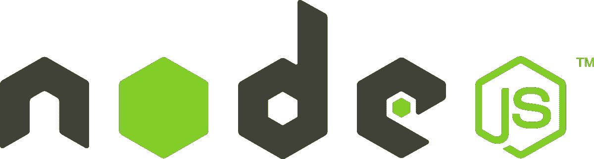
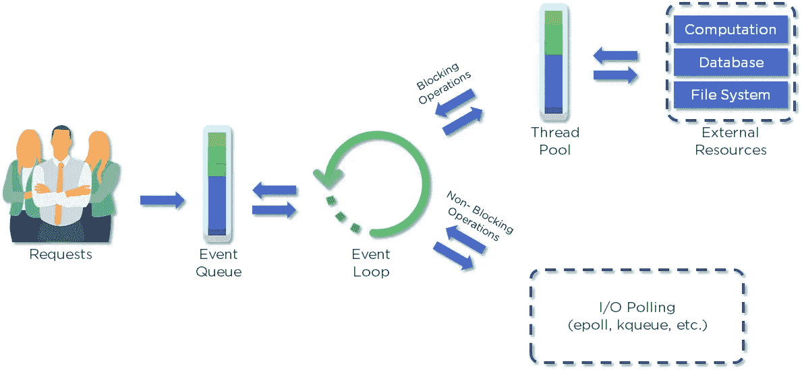
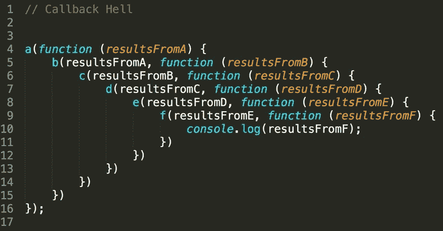
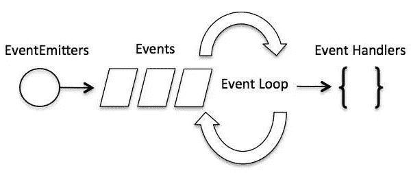
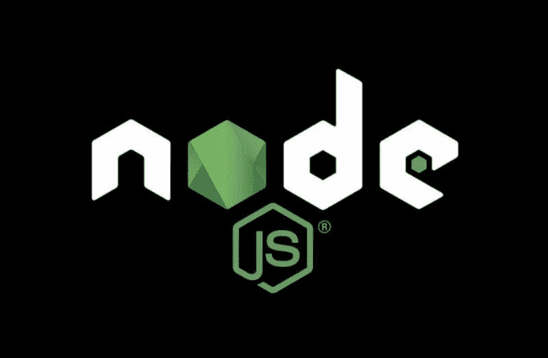

# Node.js 是什么？

> 原文：<https://javascript.plainenglish.io/what-is-node-js-6d9cc7a5068a?source=collection_archive---------8----------------------->

## Node.js 是基于 Chrome 的 V8 引擎构建的 JavaScript 运行时环境。它最初是由美国软件工程师 Ryan Dahl 创建的，他最近也开发了 Deno(node . js 的替代品)。



Official Node.js Logo

Node.js 是一个后端 JavaScript 运行时环境，运行在 V8 引擎上，在 web 浏览器之外执行代码。Node.js 在其运行时环境中解释并执行基于 JavaScript 的脚本。Node.js 是最快的服务器端应用平台之一。

*“你永远无法理解一切。但你应该推动自己去理解这个系统。”— Ryan Dahl，Node.js 的创建者*

## **node . js 为什么这么受欢迎？**

1.  Node.js 是开源的，因此有一个由许多开源库组成的庞大生态系统，可以使用 npm 加以利用。
2.  Node.js 中的一切都是异步的。
3.  Node.js 是单线程的，但是在事件和回调的帮助下支持并发。
4.  Node.js 是跨平台的。它可以在 Windows、Linux、Unix、Mac OS X 等平台上运行。
5.  Node.js 基于最流行的编程语言之一——JavaScript。
6.  Node.js 提供了一种构建可伸缩企业应用程序的简单方法。

现在，让我们讨论一些重要的理论概念，它们将真正帮助您理解 Node.js 是如何如此高效地工作的。



The Architecture Workflow of Node.js (Image Source — [https://www.simplilearn.com/](https://www.simplilearn.com/))

## **Node.js 异步**

Node.js 中的所有 API 都是异步和非阻塞的。非阻塞是指 Node.js 进程中额外 JavaScript 代码的执行不需要等到非 JavaScript 操作完成。这实质上意味着 Node.js 服务器永远不会等待 API 返回数据。调用 API 后，它将继续下一个 API，并使用事件队列通知机制来跟踪 API 请求顺序。

举个例子，让我们考虑这样一种情况，对 web 服务器的每个请求需要 90 毫秒才能完成，而这 90 毫秒中有 70 毫秒是可以异步执行的数据库 I/O 操作。因为 Node.js 是异步的，所以它为每个请求释放了 70 毫秒来处理其他外部请求。这种差异可能看起来很小，但是当一个大型应用程序的数千个请求加在一起时，Node.js &异步编程确实可以提高效率和性能。

## **Node.js 是单线程的**

Node.js 使用单线程模型和事件循环进行异步处理。这提高了性能和可伸缩性。与典型的基于线程的实现相比，在典型的 web 请求负载下，通过在单线程上进行异步处理，可以实现更多的处理、性能和可伸缩性。

## **node . js 中的回调函数**

由于 Node.js 的异步特性，它不会等待特定的函数调用完成执行。相反，它使用回调函数。用 Node.js 编写的所有 API 都使用回调。

如果一个特定的函数需要大量的时间来执行，它通常会阻塞剩余程序的执行。但是，Node.js 使用回调和异步编程来继续执行程序的剩余部分。这些回调函数在原函数执行完成后执行，不影响程序的正常流程。

简单地说，回调函数是这样一个函数，它说，“一旦你完成了这个，就做这个。”

## **回调地狱**

回调地狱是由于使用嵌套回调而出现的一个主要问题。当每个回调都将一个参数作为前一个回调的结果时，就会出现这种情况，这使得代码结构难以阅读和维护。除此之外，如果一个函数出错，所有相应的回调函数都会受到影响。

为了避免回调地狱，使用了承诺。承诺是异步操作的结果。简而言之，一旦执行了代码的某个特定部分，就返回一个对象或一段代码。承诺有三种状态——待定、已解决和已拒绝。根据代码中是否有错误，调用承诺的特定状态。因此，可以使用承诺链接机制来避免由于多个嵌套回调函数而导致的回调地狱。



Callback hell in JS (Source — [https://medium.com/@jaybhoyar1997/avoiding-callback-hell-in-node-js-7c1c16ebd4d3](https://medium.com/@jaybhoyar1997/avoiding-callback-hell-in-node-js-7c1c16ebd4d3))

## **node . js 中的事件循环**

事件循环处理异步回调。它允许 Node.js 通过尽可能将操作卸载到系统内核来执行非阻塞 I/O 操作——尽管 JavaScript 是单线程的。事件循环是一个无限循环，它等待任务，一旦收到任务就执行，然后再次等待更多的任务。只有当调用堆栈为空时，即没有正在进行的任务时，事件循环才执行事件队列中的任务。每当任务完成时，事件循环都会触发一个事件，通知事件侦听器函数执行。一旦特定事件被触发，事件处理程序就决定要做什么。

事件可能看起来类似于回调函数。然而，两者之间的关键区别在于，每当异步函数调用完成时，回调函数就会被执行，而事件更像是观察者，等待特定事件被触发。



Source — [https://www.tutorialspoint.com/nodejs/nodejs_event_loop.htm](https://www.tutorialspoint.com/nodejs/nodejs_event_loop.htm)l

## **节点 _ 环境**

NODE_ENV 是环境变量。在代码执行期间，它可以检查这个环境的值，并执行一些额外的代码行。NODE_ENV 最常用于检查环境是处于开发阶段还是生产阶段，以便可以执行或不执行某些特定的调试代码行。它基本上就像一个标志，用于检查代码是在开发中运行还是在生产中运行，并基于该标志执行必要的代码。

## **节点包管理器(npm)**

Npm 代表节点程序包管理器。它是一个用于发布 Node.js 项目的在线存储库，也是一个命令行实用程序，可以帮助安装可以在 Node.js 应用程序中使用的包。npm 上发布了大量的节点包，并且每天都有更多的节点包被添加进来。你可以在这里搜索各种包[。](https://www.npmjs.com/)
总而言之，npm 基本上是一个节点包管理器，可以用来直接从命令行下载各种要在应用程序中使用的包。


Node Package Manager (Source — [https://en.wikipedia.org/wiki/Npm_(software)](https://en.wikipedia.org/wiki/Npm_(software)))

## **热门 Node.js 模块**

模块只不过是 JavaScript 库，可以用来将一些特定的代码行导入到程序中，或者用更简单的语法导入特定的编码逻辑，这进一步提高了代码的可读性。我们可以使用圆括号内带有模块名称的`require()`函数将特定模块导入 Node.js 应用程序。

1.  *HTTP*
    语法:`const http = require(‘http’);`
2.  *util*
    这个模块提供了一些对开发者非常有用的实用函数。语法: `const util = require(‘util’);`
3.  这个模块包括处理文件 I/O 操作的事件、类和方法。`Syntax: const fs = require(‘fs’);`
4.  这个模块有用于 url 解析和解析的工具。
    语法:`const url = require(‘url’);`
5.  lodash 是最流行的 npm 包之一。它通过提供处理数组、数字、对象&字符串的格式，使得处理 JavaScript 更加容易。语法: `const lodash = require(‘lodash’);`
6.  *下划线* 这是另一个非常流行的 npm 包。它类似于 *lodash* ，并为迭代&操作数组、对象、字符串等提供格式。
    语法:`const _ = require(‘underscore’);`
7.  *express* Express 是一个最小且灵活的 Node.js web 应用程序框架，为 web 和移动应用程序提供了一组健壮的特性。这使得使用 Node.js 进行 API 开发变得更加容易。Node.js 和 Express 通常总是一起用于后端开发。
    语法:`const express = require(‘express’);`

## **Package.json 文件**

每个 Node.js 项目在其根文件夹中都包含一个 package.json 文件，该文件包含有关项目的元数据。它包含了项目中使用的各种模块的数据，它们的版本号，依赖关系，开发依赖关系，等等。它还包含有关项目的数据，如项目描述、版本、许可证等。
例如:

```
{
  "name" : "underscore",
  "description" : "JavaScript's functional programming helper library.",
  "homepage" : "http://documentcloud.github.com/underscore/",
  "keywords" : ["util", "functional", "server", "client", "browser"],
  "author" : "Jeremy Ashkenas <jeremy@documentcloud.org>",
  "contributors" : [],
  "dependencies" : [],
  "repository" : {"type": "git", "url": "git://github.com/documentcloud/underscore.git"},
  "main" : "underscore.js",
  "version" : "1.1.6"
}
```

# **正在使用 Node.js 的公司**

*   亚马逊、网飞、LinkedIn、易贝、PayPal、Trello、优步和 Reddit 都使用 Node.js 作为他们的后端框架。
*   LinkedIn 将移动应用的后端从 Ruby on Rails 移到了 Node。这种转变的两个主要原因是高效的性能和可扩展性。
*   PayPal 表示，在其服务器上将 Java 替换为 Node.js 使其能够更快地提供网页服务，并简化了服务器端软件的创建。PayPal 开始使用 Node.js 作为原型平台，但后来将其用于生产。
*   优步需要一个对乘客和司机都可靠的系统。他们列举了选择 Node 的 3 个主要原因。JS -快速可靠地处理大量数据的能力，方便的错误分析和快速的代码部署，以及由于开源社区而不断改进的技术。
*   Trello 是将 Node.js 用于其服务器端并作为构建单页面 web 应用程序的原型工具的公司之一。

# 如何在 Node.js 中创建一个返回 Hello World 的简单服务器？

现在，您已经了解了 Node.js 工作背后的理论，让我们动手编写一个简单的“Hello World”node . js 程序。

*   导入 HTTP 模块
*   将 createServer 函数与回调函数一起使用，并将请求和响应用作参数。
*   键入“hello world”
*   设置服务器监听端口 3000 并分配一个 IP 地址

```
const http = require('http');

http.createServer(function (req, res) {
  res.writeHead(200, {'Content-Type': 'text/plain'});
  res.end('Hello World!');
}).listen(3000);
```

恭喜你！您刚刚编写了第一个 Hello World Node.js 程序！



Node.js Logo (Source — freecodecamp.org)

# 结论

我希望你已经对 Node.js 有了一些了解，现在知道为什么它会如此受欢迎了。如果你喜欢这篇文章，也想阅读类似的作品，请务必在 [Twitter](https://twitter.com/RahilSarvaiya) 上关注我，我会在那里发布我的最新文章。请在评论区分享你对这篇文章的想法。如果你们对本文或任何与 Node.js 相关的内容有任何建议，我很乐意知道。

*更多内容请看*[***plain English . io***](https://plainenglish.io/)

其他资源:

[https://nodejs.org/en/](https://nodejs.org/en/)
[https://www.geeksforgeeks.org/node-js-event-loop/](https://www.geeksforgeeks.org/node-js-event-loop/)
[https://www.w3schools.com/nodejs/](https://www.w3schools.com/nodejs/)
[https://nodejs . org/en/docs/guides/event-loop-timers-and-next tick/](https://nodejs.org/en/docs/guides/event-loop-timers-and-nexttick/) [](https://nodejs.org/en/docs/guides/event-loop-timers-and-nexttick/) [https://www . simpli learn . com/tutorials/nodejs-tutorial/nodejs-interview-questions](https://www.simplilearn.com/tutorials/nodejs-tutorial/nodejs-interview-questions)
[https://youteam . io/blog/top-companies-that-used](https://youteam.io/blog/top-companies-that-used-node-js-in-production/#:~:text=Netflix%20is%20the%20world's%20top,to%20be%20proficient%20with%20languages)