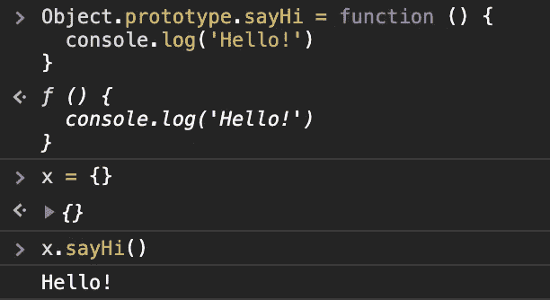

# JavaScript 中的 __proto__ 是什么？

> 原文：<https://javascript.plainenglish.io/what-is-proto-b15f16e10b72?source=collection_archive---------5----------------------->

## 如果您使用过 JavaScript，那么您很可能会遇到它

如果您使用过 JavaScript，您可能会遇到类似这样的情况:

Try console logging an empty object

我创建了一个空对象，为什么 console.log 显示一个神秘属性`__proto__`？

## 不神秘

结果是，一个空的对象不仅仅是你在屏幕上看到的两个花括号。创建的每一个 javascript 对象都自动带有一个来自`Object.prototype`对象的`__proto__`属性。迷惑？让我们尝试扩展`__proto__`对象。

现在让我们来看看`Object.prototype`。

请注意，这两者具有完全相同的属性，这是因为我们的变量`x` **从`Object.prototype`继承了**相同的`__proto__`！

## 等等，这是不是意味着我可以…

是的，你可以修改`Object.prototype`，之后创建的每一个对象也将包含你的修改。让我们通过给我们的`Object.prototype`一个新函数来测试一下。

通过给`Object.prototype`分配一个新的函数`sayHi` ，每个后续创建的对象将自动拥有该函数。

## __proto__ 无处不在

如果我不想改变**创建的每一个单独的对象**，而只想改变一个特定的对象，该怎么办？嗯，这里有一个更实际的用例。我们将创建一个“人类”对象，并赋予它通常的人类属性(你知道，像胳膊和腿)，以及一个只记录“跳跃…”的函数`jump`。

现在让我们创建一个新的对象`jane`。我们将为它命名，此外，我们还将添加一个`__proto__`属性，该属性被设置为`human`(我们之前创建的对象)。

现在我们可以做`jane.jump()`了，它会在控制台记录“跳跃…”

## 所以，只有物体才有 __proto__？

不，其他类型都有自己的。这是其中的一些

*   `Array.prototype`
*   `Number.prototype`
*   `String.prototype`
*   `Boolean.prototype`

他们的工作方式都和`Object.prototype`一样。

## 有用吗？

嗯……首先，你可以在数组原型上创建一个`isNumbers`函数，帮助我检查数组是否只包含数字

至于输出…

有用性完全由你决定。但是在你继续在你的生产应用中使用`__proto__`之前，请注意`__proto__`已经被弃用，你应该使用`[Object.getPrototypeOf()](https://developer.mozilla.org/en-US/docs/Web/JavaScript/Reference/Global_Objects/Object/getPrototypeOf)`或者`[Object.setPrototypeOf()](https://developer.mozilla.org/en-US/docs/Web/JavaScript/Reference/Global_Objects/Object/setPrototypeOf)`来代替。

## 链接

[https://developer . Mozilla . org/en-US/docs/Web/JavaScript/Reference/Global _ Objects/Object/proto](https://developer.mozilla.org/en-US/docs/Web/JavaScript/Reference/Global_Objects/Object/proto)