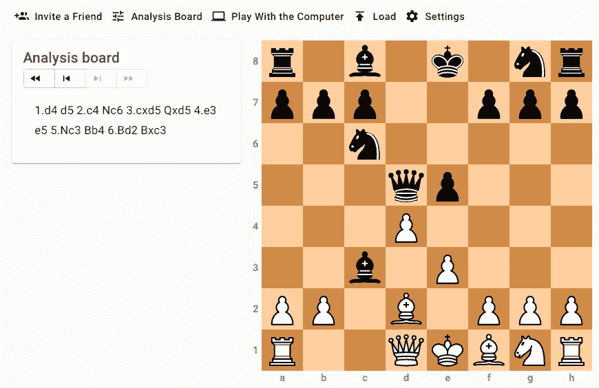
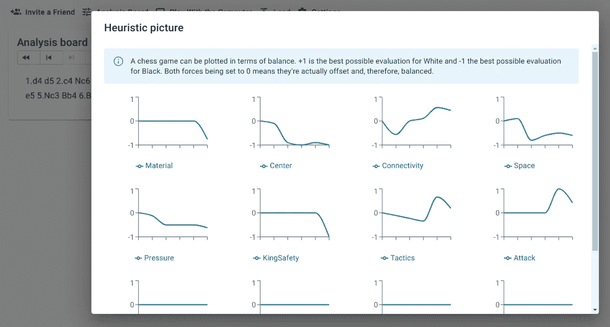

# Redux 棋是什么？

> 原文：<https://javascript.plainenglish.io/what-is-redux-chess-6264c99c1eca?source=collection_archive---------15----------------------->

## 嵌入到 React 应用程序中的易于使用的象棋插件


Photo by [Katherine Hood](https://unsplash.com/@hoodyk?utm_source=unsplash&utm_medium=referral&utm_content=creditCopyText) on [Unsplash](https://unsplash.com/s/photos/welcome?utm_source=unsplash&utm_medium=referral&utm_content=creditCopyText)

欢迎来到 web 开发和开源象棋的世界。

[Redux Chess](https://github.com/chesslablab/redux-chess) 是 GitHub 上的 ChesslaBlab 组织正在开发的一款嵌入式棋盘。这是一个包容性的开源项目，欢迎所有人。由于按照惯例编码，添加新特性很容易，但是也鼓励贡献者打破常规，从错误中学习。

Redux Chess 是一个易于使用的棋盘，为您的 React 应用程序提供了广泛的功能:

*   分析国际象棋游戏
*   加载分弦和 PGN 移动文本以供进一步研究
*   下载图像
*   邀请朋友下棋
*   拍启发性的照片

还有更多！

> 如果这是你第一次听说“启发式图片”这个术语，这是一个象棋游戏的快照。

启发式图片显示了棋盘上的几个评估特征:材料、中心、连通性、空间、压力、国王安全等等。



Figure 1\. The Chigorin Defense to the Queen’s Gambit.

你知道一盘棋可以用平衡来绘制吗？+1 是对白色的最佳可能评估，而-1 是对黑色的最佳可能评估，等于零的评估特征意味着它是偏移的或平衡的。



Figure 2\. A heuristic picture helps to visually understand which player is better in a particular position.

关于这个 chess 插件的一个吸引人的事实是，它可以不需要太多的努力就进行扩展，因为它是使用一种叫做 Redux 的设计模式编写的。

[](https://medium.com/geekculture/how-to-take-normalized-heuristic-pictures-79ca0df4cdec) [## 如何拍摄规范化的启发式图片

### 根据描述棋盘上正在发生的事情的快照来想象一个国际象棋游戏

medium.com](https://medium.com/geekculture/how-to-take-normalized-heuristic-pictures-79ca0df4cdec) 

您可能知道，Redux 是一个用于管理应用程序状态的开源 JavaScript 库，它严重依赖于发布-订阅(或发布-订阅)模式，这是一种众所周知的软件设计模式。此外，还实现了一个单一存储来集中应用程序的数据。这种方式使得数据从 UI 组件中分离出来。

Redux Chess 的本意是“仅仅是一个棋盘”,尽可能的轻便，并且可以作为 NPM 软件包[安装在 NPM 的注册表](https://www.npmjs.com/package/@chesslablab/redux-chess)上。

```
$ npm i [@chesslablab/redux-chess](http://twitter.com/chesslablab/redux-chess)
```

# 这是一个包容性的开源社区

Redux Chess 由 GitHub 上的 ChesslaBlab 组织开发。这是一个包容性的开源社区，欢迎所有想学习 web 开发和象棋的人。

目前，我们期待在这些回购中的贡献。

*   `/redux-chess`是连接到象棋服务器的 React 棋盘。
*   `/php-chess`是一个 PHP 的象棋库。
*   `/chess-server`是一个使用 PHP 的象棋服务器。
*   `/chess-data`提供管理数据库和训练模型的工具。

对了，这些 ChesslaBlab repos 参加了 Hacktoberfest 2021，不要被你的第一次公关吓倒。鼓励贡献者打破常规，从错误中学习。

让我们创造一些令人敬畏的东西！

# 阅读投稿指南

如果你想为 ChesslaBlab 库做贡献，请确保先阅读[贡献指南](https://medium.com/geekculture/how-to-contribute-to-chesslab-cca73fefaf70)。每个存储库中都有一个`README.md`文件解释如何做到这一点。简而言之，查看未解决的问题，并在您希望分配的问题上留下评论:

> 你好，快乐学习和编码！

或者，你也可以提出新的建议。

新分支的命名约定如下:

```
issue/n-the-title-of-the-issue
```

例如:

```
issue/176-display-files-and-ranks-on-the-chessboard
```

因此，如果您要从`master`创建一个新的分支机构，您应该键入如下内容:

```
$ git checkout -b issue/176-display-files-and-ranks-on-the-chessboard
```

# 目录结构

我认为可以说 Redux 是一种设计模式，也是一个 JavaScript 库。Redux Chess 的文件夹结构因此受到强烈影响。

```
└── src
    ├── __tests__
    ├── actions
    |   ├── historyActions.js
    |   └── ...
    ├── components
    |   ├── Board.js
    |   └── ...
    ├── constants
    |   ├── alertActionTypes.js
    |   └── ...
    ├── listeners
    |   ├── wsMssgListener.js
    |   └── ...
    ├── reducers
    |   ├── alertReducer.js
    |   └── ...
    ├── utils
    |   ├── Ascii.js
    |   └── ...
    ├── index.css
    ├── index.js
    ├── setupTests.js
    └── store.js
```

如果您已经熟悉了 React 和 Redux 的基础知识，那么向代码库添加新特性就变成了一个复制和粘贴的过程，这要归功于已经采用的许多约定。

# 让我们按照惯例编码

据[维基百科](https://en.wikipedia.org/wiki/Convention_over_configuration):

> 约定优于配置(也称为按约定编码)是软件框架使用的软件设计范例，它试图减少使用框架的开发人员需要做出的决策数量。

例如，所有 UI 对话框都以完全相同的方式实现。React 组件文件存储在`[src/components/Dialog](https://github.com/chesslablab/redux-chess/tree/master/src/components/Dialog)`中，文件名以单词“Dialog”为后缀。

```
└── src
    ├── ...
    ├── components
    |   └── Dialog
    |       ├── CreateInviteCodeDialog.js
    |       ├── DrawAcceptDialog.js
    |       ├── DrawOfferDialog.js
    |       ├── EnterInviteCodeDialog.js
    |       ├── FenDialog.js
    |       ├── HeuristicPictureDialog.js
    |       ├── LoadFenDialog.js
    |       ├── LoadPgnDialog.js
    |       ├── PgnDialog.js
    |       ├── RematchAcceptDialog.js
    |       ├── RematchOfferDialog.js
    |       ├── ResignAcceptDialog.js
    |       ├── TakebackAcceptDialog.js
    |       └── TakebackOfferDialog.js
    ├── ...
```

`[src/components/Buttons.js](https://github.com/chesslablab/redux-chess/blob/master/src/components/Buttons.js)`中的主导航按钮和 UI 对话框通过遵循相同的命名约定向商店分派动作。对话动作名存储在`[src/constants](https://github.com/chesslablab/redux-chess/tree/master/src/constants)`文件中，有意义的文件名以单词`DialogActionTypes`为后缀，所有文件名至少包含两个相同的动作`OPEN`和`CLOSE`，如下例所示。

上面两个例子中的代码看起来非常相似，因为是按照惯例编码的。

# 都是同样的事情，一遍又一遍

同样的事情也适用于减速器。

由`OPEN`和`CLOSE`动作发起的请求实际上是在匹配的 Redux 中实现的，这在 Redux 范例中意味着只修改应用程序的状态。这样，一旦 reducer 逻辑运行，对话框将通过`state.enterInviteCodeDialog.open`自动重新呈现，如下例所示。

请记住，无论组件的状态何时改变，React 都会重新渲染组件。

# 结论

我们刚刚检查了一个例子，并查看了所有部分如何协调工作以打开和关闭 UI 对话框，从而完成了带有同步数据的 Redux 数据流。

假设需要向代码库中添加一个新的对话框。

按照惯例进行编码的结果是，添加新特性不应该花费太多的精力，因为设计决策的重要部分已经做出。在某些情况下，它甚至像复制和粘贴一些代码一样简单。

[](https://programarivm.medium.com/check-out-the-redux-chess-demo-acbea003d710) [## 查看 Redux 国际象棋演示

### 请坐下来，享受一杯你最喜欢的啤酒

programarivm.medium.com](https://programarivm.medium.com/check-out-the-redux-chess-demo-acbea003d710) 

*更多内容请看*[*plain English . io*](http://plainenglish.io/)*。报名参加我们的* [*免费周报*](http://newsletter.plainenglish.io/) *。在我们的* [*社区*](https://discord.gg/GtDtUAvyhW) *获得独家的写作机会和建议。*