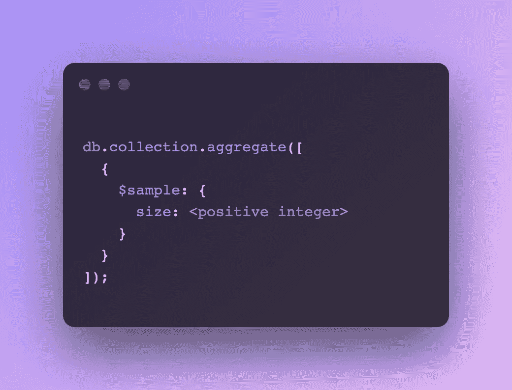

# MongoDB 中的$sample 是什么，为什么它会极其有用？

> 原文：<https://javascript.plainenglish.io/what-is-sample-in-mongodb-and-why-can-it-be-extremely-useful-4e223adc03a7?source=collection_archive---------25----------------------->

## MongoDB 中的$sample 运算符是什么？解释了一个幸运抽奖赢家应用程序的帮助。

Photo by [René Porter](https://unsplash.com/@reneporter?utm_source=medium&utm_medium=referral) on [Unsplash](https://unsplash.com?utm_source=medium&utm_medium=referral)

欢迎回到另一个故事。在这个故事中，我将分享 MongoDB 中的`$sample`操作符。故事由 4 部分组成:

*   什么是`$sample`运算符？
*   我们利用`$sample`操作符的一个实际用例。
*   示例代码。
*   该主题的有用资源。

**事不宜迟，我们开始吧**。

# 什么是`$sample`算子？

`$sample`是一个我们可以在聚合管道中使用的 MongoDB 操作符。正如您可能已经猜到的，它给了您一个数据样本—这意味着数据的一个随机子集。

你可以将上述内容与现实生活中的情景联系起来——商场里的**食品促销员**。食品促销员所做的是将食物分成多份。每一份被称为一个食物样本。像你这样的消费者可以品尝整个食物的样品。

下面的截图是`$sample`操作符的语法。

Syntax for MongoDB $sample operator

# 我们可以利用`$sample`操作符的实际用例

现在我们已经清楚地了解了`$sample`操作符能够做什么，下一个问题可能是**为什么以及何时需要使用它。很高兴你问了这个问题。**

## 幸运抽奖和赠品获奖者申请

**最流行的用例**之一是**幸运抽奖赢家**场景。这个用例非常实用。不管你是来自企业、小公司还是初创公司，你都肯定会开展促销活动，比如赠品、幸运抽奖或促销活动。

构建一个幸运抽奖赢家查询可能相当麻烦。我们通常实施的传统方法如下所示:

*   计算表(SQL)或集合(MongoDB)中的记录总数。
*   生成一个介于 0 和记录总数之间的随机数。
*   然后，我们使用生成的随机数作为索引，检索所需的数据。

上面的传统方法是假设你只选择一个赢家。然而，如果你用随机序列选择前 30 名获奖者。那会变得很复杂。

> 但是`$sample`操作符完成了上面所有的艰苦工作，我们只需要写一行或几行代码就可以实现。这真是太棒了，太优雅了。

## 与其他运算符一起使用时功能更强大

`$sample`与另一个操作符如`$match`一起使用时更强大。`$match`操作符允许您根据条件过滤数据。

一个很好的例子是，你不希望幸运抽奖的赢家是一个从不支持你公司产品的**非活跃用户**。您希望幸运抽奖的获胜者成为您的忠实客户之一，在整个过程中信任并支持您的公司。

因此，在这里使用`$match`操作符和`$sample`操作符是一个很好的组合。

# 示例代码

上面的代码表明我们:

*   过滤具有`active`档案状态和`platinum`级别的用户。
*   然后，在所有的`active`和`platinum`用户中，我们只选择 1 个用户作为获胜者。

与传统方法相比，上面的代码看起来简洁易懂。如果你正在使用 MongoDB，我强烈推荐你使用 `**$sample**` **。**

# 有用的资源

MongoDB 博客有一篇关于使用`$sample`操作符进行随机查询的精彩文章。

 [## 如何在 MongoDB | MongoDB 博客上执行随机查询

### 作为我日常工作的一部分，我偶尔会对数据集进行随机查询。我可能需要这些查询来获得一个好的…

www.mongodb.com](https://www.mongodb.com/blog/post/how-to-perform-random-queries-on-mongodb) 

# 结论

在这个故事中，我分享了:

*   什么是`$sample`运算符？并将其与食品促销员联系起来。
*   使用`$sample`的实际用例——抽奖赢家应用。
*   最后，一个使用$sample 的代码示例——简洁易懂。

感谢您的阅读，请随时与我分享您利用`$sample`操作符的用例。期待收到你的来信。

*更多内容请看*[***plain English . io***](http://plainenglish.io/)